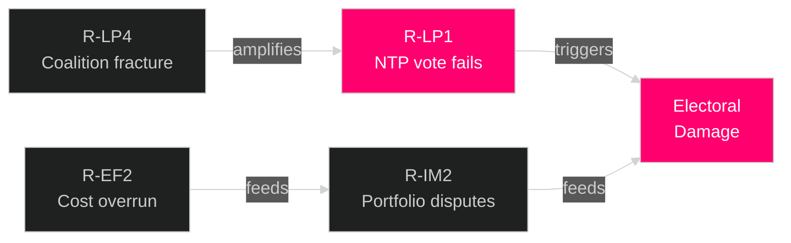

# Risk Assessment — Month Ahead May 2026

**Author**: James Pether Sörling | **Date**: 2026-04-30

## Risk Register (5-Dimension Framework)

### Dimension 1: Legislative/Political Risk

| ID | Risk | Likelihood (1-5) | Impact (1-5) | L×I | Mitigation |
|----|------|-----------------|-------------|-----|-----------|
| R-LP1 | NTP vote fails or substantially amended | 2 | 5 | **10** | SD coalition management; infrastructure committee pre-consensus |
| R-LP2 | CRR3 banking regulation delayed past June | 2 | 3 | 6 | FiU betänkande on track; EU compliance deadline enforced |
| R-LP3 | Court efficiency reform (JuU9) blocked in committee | 1 | 3 | 3 | Strong cross-party support for case backlog reduction |
| R-LP4 | Coalition fracture over SD cultural heritage demand | 2 | 4 | 8 | HD10460 interpellation shows SD accountability role is functional |

### Dimension 2: Economic/Fiscal Risk

| ID | Risk | Likelihood | Impact | L×I | Notes |
|----|------|-----------|--------|-----|-------|
| R-EF1 | Riksbank May rate hike → housing credit tightening | 2 | 4 | 8 | Inflation at 2.3% near target; rate cut more probable [IMF Apr-2026] |
| R-EF2 | NTP implementation cost overrun | 3 | 4 | 12 | 970bn SEK over 11 years; Trafikverket cost control capacity [unconfirmed] |
| R-EF3 | ESA funding gap → space sector job losses | 3 | 3 | 9 | HD10461 exposes systematic underinvestment |

### Dimension 3: Security/Geopolitical Risk

| ID | Risk | Likelihood | Impact | L×I | Notes |
|----|------|-----------|--------|-----|-------|
| R-SG1 | Deterioration of Ukraine situation reduces ODA budget room | 2 | 4 | 8 | HD11772 Ukraine aid motion; bipartisan commitment reduces risk |
| R-SG2 | NATO capability gap — dual-use space data | 2 | 4 | 8 | HD10461 ESA funding gap directly affects Nordic military satellite access |
| R-SG3 | Nuclear permitting delay under new Energy Authority | 2 | 3 | 6 | HD01NU19 designed to streamline; implementation risk remains |

### Dimension 4: Regulatory/Compliance Risk

| ID | Risk | Likelihood | Impact | L×I | Notes |
|----|------|-----------|--------|-----|-------|
| R-RC1 | AI Act transposition gap — KU36 framework insufficient | 2 | 4 | 8 | HD01KU36 proposes 17 improvements but EU AI Act Art. 4 requires dedicated legislation |
| R-RC2 | Competition law (NU22) tools challenged by EU courts | 1 | 3 | 3 | DMA alignment reviewed by KKV; low immediate risk |
| R-RC3 | Work injury under-reporting → insurance fraud liability | 2 | 3 | 6 | HD11776 — Försäkringskassan notification gap |

### Dimension 5: Implementation Risk

| ID | Risk | Likelihood | Impact | L×I | Notes |
|----|------|-----------|--------|-----|-------|
| R-IM1 | Administrative capacity overload — May legislative surge | 3 | 3 | 9 | 8+ major packages = implementation bandwidth pressure [statskontoret.se: none found] |
| R-IM2 | Trafikverket NTP project portfolio disclosure disputes | 2 | 3 | 6 | June implementation prospectus first accountability test |

## Cascading Risk Chains

## Risk Priority

Top 3 risks for May 2026: **R-EF2** (NTP cost overrun, L×I=12), **R-LP1** (NTP vote amendment, L×I=10), **R-LP4** (coalition fracture, L×I=8).

## Posterior Probability Assessment

- P(NTP passes cleanly without SD amendments): 0.65 [B2] — based on committee signal + SD's own infrastructure interest in southern Sweden
- P(NTP passes with minor SD amendment): 0.25 [C2]
- P(NTP delayed past July recess): 0.10 [C2]
