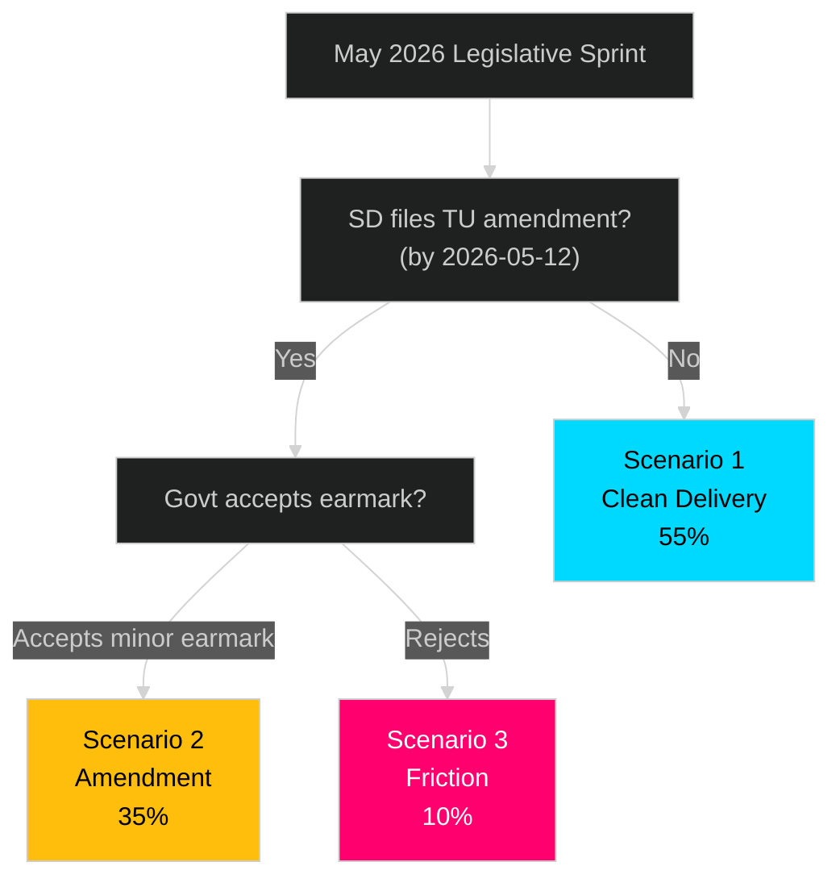

# Scenario Analysis — Month Ahead May 2026

**Author**: James Pether Sörling | **Date**: 2026-04-30

## Scenario Framework

Three scenarios for the Tidöalliansen's May–June 2026 legislative sprint, informed by coalition dynamics, NTP vote timeline, and pre-election positioning.

## Scenario 1: Clean Legislative Delivery (Probability: 55%)

**Headline**: NTP passes without major amendment; all committee reports advance on schedule; government enters summer with consolidated legacy

**Conditions**:
- SD accepts minor transport earmarks in TU and votes Ja on NTP
- FiU betänkande on CRR3 passed by late May
- KU36 and JuU9 reports advance with cross-party support for rule-of-law elements
- No major coalition incident

**Leading indicators**:
- By 2026-05-15: SD submits no substantive TU amendment to HD03259
- By 2026-05-20: TU committee announces vote date

**Consequences**:
- Government enters pre-election summer with: 970bn infrastructure plan, banking regulation, court reform, digital privacy, nuclear permitting as concrete legacy claims
- Polling: M/KD/L bloc expected to stabilise at 45–48% (within governing range)
- Opposition narrates social policy deficit but lacks a blocking event

**Confidence**: MEDIUM-HIGH [B2]

## Scenario 2: SD Amendment Negotiation (Probability: 35%)

**Headline**: SD extracts road investment concession in southern Sweden before voting Ja on NTP; vote delayed 1–2 weeks

**Conditions**:
- SD files TU amendment for Förbifart Stockholm expansion funding or southern E4/E6 upgrades
- Government accepts minor earmark (under 5bn SEK) from existing NTP envelope
- NTP passes late May or early June with SD modification

**Leading indicators**:
- By 2026-05-12: SD files TU amendment
- By 2026-05-17: Government/SD leadership meeting on NTP

**Consequences**:
- NTP passes but SD can claim credit for southern road element
- Minor government narrative dilution: "infrastructure plan modified under pressure"
- No material legislative delay — all other packages advance normally
- Precedent set for SD extracting concessions in final term legislation

**Confidence**: MEDIUM [C2]

## Scenario 3: Coalition Friction and Partial Delivery (Probability: 10%)

**Headline**: SD demands rejected or accepts cultural heritage concessions; multiple coalition disputes; NTP delayed to autumn; partial legislative delivery

**Conditions**:
- SD escalates on both NTP road demands AND cultural heritage (SFV grants HD10460)
- Government refuses concessions on both
- SD signals abstention on NTP
- Government forced to seek S support for NTP passage (unlikely: S opposed)

**Leading indicators**:
- By 2026-05-10: SD party leadership publicly demands NTP road amendment
- By 2026-05-14: Riksdag debate on cultural heritage takes adversarial tone

**Consequences**:
- NTP delayed; government cannot complete infrastructure legacy claim before election
- Coalition governance crisis narrative dominates June–July
- Opposition gains electoral momentum on "Tidöalliansen dysfunctional" framing
- Probability of NTP passage in autumn reduces further as campaign season begins

**Confidence**: LOW [C3] — requires two simultaneous SD escalations, historically unusual

## Probability Summary

| Scenario | Probability | P(sum) | Leading indicator date |
|----------|-------------|--------|----------------------|
| S1: Clean Delivery | 0.55 | 0.55 | 2026-05-15 |
| S2: SD Amendment | 0.35 | 0.90 | 2026-05-12 |
| S3: Coalition Friction | 0.10 | 1.00 | 2026-05-10 |

## Scenario Decision Tree

