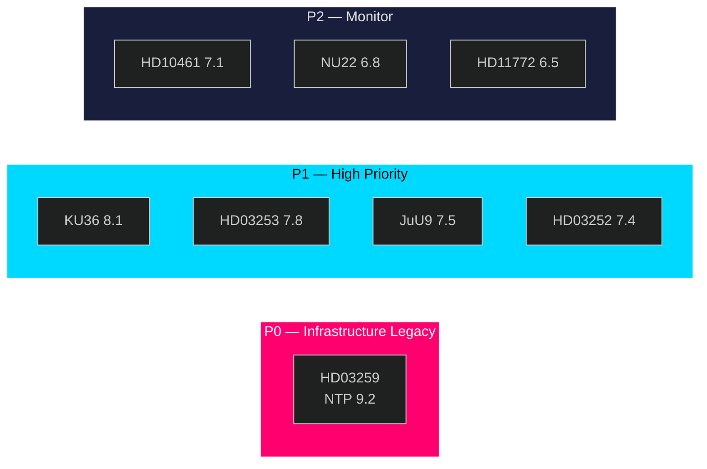

# Significance Scoring — Month Ahead May 2026

**Author**: James Pether Sörling | **Date**: 2026-04-30

## DIW Scoring Methodology

DIW (Dimensional Impact Weighting): Policy Weight × Temporal Weight × Information Weight × Political Weight

## Document Scores

| dok_id | Title | Policy | Temporal | Info | Political | DIW Total | Tier |
|--------|-------|--------|----------|------|-----------|-----------|------|
| HD03259 | NTP 2026–2037 (970bn SEK) | 9.5 | 9.0 | 9.0 | 9.5 | **9.2** | L3 |
| HD01KU36 | Digital privacy review | 8.5 | 8.0 | 8.0 | 8.0 | **8.1** | L2+ |
| HD03253 | CRR3 Banking (EU) | 8.0 | 7.5 | 8.0 | 7.5 | **7.8** | L2+ |
| HD01JuU9 | Court efficiency | 7.5 | 7.5 | 7.5 | 7.5 | **7.5** | L2+ |
| HD03252 | Benefit restriction/convicted | 7.5 | 8.0 | 7.0 | 7.0 | **7.4** | L2+ |
| HD10461 | Space/ESA funding | 7.0 | 7.5 | 7.0 | 7.0 | **7.1** | L2 |
| HD01NU22 | Competition law update | 7.0 | 6.5 | 7.0 | 7.0 | **6.8** | L2 |
| HD11772 | Ukraine aid motion | 6.5 | 7.0 | 6.0 | 6.5 | **6.5** | L2 |
| HD01NU19 | Nuclear permitting | 6.5 | 6.0 | 6.5 | 6.0 | **6.3** | L2 |
| HD11774 | Housing credit guarantee | 5.5 | 6.0 | 6.0 | 6.0 | **5.8** | L2 |
| HD11769 | Mental health action plan | 5.5 | 5.5 | 6.0 | 5.5 | **5.6** | L1 |
| HD11775 | Child poverty/single parents | 5.5 | 5.5 | 5.5 | 5.5 | **5.5** | L1 |
| HD11773 | Real estate broker liability | 5.0 | 5.5 | 5.5 | 5.5 | **5.4** | L1 |
| HD11776 | Work injury reporting | 5.0 | 5.0 | 5.5 | 5.0 | **5.1** | L1 |
| HD11768 | Turbo chicken ban | 4.5 | 5.0 | 5.0 | 5.5 | **5.0** | L1 |
| HD11770 | VULF nursing education | 4.5 | 5.0 | 5.0 | 5.0 | **4.9** | L1 |
| HD11771 | Moose hunting times | 4.0 | 4.5 | 4.5 | 4.0 | **4.2** | L1 |
| HD10460 | Cultural heritage/SFV grants | 7.0 | 6.0 | 7.5 | 7.5 | **7.0** | L2 |

## Priority Tiers

**P0 — Immediate action (L3, DIW ≥ 9.0)**: HD03259 — requires continuous monitoring through Riksdag vote
**P1 — High priority (L2+, DIW 7.5–8.9)**: HD01KU36, HD03253, HD01JuU9, HD03252
**P2 — Monitor (L2, DIW 6.0–7.4)**: HD10461, HD01NU22, HD11772, HD01NU19, HD10460
**P3 — Background (L1, DIW < 6.0)**: All remaining motions

## Sensitivity Analysis

- If NTP vote is delayed past July 2026: HD03259 DIW drops to 8.5 (temporal weight decreases) but political weight increases as election liability
- If Riksbank raises rates in May: HD03253 CRR3 banking significance increases to 8.5 (immediate capital requirement overlap)
- If SD withdraws support for NTP: All infrastructure scores recalibrate; systemic risk level elevates
