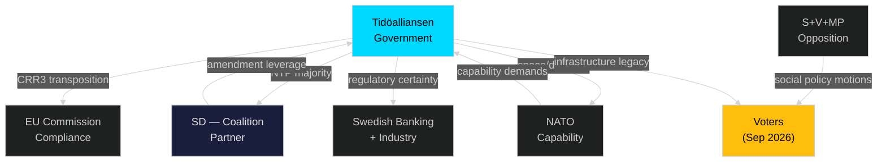

# Stakeholder Perspectives — Month Ahead May 2026

**Author**: James Pether Sörling | **Date**: 2026-04-30

## 6-Lens Stakeholder Matrix

### Lens 1: Government Actors

| Actor | Position | Interest | Influence | Evidence |
|-------|----------|----------|-----------|---------|
| Tidöalliansen (M+SD+KD+L) | Pro-NTP, pro-CRR3, pro-HD03252 | Secure legislative legacy before election | Very High | HD03259, HD03252 tabled by government [riksdagen.se] |
| Ebba Busch (KD, Energy) | Pro-nuclear permitting streamlining | Energy security + nuclear expansion | High | HD01NU19 tabled under Energy ministry |
| Johan Pehrson (L, Justice) | Pro-court efficiency | Rule-of-law modernisation | High | HD01JuU9 justice package [riksdagen.se] |

### Lens 2: Parliamentary Opposition

| Actor | Position | Interest | Influence | Evidence |
|-------|----------|----------|-----------|---------|
| Socialdemokraterna (S) | Against HD03252; pro-Ukraine aid | Social policy agenda; foreign policy bipartisanship | High | HD11772 Ukraine motion; counter-framing on benefits restriction |
| Vänsterpartiet (V) | Against HD03252, HD03253; pro-housing guarantees | Anti-austerity; housing rights | Medium | HD11774, HD11775 motions [riksdagen.se] |
| Miljöpartiet (MP) | Pro-animal welfare (HD11768); critical of nuclear | Green policy differentiation | Medium | HD11768 turbo chicken motion [riksdagen.se] |
| Centerpartiet (C) | Mixed on NTP (road vs rail) | Rural connectivity; deregulation | Medium | Agriculture committee positions |

### Lens 3: Business and Industry

| Actor | Position | Interest | Influence |
|-------|----------|----------|-----------|
| Swedish banking sector (SEB, Handelsbanken, Nordea) | Pro-CRR3 | Regulatory certainty + Basel III compliance | High |
| Trafikverket | Implementing NTP | Delivery credibility + budget allocation | High |
| Rymdstyrelsen + space industry | Pro-ESA increase | Research funding, dual-use contracts | Medium |
| Swedish tech sector | Pro-KU36 + AI Act preparation | Legal certainty for AI products | Medium |

### Lens 4: Civil Society and NGOs

| Actor | Position | Interest | Evidence |
|-------|----------|----------|---------|
| Legal aid organisations | Pro-JuU9 | Access to justice; case backlog reduction | HD01JuU9 |
| Child poverty organisations | Pro-HD11775 | Single parent welfare | HD11775 motion [riksdagen.se] |
| Animal welfare groups | Pro-HD11768 | Turbo chicken breeding ban | HD11768 [riksdagen.se] |
| Housing NGOs | Pro-HD11774 | Social housing access | HD11774 |

### Lens 5: EU and International

| Actor | Position | Interest | Evidence |
|-------|----------|----------|---------|
| European Commission | Monitoring CRR3 transposition | Basel III compliance deadline | HD03253 EU alignment |
| ESA (European Space Agency) | Concerned about SWE contribution gap | Membership contribution | HD10461 |
| NATO | Monitors dual-use capability | C4ISR resilience | HD10461 space infrastructure |
| Ukraine (bilateral) | Pro-HD11772 | ODA continuity | HD11772 Ukraine aid motion |

### Lens 6: Electoral/Voter Segments

| Segment | Key issue | Government exposure | Opposition opportunity |
|---------|-----------|--------------------|-----------------------|
| Rural/northern voters | NTP rail connectivity | Positive (Norrland investment) | Minimal |
| Southern urban voters | Road investment | Moderate (SD demand) | Moderate |
| Young families | Housing access (HD11774) | Negative | High |
| Security-concerned voters | NATO/space/explosives | Positive | Minimal |
| Welfare-dependent | HD03252 benefit restriction | Negative | High |

## Influence Network

