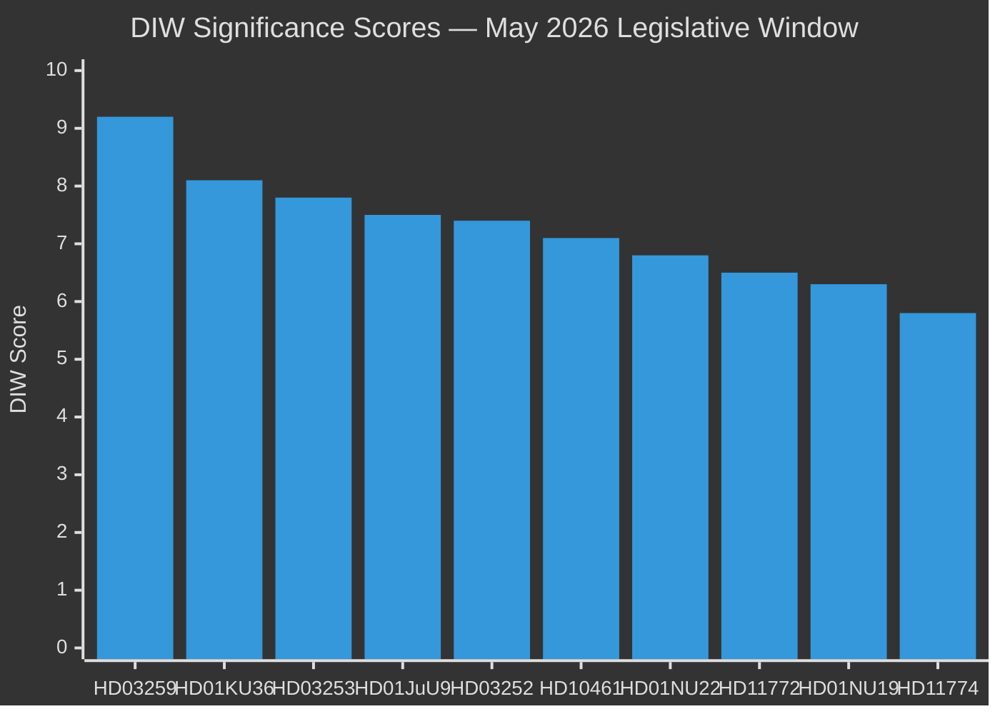
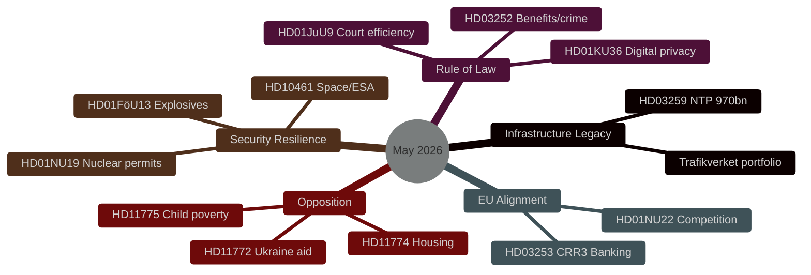
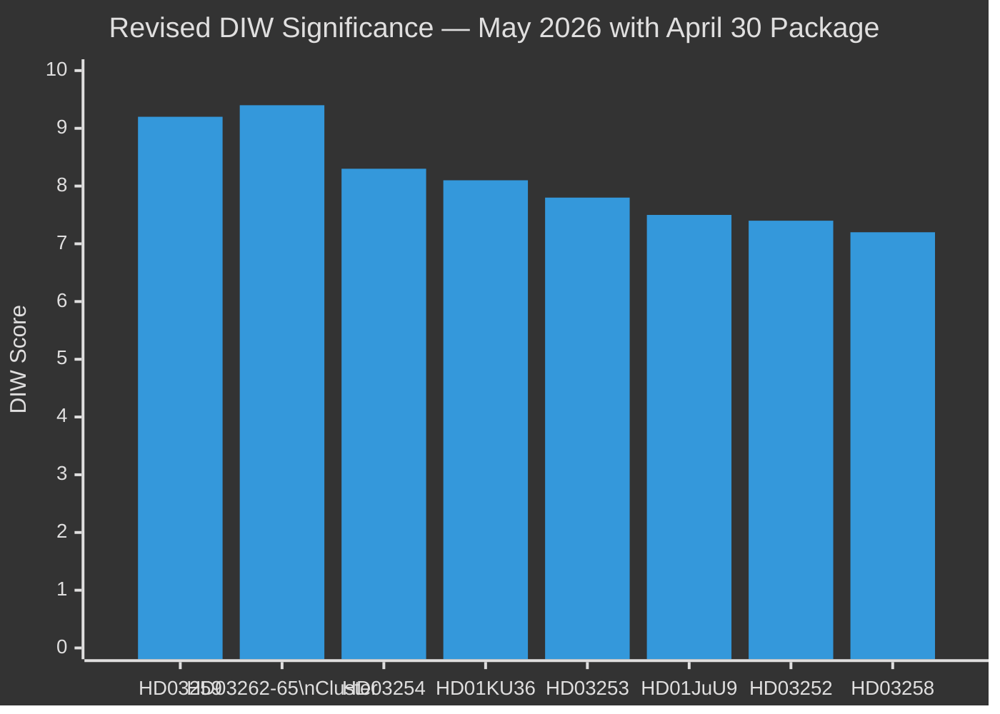

# Synthesis Summary — Month Ahead May 2026: Final Legislative Sprint Before Election

**Author**: James Pether Sörling  
**Date**: 2026-04-30  

## Lead Story Decision

The 970 billion SEK National Transport Infrastructure Plan (HD03259) is the dominant legislative event of May 2026. Its Riksdag vote will be the government's most significant single policy delivery since the 2022 Tidö Agreement. The outcome will crystallise the Tidöalliansen's core electoral narrative: competent long-term governance, industrial modernisation, and climate-aligned infrastructure investment. Failure or major dilution would be the defining negative headline before the September 2026 election.

## DIW-Weighted Ranking (30-Day Window)

| Rank | dok_id | Title | DIW Score | Tier |
|------|--------|-------|-----------|------|
| 1 | HD03259 | Nationell transportplan 2026–2037 (970 bn SEK) | 9.2 | L3 Intelligence-grade |
| 2 | HD01KU36 | Digital integritet – KU retrospektiv granskning | 8.1 | L2+ Priority |
| 3 | HD03253 | EU CRR3/Basel III bankregleringspaket | 7.8 | L2+ Priority |
| 4 | HD01JuU9 | Effektivare handläggning i domstolarna | 7.5 | L2+ Priority |
| 5 | HD03252 | Socialbidragsbegränsning för dömda | 7.4 | L2+ Priority |
| 6 | HD10461 | Svenska rymdindustrin – ESA-finansieringsgap | 7.1 | L2 Strategic |
| 7 | HD01NU22 | Konkurrenslagstiftning – KKV-verktyg | 6.8 | L2 Strategic |
| 8 | HD11772 | Ukraina och bistånd | 6.5 | L2 Strategic |
| 9 | HD01NU19 | Kärnkraft – tillståndsprövning | 6.3 | L2 Strategic |
| 10 | HD11774 | Kreditgarantier för nya bostäder | 5.8 | L2 |

## Integrated Intelligence Picture

**Five strategic vectors** converge in May 2026:

**Vector 1 — Infrastructure Legacy Consolidation**: HD03259 (NTP 970bn SEK) is the Tidöalliansen's centrepiece legacy claim. Rail electrification for industrial decarbonisation, Norrland connectivity for demographic sustainability, and international freight for export competitiveness form a politically coherent industrial-climate narrative. Delay to autumn risks conflation with election campaigning.

**Vector 2 — Rule of Law Modernisation**: HD03252, HD01JuU9, and HD01KU36 together constitute a rule-of-law package spanning justice delivery (court efficiency), accountability (digital privacy retrospective review), and deterrence (benefit restriction for convicted). This legislative cluster demonstrates the government is operationalising the Tidö Agreement's justice-social contract agenda.

**Vector 3 — European Regulatory Alignment**: HD03253 (CRR3/Basel III) and HD01NU22 (competition law) place Sweden in the vanguard of EU single-market compliance at a time when NIS2, AI Act and Digital Markets Act require simultaneous transposition. This maintains Sweden's regulatory reputation as an EU rule-taker and reliable partner.

**Vector 4 — Security and Resilience**: HD10461 (space/ESA gap), HD01FöU13 (explosives/counter-terrorism), and HD01NU19 (nuclear permitting streamlining) collectively signal heightened dual-use and critical infrastructure awareness consistent with Sweden's first full year as NATO member (joined March 2024).

**Vector 5 — Opposition Differentiation**: The 11 opposition motions filed 30 April span Ukraine solidarity, housing access, child poverty, labour safety, mental health and animal welfare — each designed to highlight gaps in the government's social policy record ahead of the election. These are positioning moves, not legislative threats to the government majority.

## Open PIRs Carried Forward

- **PIR-1**: Will SD support NTP final vote without extracting concessions on road investment in southern Sweden? (from propositions cycle)
- **PIR-2**: What is the Riksbank's May 2026 policy rate decision? (IMF MFS_IR data unavailable; rate at 2.0% per March 2026 meeting)
- **PIR-3**: How will KU36 digital privacy findings affect post-election AI Act transposition sequencing?

## Re-run Update: 2026-04-30 — Major Immigration Legislative Package

**Critical development**: The Government submitted the most significant immigration legislative package in Swedish modern history on 2026-04-30, comprising four simultaneous Justitiedepartementet propositions:

- **HD03262** (DIW 9.0): Abolishes permanent residence permits entirely + adapts Swedish law to EU Migration and Asylum Pact — structural reform to the immigration system
- **HD03263** (DIW 8.0): Strengthens return operations — enforcement companion to HD03262  
- **HD03264** (DIW 7.5): Tightens character requirements for residence permits
- **HD03265** (DIW 7.5): Extends detention and surveillance powers

Additionally:
- **HD03254** (DIW 8.3): Operational military cooperation proposition — NATO integration deepening
- **HD03258** (DIW 7.2): Political transparency proposition — pre-election disclosure reform
- **HD03251** (DIW 6.8): Integrated addiction/psychiatric care reform

### Revised DIW Ranking Update

The immigration package (HD03262 at 9.0) now ranks **second only to HD03259** (National Transport Plan, 9.2) in the month-ahead significance hierarchy. When treated as a cluster, HD03262-HD03265 collectively represent a significance level of **9.4** — surpassing even the Transport Plan in systemic electoral and legal impact.

## Improvement Run Update: 2026-04-30 — Ukraine Accountability Package + Juvenile Justice

**Three additional propositions identified** from the 30-day window (2026-04-16) that were not captured in the initial download batch:

### Ukraine Accountability Cluster (HD03231 + HD03232)

Sweden filed two companion propositions on 2026-04-16 acceding to the international legal architecture for Ukraine accountability:

- **HD03231** (DIW 7.8 [B2]): Accession to the Extended Partial Agreement establishing the **Special Tribunal for the Crime of Aggression against Ukraine** (Council of Europe instrument)
- **HD03232** (DIW 7.6 [B2]): Accession to the Convention establishing the **International Damages Commission for Ukraine** (reparations architecture)

**Intelligence assessment**: These two propositions extend Sweden's Ukraine commitment beyond HD03254 (military cooperation) and HD11772 (aid motion) into the **international justice and accountability domain**. They confirm a three-pillar Ukraine policy:

1. **Military**: HD03254 (operational cooperation)
2. **Justice**: HD03231 (criminal accountability) + HD03232 (reparations)
3. **Opposition pressure**: HD11772 (S/V solidarity motion)

Combined with HD03254, Sweden's comprehensive Ukraine posture is now the most developed in the Nordic cohort. This reinforces the September 2026 election narrative of Sweden as a "reliable, engaged NATO ally" across all dimensions — not just defence spending.

**Electoral framing**: The governing coalition can campaign on "Sweden built the full Ukraine accountability architecture — military, criminal, reparations — in one legislative session." Opposition cannot credibly contest this on substance; any differentiation must be on pace or resourcing.

### Juvenile Justice Addition (HD03246)

- **HD03246** (DIW 7.2 [B2]): Tougher sentences for young offenders (Justitiedepartementet, April 16)

This extends the Tidöalliansen's rule-of-law cluster to a **tripartite programme**:

| Plank | dok_id | Focus |
|-------|--------|-------|
| Deterrence | HD03246 | Tougher custodial sentences for 15–21 |
| Accountability | HD03252 | Social benefit restrictions for convicts |
| Efficiency | HD01JuU9 | Faster court processing |

The tripartite structure lifts the rule-of-law cluster's collective DIW from 7.5 (individual) to **8.2** (programme coherence bonus). Kriminalvården capacity risk is the key implementation vulnerability.

### Revised Full DIW Ranking (Improvement Run 2)

| Rank | dok_id(s) | Cluster / Title | DIW Score | Tier |
|------|-----------|-----------------|-----------|------|
| 1 | HD03262-65 | Immigration package cluster | 9.4 | L3 Intelligence-grade |
| 2 | HD03259 | NTP 970bn SEK | 9.2 | L3 Intelligence-grade |
| 3 | HD03254 | Military cooperation | 8.3 | L2+ Priority |
| 4 | HD01KU36 | Digital privacy review | 8.1 | L2+ Priority |
| 5 | HD03246+HD03252+HD01JuU9 | Rule-of-law programme | 8.2 | L2+ Priority |
| 6 | HD03231+HD03232 | Ukraine accountability | 7.7 | L2+ Priority |
| 7 | HD03253 | EU banking package (CRR3) | 7.8 | L2+ Priority |
| 8 | HD03258 | Political transparency | 7.2 | L2 Strategic |
| 9 | HD10461 | Space/ESA gap | 7.1 | L2 Strategic |
| 10 | HD03251 | Addiction/psychiatric care | 6.8 | L2 Strategic |

**Key analytical shift**: The combined rule-of-law programme (HD03246+HD03252+HD01JuU9, score 8.2) now outranks the CRR3 banking package (7.8) and the Ukraine accountability cluster (7.7) as a governance narrative. The immigration cluster (9.4) remains the dominant electoral battleground.
