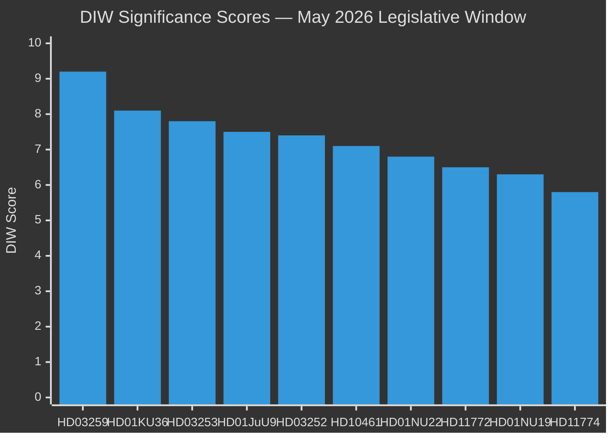
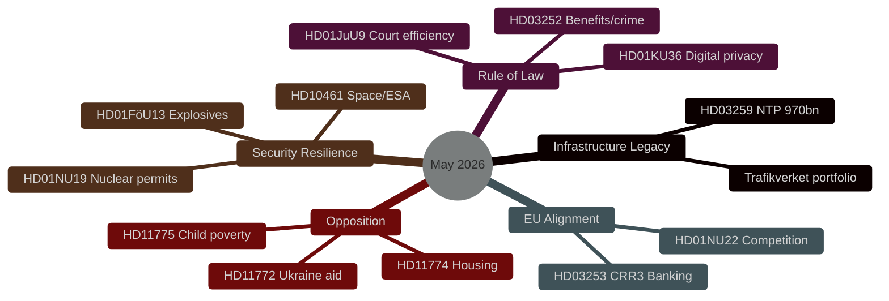

# Synthesis Summary — Month Ahead May 2026: Final Legislative Sprint Before Election

**Author**: James Pether Sörling  
**Date**: 2026-04-30  

## Lead Story Decision

The 970 billion SEK National Transport Infrastructure Plan (HD03259) is the dominant legislative event of May 2026. Its Riksdag vote will be the government's most significant single policy delivery since the 2022 Tidö Agreement. The outcome will crystallise the Tidöalliansen's core electoral narrative: competent long-term governance, industrial modernisation, and climate-aligned infrastructure investment. Failure or major dilution would be the defining negative headline before the September 2026 election.

## DIW-Weighted Ranking (30-Day Window)

| Rank | dok_id | Title | DIW Score | Tier |
|------|--------|-------|-----------|------|
| 1 | HD03259 | Nationell transportplan 2026–2037 (970 bn SEK) | 9.2 | L3 Intelligence-grade |
| 2 | HD01KU36 | Digital integritet – KU retrospektiv granskning | 8.1 | L2+ Priority |
| 3 | HD03253 | EU CRR3/Basel III bankregleringspaket | 7.8 | L2+ Priority |
| 4 | HD01JuU9 | Effektivare handläggning i domstolarna | 7.5 | L2+ Priority |
| 5 | HD03252 | Socialbidragsbegränsning för dömda | 7.4 | L2+ Priority |
| 6 | HD10461 | Svenska rymdindustrin – ESA-finansieringsgap | 7.1 | L2 Strategic |
| 7 | HD01NU22 | Konkurrenslagstiftning – KKV-verktyg | 6.8 | L2 Strategic |
| 8 | HD11772 | Ukraina och bistånd | 6.5 | L2 Strategic |
| 9 | HD01NU19 | Kärnkraft – tillståndsprövning | 6.3 | L2 Strategic |
| 10 | HD11774 | Kreditgarantier för nya bostäder | 5.8 | L2 |

## Integrated Intelligence Picture

**Five strategic vectors** converge in May 2026:

**Vector 1 — Infrastructure Legacy Consolidation**: HD03259 (NTP 970bn SEK) is the Tidöalliansen's centrepiece legacy claim. Rail electrification for industrial decarbonisation, Norrland connectivity for demographic sustainability, and international freight for export competitiveness form a politically coherent industrial-climate narrative. Delay to autumn risks conflation with election campaigning.

**Vector 2 — Rule of Law Modernisation**: HD03252, HD01JuU9, and HD01KU36 together constitute a rule-of-law package spanning justice delivery (court efficiency), accountability (digital privacy retrospective review), and deterrence (benefit restriction for convicted). This legislative cluster demonstrates the government is operationalising the Tidö Agreement's justice-social contract agenda.

**Vector 3 — European Regulatory Alignment**: HD03253 (CRR3/Basel III) and HD01NU22 (competition law) place Sweden in the vanguard of EU single-market compliance at a time when NIS2, AI Act and Digital Markets Act require simultaneous transposition. This maintains Sweden's regulatory reputation as an EU rule-taker and reliable partner.

**Vector 4 — Security and Resilience**: HD10461 (space/ESA gap), HD01FöU13 (explosives/counter-terrorism), and HD01NU19 (nuclear permitting streamlining) collectively signal heightened dual-use and critical infrastructure awareness consistent with Sweden's first full year as NATO member (joined March 2024).

**Vector 5 — Opposition Differentiation**: The 11 opposition motions filed 30 April span Ukraine solidarity, housing access, child poverty, labour safety, mental health and animal welfare — each designed to highlight gaps in the government's social policy record ahead of the election. These are positioning moves, not legislative threats to the government majority.

## Open PIRs Carried Forward

- **PIR-1**: Will SD support NTP final vote without extracting concessions on road investment in southern Sweden? (from propositions cycle)
- **PIR-2**: What is the Riksbank's May 2026 policy rate decision? (IMF MFS_IR data unavailable; rate at 2.0% per March 2026 meeting)
- **PIR-3**: How will KU36 digital privacy findings affect post-election AI Act transposition sequencing?
