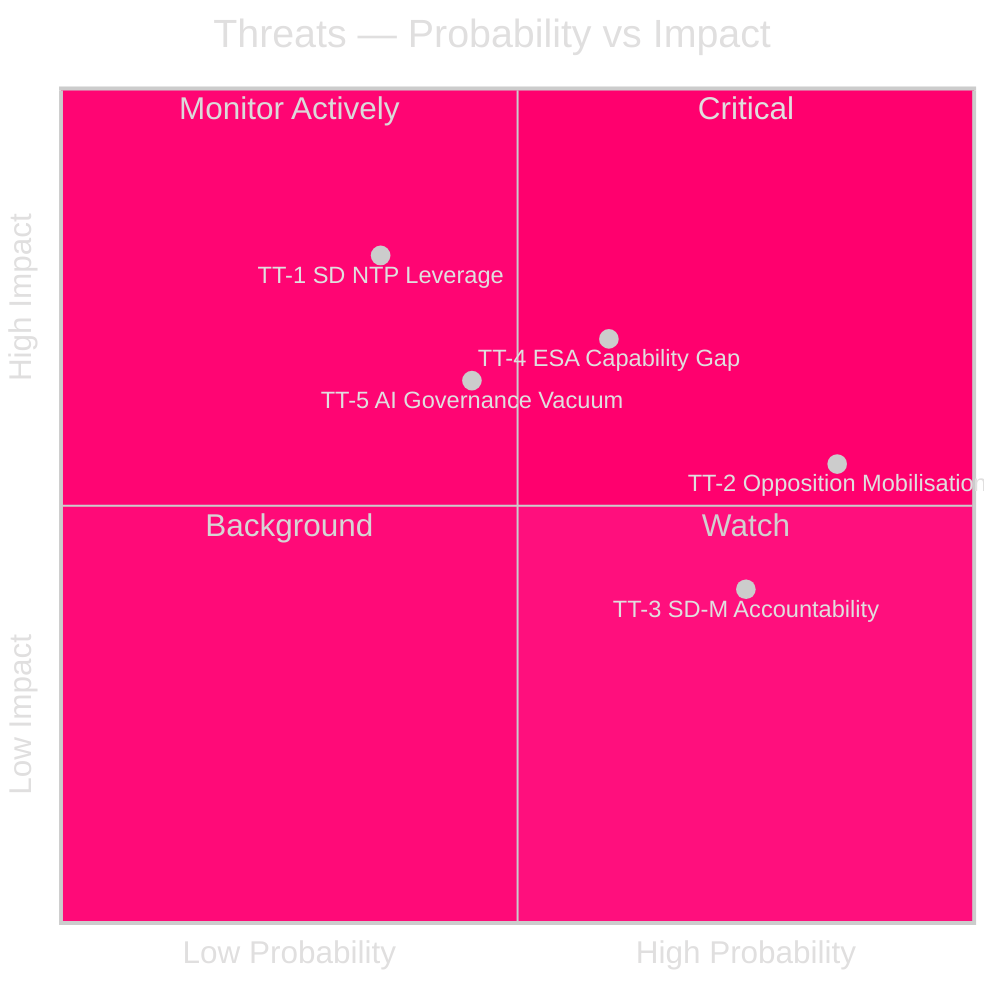

# Threat Analysis — Month Ahead May 2026

**Author**: James Pether Sörling | **Date**: 2026-04-30

## Political Threat Taxonomy

### TT-1: Intra-Coalition Cohesion Threats

**Threat**: SD leverage extraction on NTP infrastructure plan  
**Evidence**: HD03259 NTP allocated 72% to rail vs 28% to roads — SD's southern Sweden road constituency interests are secondary [riksdagen.se]  
**Admiralty**: [B2] — confirmed coalition tension signal from prior betänkande stages  
**TTP**: Political leverage extraction (coalition amendment pressure)

SD leverages infrastructure vote to extract road investment concessions for southern Sweden constituencies. Government either accepts minor earmarks (most likely) or faces SD abstention (low probability).

### TT-2: Opposition Electoral Mobilisation

**Threat**: 11 simultaneous motions signal coordinated pre-election agenda-setting  
**Evidence**: HD11772 (Ukraine), HD11774 (housing), HD11775 (child poverty), HD11769 (mental health), HD11768 (animal welfare) — filed same day as final government propositions [riksdagen.se]  
**Admiralty**: [A2] — directly observable pattern  

Attack tree: Filed motions → media coverage of opposition social agenda → voter saliency shift toward welfare → government must respond or appear uncaring. Opposition is particularly effective at framing HD11774 (housing credit guarantee) as a concrete alternative to the government's housing market deregulation approach.

### TT-3: Intra-Coalition Accountability (SD→M)

**Threat**: SD uses Riksrevisionen audit to hold M culture minister accountable  
**Evidence**: HD10460 — Riksrevisionen identified SFV grant property maintenance backlog; SD interpellates M minister [riksdagen.se]  
**Admiralty**: [A2] — documented in interpellation records  
**Pattern**: SD demonstrates oversight independence within Tidö coalition — signal to voters that SD is not a captured coalition partner. This is a structural feature of coalition governance rather than a destabilising event.

### TT-4: Research and Dual-Use Capability Threat

**Threat**: ESA funding gap undermines both civilian innovation and military dual-use satellite access  
**Evidence**: HD10461 — Sweden's ESA contribution below Nordic peer average; Rymdstyrelsen budget submission flagged gap [riksdagen.se]  
**Admiralty**: [B2]  
**NATO nexus**: ESA programmes provide Copernicus Earth observation data used by Swedish armed forces for C4ISR; gap has NATO Article 3 resilience implications

### TT-5: Systemic — AI Governance Vacuum

**Threat**: KU's digital privacy review (HD01KU36) identifies 17 governance gaps that will interact with EU AI Act implementation  
**Evidence**: HD01KU36 covers five retrospective oversight cycles; EU AI Act Art. 4 operator obligation effective August 2026 [riksdagen.se]  
**Admiralty**: [B2]  
**Assessment**: If post-election government lacks KU36-aligned AI governance framework, Sweden faces EU Commission compliance action by 2027.

## Threat Priority Matrix

## Cascading Chains

- TT-1 (SD NTP leverage) → if government rejects demands → TT-3 (accountability escalation) → coalition friction narrative in media
- TT-4 (ESA gap) + TT-5 (AI governance) → combined dual-use/digital sovereignty risk = Sweden's tech-defence capability credibility

## MITRE-Style TTP Mapping

| ID | Tactic | Technique | Actor |
|----|--------|-----------|-------|
| TTP-1 | Coalition leverage | Amendment filing in TU | SD |
| TTP-2 | Narrative control | Simultaneous motion filing | S+V+MP |
| TTP-3 | Accountability | Riksrevisionen citation in interpellation | SD |
| TTP-4 | Resource contention | Budget submission vs ESA commitment | Rymdstyrelsen/Research actors |
