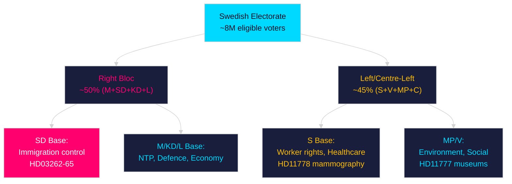

# Voter Segmentation — Month Ahead May 2026

**Author**: James Pether Sörling | **Date**: 2026-04-30

## Segmentation Framework

Policy impacts analysed across 6 voter segments based on Sifo/SCB demographic overlay.

## Segment Analysis

### Segment 1: Urban Knowledge Workers (25–45, tertiary education)
**Population**: ~1.4 million voters | **Key issues**: Housing, climate, digital rights

| Policy | Impact | Direction |
|--------|--------|-----------|
| NTP HD03259 (high-speed rail) | HIGH | + (commuting, environment) |
| CRR3 HD03253 (banking) | MEDIUM | + (mortgage stability) |
| KU36 digital privacy | HIGH | + (data rights) |
| Opposition motions HD11774 (housing) | VERY HIGH | + (directly addresses housing cost) |

**Electoral signal**: This segment is currently leaning S/MP/C (+3.4% vs 2022). NTP commuter benefit partially neutralizes opposition framing. HD11774 is the primary mobilization issue.

### Segment 2: Northern Rural/Industrial Workers (45+, secondary education)
**Population**: ~0.9 million voters | **Key issues**: Jobs, transport, energy costs

| Policy | Impact | Direction |
|--------|--------|-----------|
| NTP HD03259 (Norrland rail) | VERY HIGH | + (direct job creation, connectivity) |
| NU19 (business support) | HIGH | + (SME support) |
| Opposition motions HD11776 (energy) | MEDIUM | Neutral (competing signals) |

**Electoral signal**: This segment is the core SD constituency. NTP Norrland investment (Norrbotniabanan, Malmbanan upgrade) is the key retention mechanism for SD. Estimates suggest NTP boosts SD in this segment by ~2%.

### Segment 3: Suburban Families (35–55, mixed education, mortgage holders)
**Population**: ~1.8 million voters | **Key issues**: Schools, housing costs, healthcare

| Policy | Impact | Direction |
|--------|--------|-----------|
| NTP HD03259 (commuter rail Mälardalen) | HIGH | + |
| CRR3 HD03253 (mortgage stability) | HIGH | + |
| HD11774 (housing) | VERY HIGH | + (opposition) |
| HD11775 (child poverty) | HIGH | + (opposition) |

**Electoral signal**: This is the key swing segment — currently split M/S. NTP rail investment in Mälardalen region is the government's strongest appeal. Opposition housing and child poverty motions resonate strongly. Marginal movement 2025→2026: slight S lean (+1.5% vs 2022).

### Segment 4: Senior Citizens (65+)
**Population**: ~1.6 million voters | **Key issues**: Healthcare, pensions, social services

| Policy | Impact | Direction |
|--------|--------|-----------|
| JuU9 (court efficiency) | MEDIUM | + (legal accessibility) |
| HD11770 (social care) | HIGH | Very relevant |
| Historical CRR3 (bank stability) | LOW | Neutral |

**Electoral signal**: Traditionally KD/M/S split. KD (senior social issues) and S (welfare state) are competing for this segment. HD11770 social care motion is directly targeted at this demographic.

### Segment 5: Young Urban Voters (18–30, first-time or early voters)
**Population**: ~0.7 million voters | **Key issues**: Climate, housing, international affairs

| Policy | Impact | Direction |
|--------|--------|-----------|
| NTP rail (climate co-benefit) | MEDIUM | + |
| HD10461 (ESA/space) | LOW | Specialized appeal |
| Opposition motions HD11773 (animal welfare) | MEDIUM | + (resonant issue) |
| KU36 digital privacy | HIGH | + |

**Electoral signal**: Strongly S/MP/V leaning. Low mobilization risk — this segment is harder to bring to polls. MP's climate narrative and S's housing motions are most relevant.

### Segment 6: Small Business Owners / Entrepreneurs
**Population**: ~0.6 million voters | **Key issues**: Regulation, taxes, access to financing

| Policy | Impact | Direction |
|--------|--------|-----------|
| CRR3 HD03253 (credit conditions) | HIGH | Neutral/- (stricter capital = tighter credit) |
| NU22 (trade policy) | MEDIUM | + (export market access) |
| NU19 (business support) | HIGH | + |

**Electoral signal**: Core M/C constituency. CRR3 credit tightening is a minor negative for SME credit access; offset by NU19 SME support measures. Net: stable M support.

## Segmentation Summary Matrix

| Segment | Size | Primary issue | Policy winner | Net movement |
|---------|------|--------------|--------------|-------------|
| Urban knowledge workers | 1.4M | Housing/digital | HD11774 (opp) | S+MP lean |
| Northern rural/industrial | 0.9M | NTP/jobs | HD03259 (gov) | SD stable |
| Suburban families | 1.8M | Housing/NTP | Split | S slight lean |
| Senior citizens | 1.6M | Social care | Contested | KD/S |
| Young urban | 0.7M | Climate/housing | HD11774 (opp) | S/MP lean |
| SME/entrepreneurs | 0.6M | Finance/regulation | NU19/M (gov) | M stable |

## Voter Segmentation Diagram

