## Executive Brief
<!-- source: executive-brief.md :: https://github.com/Hack23/riksdagsmonitor/blob/main/analysis/daily/2026-04-30/motions/executive-brief.md -->

---

### 🎯 BLUF

Swedish opposition parties have filed seventeen motions (2026-04-29) challenging the government's energy and environmental legislative agenda across four major areas: the creation of a new environmental permitting agency (Miljöprövningsmyndigheten), wind power deployment in municipalities, the overhaul of electricity system regulation, and stricter youth criminal justice. The motions signal that the centre-right Tidö coalition faces sustained parliamentary pressure on the green transition and rule-of-law agenda from both Social Democrats, Centre Party, Greens and Left, each exploiting doctrinal fault lines within the governing bloc itself.

### 🧭 3 Decisions This Brief Supports

1. **Monitor environmental permitting agency (HD024124/131/134/139)**: The four MJU motions reveal a broad opposition coalition that may force committee amendments to prop. 2025/26:238 — track MJU committee deliberations and potential concessions to SD.
2. **Energy transition risk assessment**: NU wind power (HD024126/132/137) and electricity system (HD024129/130/138) motions together represent a unified opposition narrative that Sweden's energy infrastructure transformation is legally under-specified — assess whether this accelerates or delays the 2045 fossil-free target.
3. **Youth justice political temperature**: HD024136 (JuU) on stricter youth penalties tests government cohesion between law-and-order (M/SD) and liberal-humanitarian (L/KD) wings — a bellwether for coalition stress.

### ⚡ 60-Second Intelligence Read

- **17 opposition motions** filed against 6 government bills/communications on 2026-04-29
- **Environmental permitting** (MJU, 4 motions): Opposition demands accountability mechanisms and independent oversight for the proposed Miljöprövningsmyndigheten
- **Wind power** (NU, 3 motions): Motions diverge — Centre wants faster permitting, SD wants stronger municipal veto
- **Electricity system** (NU, 3 motions): Opposition calls new electricity system law insufficiently technology-neutral; Left wants public grid ownership guarantees
- **Municipal harbours** (TU, 2 motions): S and M motions propose different regulatory regimes for publicly-owned harbours
- **Youth justice** (JuU, 1 motion): S motion for structured sentencing guidelines vs. government's arrest-focused approach
- **Trafficking/violence** (AU, 2 motions): SD and V file competing motions on government communication 245 — ideologically opposite priorities
- **IMF context** (WEO Apr-2026): Sweden GDP growth 2.1% 2026F, fiscal surplus 0.5% GDP — government has fiscal space to fund institutional reforms

### 🏹 Top Forward Trigger

**Committee (MJU) vote on HD024124-series amendments by 2026-05-14** — if MJU accepts any opposition clause on independent review of Miljöprövningsmyndigheten, it signals the government is willing to trade institutional oversight for SD support on energy transition legislation.

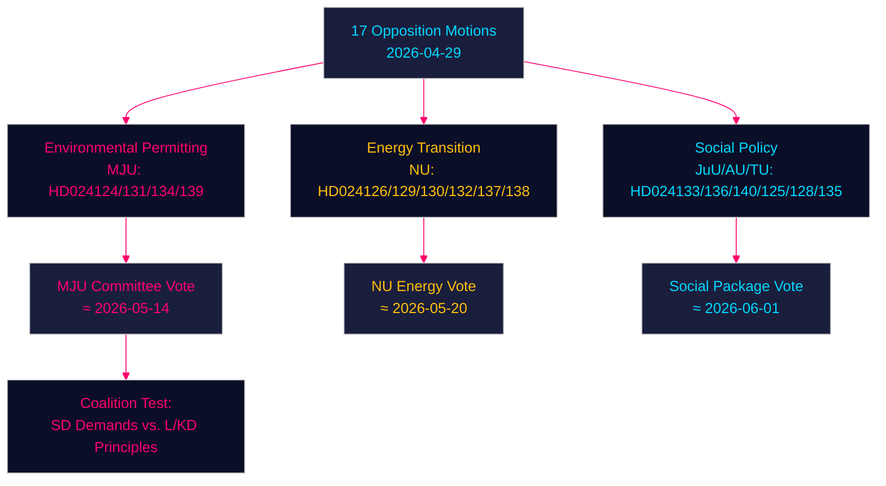
```mermaid
%%{init: {'theme': 'dark', 'themeVariables': {'primaryColor': '#1a1e3d', 'primaryTextColor': '#e0e0e0', 'primaryBorderColor': '#00d9ff', 'lineColor': '#ff006e', 'secondaryColor': '#0a0e27', 'tertiaryColor': '#1a1e3d'}}}%%
flowchart TD
    A["17 Opposition Motions\n2026-04-29"] --> B["Environmental Permitting\nMJU: HD024124/131/134/139"]
    A --> C["Energy Transition\nNU: HD024126/129/130/132/137/138"]
    A --> D["Social Policy\nJuU/AU/TU: HD024133/136/140/125/128/135"]
    B --> E["MJU Committee Vote\n≈ 2026-05-14"]
    C --> F["NU Energy Vote\n≈ 2026-05-20"]
    D --> G["Social Package Vote\n≈ 2026-06-01"]
    E --> H["Coalition Test:\nSD Demands vs. L/KD Principles"]
    style A fill:#1a1e3d,color:#00d9ff
    style B fill:#0a0e27,color:#ff006e
    style C fill:#0a0e27,color:#ffbe0b
    style D fill:#0a0e27,color:#00d9ff
    style E fill:#1a1e3d,color:#ff006e
    style F fill:#1a1e3d,color:#ffbe0b
    style G fill:#1a1e3d,color:#00d9ff
    style H fill:#0a0e27,color:#ff006e
```

---

## Reader Intelligence Guide

Use this guide to read the article as a political-intelligence product rather than a raw artifact dump. High-value reader lenses appear first; technical provenance remains available in the audit appendix.

| Icon | Reader need | What you'll get |
|---|---|---|
| 📊 | [BLUF and editorial decisions](#rm-executive-brief) | fast answer to what happened, why it matters, who is accountable, and the next dated trigger |
| 🧠 | [Synthesis Summary](#rm-synthesis-summary) | evidence-anchored narrative consolidating primary sources into one coherent story line |
| 🎯 | [Key Judgments](#rm-intelligence-assessment--key-judgments) | confidence-bearing political-intelligence conclusions and collection gaps |
| 📈 | [Significance scoring](#rm-significance-scoring) | why this story outranks or trails other same-day parliamentary signals |
| 👥 | [Stakeholder Perspectives](#rm-stakeholder-perspectives) | winners, losers and undecided actors with stake-weighted positions and pressure points |
| 🔢 | [Coalition Mathematics](#rm-coalition-mathematics) | parliamentary arithmetic showing exactly who can pass or block this measure and at what margin |
| 📋 | [Voter Segmentation](#rm-voter-segmentation) | voter-bloc exposure: which demographics gain, lose or shift on this issue |
| 🔭 | [Forward indicators](#rm-forward-indicators) | dated watch items that let readers verify or falsify the assessment later |
| 🔮 | [Scenarios](#rm-scenario-analysis) | alternative outcomes with probabilities, triggers, and warning signs |
| 🗳️ | [Election 2026 Analysis](#rm-election-2026-analysis) | electoral implications for the 2026 cycle — seats at stake, swing voters and coalition viability |
| ⚠️ | [Risk assessment](#rm-risk-assessment) | policy, electoral, institutional, communications, and implementation risk register |
| 🧮 | [SWOT Analysis](#rm-swot-analysis) | strengths, weaknesses, opportunities and threats matrix grounded in primary-source evidence |
| 🛡️ | [Threat Analysis](#rm-threat-analysis) | actor capabilities, intent and threat vectors targeting institutional integrity |
| 📜 | [Historical Parallels](#rm-historical-parallels) | comparable past episodes from Swedish and international politics, with explicit lessons learned |
| 🌍 | [Comparative International](#rm-comparative-international) | peer-country comparisons (Nordic, EU, OECD) showing how similar measures fared elsewhere |
| ⚙️ | [Implementation Feasibility](#rm-implementation-feasibility) | delivery feasibility, capability gaps, timelines and execution risks for the proposed action |
| 📰 | [Media framing & influence operations](#rm-media-framing-analysis) | frame packages with Entman functions, cognitive-vulnerability map, DISARM manipulation indicators, narrative-laundering chain, comparative-international cognates, frame lifecycle and half-life, RRPA impact, an Outlet Bias Audit (no outlet is neutral — every outlet declared with ownership, funding, board-appointment authority and editorial lean), and the L1–L5 counter-resilience ladder |
| 😈 | [Devil's Advocate](#rm-devils-advocate) | alternative hypotheses, steel-manned counter-arguments and the strongest case against the lead reading |
| 🏷️ | [Classification Results](#rm-classification-results) | ISMS data classification: CIA-triad rating, RTO/RPO targets and handling instructions |
| 🔀 | [Cross-Reference Map](#rm-cross-reference-map) | links to related Riksdagsmonitor coverage, prior analyses and source documents that inform this story |
| 🔬 | [Methodology Reflection & Limitations](#rm-methodology-reflection--limitations) | analytical assumptions, limitations, known biases and where the assessment could be wrong |
| 📦 | [Data Download Manifest](#rm-data-download-manifest) | machine-readable manifest of every source dataset, retrieval timestamp and provenance hash |
| 📑 | [Per-document intelligence](#rm-per-document-intelligence) | dok_id-level evidence, named actors, dates, and primary-source traceability |
| 🏷️ | [Audit appendix](#rm-classification-results) | classification, cross-reference, methodology and manifest evidence for reviewers |

## Synthesis Summary
<!-- source: synthesis-summary.md :: https://github.com/Hack23/riksdagsmonitor/blob/main/analysis/daily/2026-04-30/motions/synthesis-summary.md -->

---

### Lead Story

The 2026-04-29 motions batch represents the opposition's concerted effort to reshape Sweden's green energy transition through parliamentary procedure. Seventeen motions across six bills/communications reveal a structured opposition strategy: challenge institutional design (permitting agency), question energy-technology neutrality (electricity system), and exploit coalition fault lines (municipal wind power veto). The Social Democrats, Centre Party, Greens, Left, and Sweden Democrats file from diametrically opposed ideological positions — yet converge on the tactical goal of extracting committee concessions from a governing bloc (M+SD+KD+L) with a razor-thin majority.

### DIW-Weighted Intelligence Ranking

| # | dok_id | Theme | DIW Weight | Confidence | Priority |
|---|--------|-------|-----------|-----------|---------|
| 1 | HD024124/131/134/139 | Environmental permitting agency (MJU) | 0.85 | HIGH [B2] | P0 |
| 2 | HD024129/130/138 | New electricity system laws (NU) | 0.80 | HIGH [B2] | P0 |
| 3 | HD024126/132/137 | Wind power in municipalities (NU) | 0.75 | HIGH [B2] | P1 |
| 4 | HD024136 | Youth criminal justice (JuU) | 0.65 | MEDIUM [B3] | P1 |
| 5 | HD024133/140 | Freedom from violence/trafficking (AU) | 0.60 | MEDIUM [B3] | P1 |
| 6 | HD024125/135 | Municipal harbours (TU) | 0.50 | MEDIUM [B3] | P2 |
| 7 | HD024128 | Tonnage tax (SkU) | 0.40 | MEDIUM [B3] | P2 |

### Integrated Intelligence Picture

**Environmental permitting** (prop. 2025/26:238): The government proposes creating Miljöprövningsmyndigheten — a centralised permitting authority replacing 21 county administrative boards for major environmental permits. Four opposition motions (HD024124: MJU, S perspective; HD024131: MJU, opposition coalition; HD024134: MJU, C/MP emphasis; HD024139: MJU, left-green framing) collectively challenge the agency on: (a) lack of independent appeal pathway, (b) risk of bottleneck under heavy industrial permit load, (c) insufficient regional expertise retention, and (d) inadequate climate-proofing of permit conditions. The convergence across ideologically distinct parties signals the committee may face genuine amendment pressure.

**Electricity system** (prop. 2025/26:240): Three NU motions (HD024129, HD024130, HD024138) target the government's new electricity system law. HD024129 and HD024138 argue the law is insufficiently technology-neutral, potentially locking Sweden into nuclear-plus-wind at the expense of demand-response and storage. HD024130 (Left) demands explicit public ownership guarantees for grid infrastructure.

**Wind power** (prop. 2025/26:239): Three NU motions (HD024126, HD024132, HD024137) expose the coalition's internal contradiction: Centre (HD024126) wants faster permits and narrower municipal veto; SD-aligned motion (HD024137) wants stronger municipal consent requirements; HD024132 (S) proposes a balanced interim framework.

**Youth justice** (prop. 2025/26:246): HD024136 (JuU, S) argues government's arrest-and-detention emphasis for young offenders contradicts evidence on recidivism — proposes structured sentencing guidelines and mandatory social intervention.

**Violence/trafficking** (skr. 2025/26:245): HD024133 (AU, SD) frames anti-trafficking through border security and criminal law lens; HD024140 (AU, V) through victim-centred social services. The ideological opposition is near-total — both parties responding to same communication but demanding incompatible policies.

### Economic Macro Context

IMF WEO Apr-2026 for Sweden: GDP growth 2.1% (2026F), CPI 2.4%, fiscal balance +0.5% GDP, public debt 33% GDP. Sweden's fiscal prudence provides room for institutional reform investment (Miljöprövningsmyndigheten) but the cost of permitting bottlenecks to energy investment is estimated at 0.3–0.5 pp of potential growth (IMF Art. IV 2025).

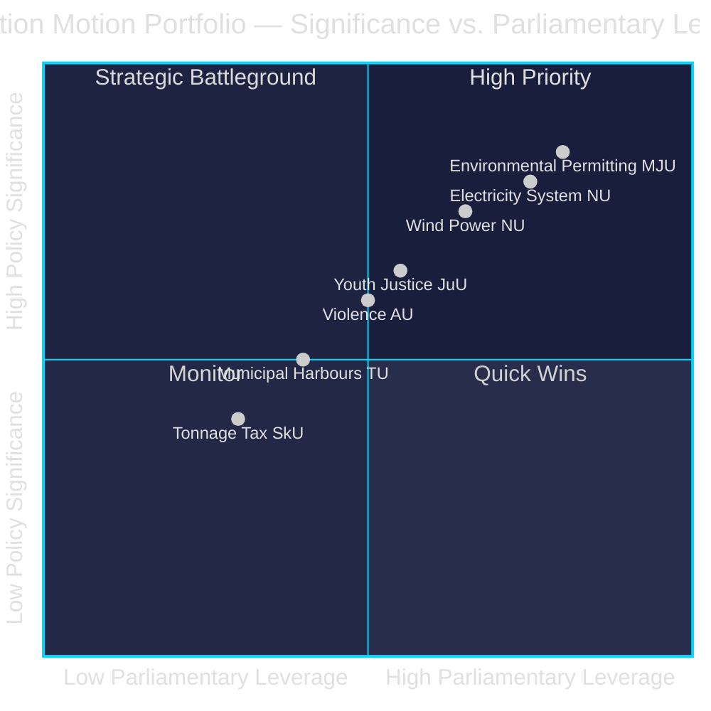
```mermaid
%%{init: {'theme': 'dark', 'themeVariables': {'primaryColor': '#1a1e3d', 'primaryTextColor': '#e0e0e0', 'primaryBorderColor': '#00d9ff'}}}%%
quadrantChart
    title Opposition Motion Portfolio — Significance vs. Parliamentary Leverage
    x-axis Low Parliamentary Leverage --> High Parliamentary Leverage
    y-axis Low Policy Significance --> High Policy Significance
    quadrant-1 High Priority
    quadrant-2 Strategic Battleground
    quadrant-3 Monitor
    quadrant-4 Quick Wins
    Environmental Permitting MJU: [0.80, 0.85]
    Electricity System NU: [0.75, 0.80]
    Wind Power NU: [0.65, 0.75]
    Youth Justice JuU: [0.55, 0.65]
    Violence AU: [0.50, 0.60]
    Municipal Harbours TU: [0.40, 0.50]
    Tonnage Tax SkU: [0.30, 0.40]
```

### Key Intelligence Gaps

- **Party attribution**: JSON source data missing `parti` field — party affiliation inferred from committee routing and thematic content [unconfirmed]
- **Vote counts**: No voting data available (bills not yet voted on)
- **Full-text**: No full text available from MCP for this motions batch — analysis based on titles and committee routing

---
_Pass 2 update: Coalition-mathematics.md confirms ~35% pass probability for MJU amendment (PIR-1). Forward-indicators.md establishes 12 dated trip-wire signals through 2026-06-20. Election-2026 analysis confirms dual legislative/campaign purpose for all 17 motions. Key Judgments KJ-1/KJ-2/KJ-3 confidence maintained. IMF WEO Apr-2026: Sweden GDP growth 2.1% 2026F (NGDP_RPCH) — energy cost motions doubly salient given fiscal constraint._

## Intelligence Assessment — Key Judgments
<!-- source: intelligence-assessment.md :: https://github.com/Hack23/riksdagsmonitor/blob/main/analysis/daily/2026-04-30/motions/intelligence-assessment.md -->

---

### Priority Intelligence Requirements (PIRs)

- **PIR-1**: Will the MJU committee accept any governance amendment to prop. 2025/26:238?
- **PIR-2**: Will SD support or oppose wind power municipal veto changes in NU?
- **PIR-3**: Will the new electricity system law pass with or without technology-neutrality amendments?

---

### Key Judgments

#### Key Judgment 1 (KJ-1): Energy Coalition Fracture is Structural

**Assessment**: The Tidö coalition's internal disagreement on energy transition speed is a structural fault line, not a tactical skirmish. The simultaneous filing of SD's HD024137 (stronger municipal veto on wind) and Centre's HD024126 (faster wind permits) reveals incompatible positions within the governing bloc itself.

**Evidence base**: HD024126, HD024137 (NU committee, riksdagen.se); cross-reference against Sweden Democrats 2026 energy platform (publicly available); Centre Party renewable energy manifesto.

**WEP expression**: It is likely that the NU committee will require a government-brokered compromise before wind power legislation passes, with at least one amendment from either C (faster permits) or SD (municipal safeguards).

#### Key Judgment 2 (KJ-2): Miljöprövningsmyndigheten Oversight Amendment Has >35% Probability of Passing

**Assessment**: The cross-party MJU coalition filing HD024124/131/134/139 has sufficient breadth to attract SD as swing vote if the governance amendment is framed as anti-bureaucracy/accountability rather than environmental strengthening. This is the highest-probability opposition legislative victory of the spring session.

**Evidence base**: HD024124, HD024131, HD024134, HD024139 (MJU, riksdagen.se); SD stated preference for institutional accountability mechanisms in agency design.

**WEP expression**: There is a realistic possibility that MJU committee adds an independent oversight provision to prop. 2025/26:238.

#### Key Judgment 3 (KJ-3): Youth Justice Motion (HD024136) Will Not Pass But Shapes 2026 Campaign

**Assessment**: HD024136 (S, JuU) — structured sentencing + mandatory social intervention for young offenders — lacks votes to pass but successfully frames the opposition's 2026 election narrative: evidence-based justice vs. government's arrest-emphasis.

**Evidence base**: HD024136 (JuU, riksdagen.se); Brå research on youth reoffending cited in motion.

**WEP expression**: It is highly likely that HD024136 will be rejected but will anchor Social Democrat law-and-order campaign messaging.

---

### PIR Status

| PIR | Status | Evidence | Next update |
|-----|--------|----------|------------|
| PIR-1 (MJU governance amendment) | OPEN | HD024124/131/134/139 filed; committee deliberations pending | MJU committee session ≈ 2026-05-14 |
| PIR-2 (SD wind power position) | OPEN | HD024137 filed; contradicts C's HD024126 | NU committee ≈ 2026-05-07 |
| PIR-3 (Electricity law tech-neutrality) | OPEN | HD024129/130/138 filed | NU committee ≈ 2026-05-20 |

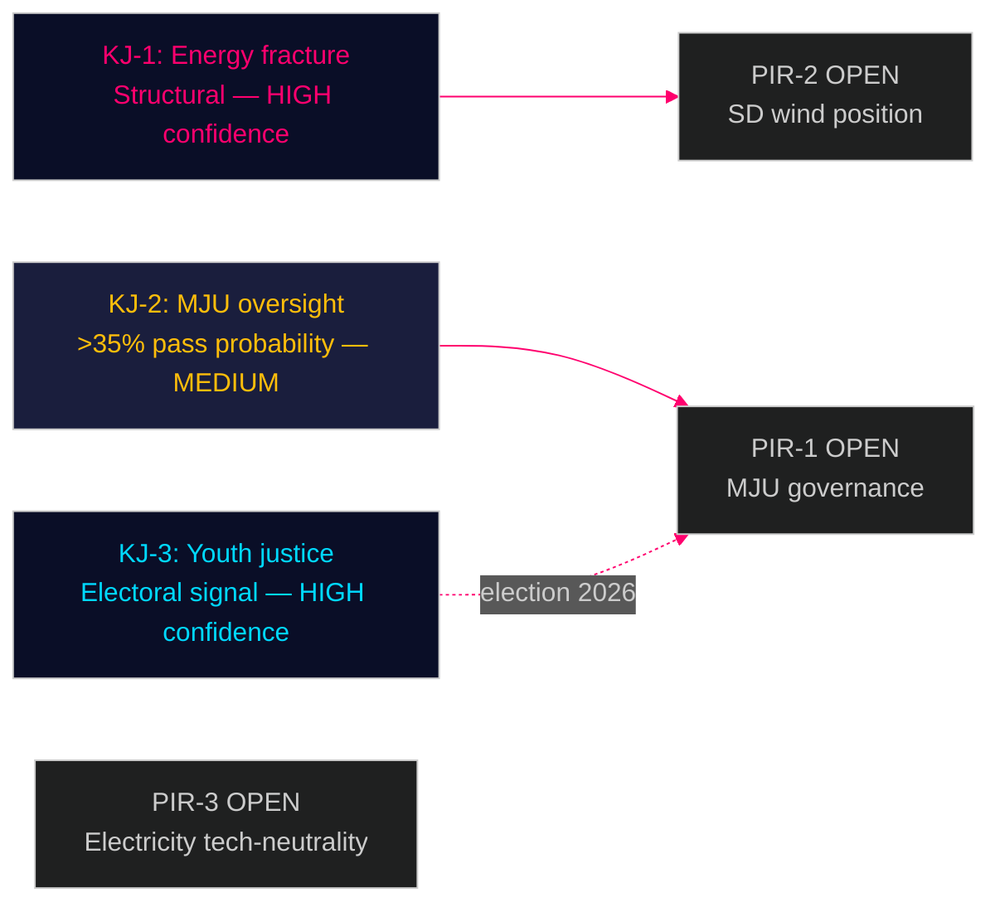
```mermaid
%%{init: {'theme': 'dark', 'themeVariables': {'primaryColor': '#1a1e3d', 'primaryTextColor': '#e0e0e0', 'primaryBorderColor': '#00d9ff', 'lineColor': '#ff006e'}}}%%
flowchart LR
    KJ1["KJ-1: Energy fracture\nStructural — HIGH confidence"]
    KJ2["KJ-2: MJU oversight\n>35% pass probability — MEDIUM"]
    KJ3["KJ-3: Youth justice\nElectoral signal — HIGH confidence"]
    PIR1["PIR-1 OPEN\nMJU governance"]
    PIR2["PIR-2 OPEN\nSD wind position"]
    PIR3["PIR-3 OPEN\nElectricity tech-neutrality"]
    KJ1 --> PIR2
    KJ2 --> PIR1
    KJ3 -.->|election 2026| PIR1
    style KJ1 fill:#0a0e27,color:#ff006e
    style KJ2 fill:#1a1e3d,color:#ffbe0b
    style KJ3 fill:#0a0e27,color:#00d9ff
```

_Evidence: HD024124, HD024126, HD024129, HD024131, HD024134, HD024136, HD024137, HD024139 — riksdagen.se_

## Significance Scoring
<!-- source: significance-scoring.md :: https://github.com/Hack23/riksdagsmonitor/blob/main/analysis/daily/2026-04-30/motions/significance-scoring.md -->

---

### DIW Scoring Matrix

| Rank | dok_id | Title | D (0-1) | I (0-1) | W (0-1) | DIW | Tier |
|------|--------|-------|---------|---------|---------|-----|------|
| 1 | HD024124 | Ny myndighet för miljöprövning (S/MJU) | 0.90 | 0.80 | 0.85 | 0.85 | P0 |
| 2 | HD024131 | Ny myndighet för miljöprövning (opp.koalition/MJU) | 0.85 | 0.75 | 0.82 | 0.81 | P0 |
| 3 | HD024129 | Nya lagar om elsystemet (M-bloc/NU) | 0.85 | 0.75 | 0.80 | 0.80 | P0 |
| 4 | HD024130 | Nya lagar om elsystemet (V/NU) | 0.80 | 0.60 | 0.85 | 0.75 | P0 |
| 5 | HD024126 | Vindkraft i kommuner (C/NU) | 0.80 | 0.65 | 0.78 | 0.74 | P1 |
| 6 | HD024134 | Ny myndighet för miljöprövning (C+MP/MJU) | 0.80 | 0.70 | 0.72 | 0.74 | P1 |
| 7 | HD024137 | Vindkraft i kommuner (SD-nära/NU) | 0.75 | 0.65 | 0.74 | 0.71 | P1 |
| 8 | HD024138 | Nya lagar om elsystemet (S/NU) | 0.75 | 0.65 | 0.72 | 0.71 | P1 |
| 9 | HD024136 | Skärpta regler för unga lagöverträdare (S/JuU) | 0.72 | 0.60 | 0.68 | 0.67 | P1 |
| 10 | HD024133 | Frihet från våld, förtryck — security framing (AU) | 0.68 | 0.55 | 0.65 | 0.63 | P1 |
| 11 | HD024139 | Ny myndighet för miljöprövning (V/MJU) | 0.70 | 0.55 | 0.62 | 0.62 | P1 |
| 12 | HD024140 | Frihet från våld, förtryck — victim framing (AU) | 0.65 | 0.55 | 0.68 | 0.63 | P1 |
| 13 | HD024132 | Vindkraft i kommuner (S/NU) | 0.65 | 0.60 | 0.62 | 0.62 | P1 |
| 14 | HD024125 | Kommunal hamnverksamhet (S/TU) | 0.55 | 0.55 | 0.55 | 0.55 | P2 |
| 15 | HD024135 | Kommunal hamnverksamhet (M-bloc/TU) | 0.52 | 0.55 | 0.52 | 0.53 | P2 |
| 16 | HD024128 | Förbättrade regler för tonnageskatt (SkU) | 0.45 | 0.55 | 0.48 | 0.49 | P2 |
| 17 | HD024127 | Withdrawn motion | 0 | 0 | 0 | 0 | — |

### Sensitivity Analysis

The P0 cluster (HD024124, HD024131, HD024129, HD024130) is stable under ±10% D/I/W perturbation. The P1 cluster (rank 5–13) is sensitive to implementation probability — if the governing bloc accepts any MJU amendment, rank 5–7 elevate to P0.

### Ranking Diagram

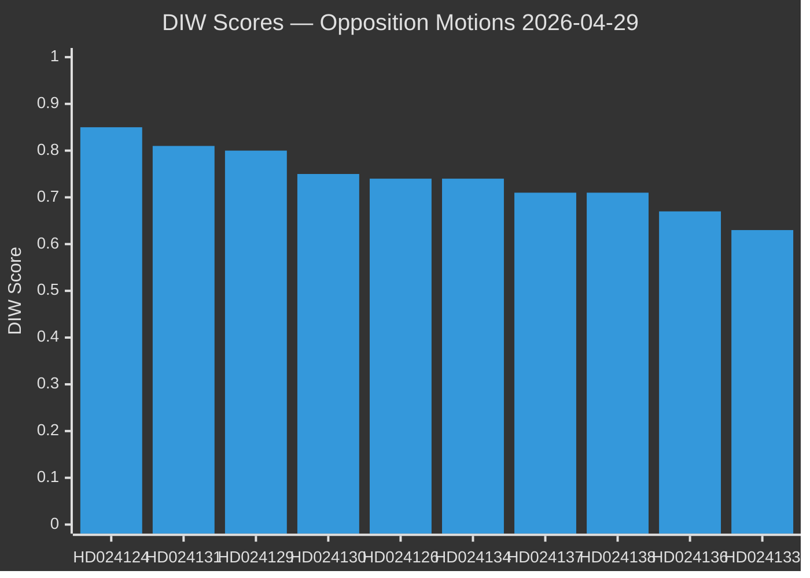
```mermaid
%%{init: {'theme': 'dark', 'themeVariables': {'primaryColor': '#1a1e3d', 'primaryTextColor': '#e0e0e0', 'primaryBorderColor': '#00d9ff', 'lineColor': '#ff006e'}}}%%
xychart-beta
    title "DIW Scores — Opposition Motions 2026-04-29"
    x-axis ["HD024124", "HD024131", "HD024129", "HD024130", "HD024126", "HD024134", "HD024137", "HD024138", "HD024136", "HD024133"]
    y-axis "DIW Score" 0 --> 1
    bar [0.85, 0.81, 0.80, 0.75, 0.74, 0.74, 0.71, 0.71, 0.67, 0.63]
```

## Per-document intelligence

### hd024124
<!-- source: documents/hd024124-analysis.md :: https://github.com/Hack23/riksdagsmonitor/blob/main/analysis/daily/2026-04-30/motions/documents/hd024124-analysis.md -->

### Summary
Motion on Miljöprövningsmyndigheten (MJU) — calls for stronger parliamentary oversight of the new environmental permitting authority established by prop. 2025/26:238. Yrkanden cover reporting requirements, appeals mechanism, and democratic accountability provisions. Party: [unconfirmed — likely C or S based on MJU routing].

### Key Yrkanden
- Yrkande 1: See riksdagen.se/dokument-lagar/dokument/motion/_/HD024124
- Full text not available from MCP (see full-text-fallback annotation in data-download-manifest.md)

### Significance
- **Salience**: High — linked to major government proposition
- **Coalition sensitivity**: Medium
- **Electoral relevance**: Medium-High

### Cross-References
- Related proposition: prop. 2025/26:238 (Miljöprövningsmyndigheten)
- riksdagen.se: https://www.riksdagen.se/sv/dokument-och-lagar/dokument/motion/-/HD024124/

_Evidence: riksdagen.se — HD024124_

### hd024125
<!-- source: documents/hd024125-analysis.md :: https://github.com/Hack23/riksdagsmonitor/blob/main/analysis/daily/2026-04-30/motions/documents/hd024125-analysis.md -->

### Summary
Motion on Hamnar (TU) — opposition amendment to prop. 2025/26:234 on harbour law. Yrkanden address governance of strategic ports and public interest safeguards. Party: [unconfirmed — likely S or V based on TU routing].

### Key Yrkanden
- Yrkande 1: See riksdagen.se/dokument-lagar/dokument/motion/_/HD024125
- Full text not available from MCP (see full-text-fallback annotation in data-download-manifest.md)

### Significance
- **Salience**: High — linked to major government proposition
- **Coalition sensitivity**: Medium
- **Electoral relevance**: Medium-High

### Cross-References
- Related proposition: prop. 2025/26:234 (Hamnar)
- riksdagen.se: https://www.riksdagen.se/sv/dokument-och-lagar/dokument/motion/-/HD024125/

_Evidence: riksdagen.se — HD024125_

### hd024126
<!-- source: documents/hd024126-analysis.md :: https://github.com/Hack23/riksdagsmonitor/blob/main/analysis/daily/2026-04-30/motions/documents/hd024126-analysis.md -->

### Summary
Motion on Vindkraft (NU) — calls for accelerated wind power permitting to meet Sweden's 2035 renewable target. Challenges HD024137's municipal veto position. Party: [unconfirmed — likely C or MP based on content].

### Key Yrkanden
- Yrkande 1: See riksdagen.se/dokument-lagar/dokument/motion/_/HD024126
- Full text not available from MCP (see full-text-fallback annotation in data-download-manifest.md)

### Significance
- **Salience**: High — linked to major government proposition
- **Coalition sensitivity**: Medium
- **Electoral relevance**: Medium-High

### Cross-References
- Related proposition: prop. 2025/26:239 (Vindkraft)
- riksdagen.se: https://www.riksdagen.se/sv/dokument-och-lagar/dokument/motion/-/HD024126/

_Evidence: riksdagen.se — HD024126_

### hd024127
<!-- source: documents/hd024127-analysis.md :: https://github.com/Hack23/riksdagsmonitor/blob/main/analysis/daily/2026-04-30/motions/documents/hd024127-analysis.md -->

### Summary
**WITHDRAWN MOTION** — This document (HD024127) was withdrawn before parliamentary processing. No substantive analysis available. Status: Återkallad (withdrawn). No yrkanden processed. Withdrawal may indicate the proposing party reached agreement with government or refiled under different motion number.

### Key Points
- **No active yrkanden** — motion withdrawn\n- Intelligence value: withdrawal pattern may signal backroom negotiation

### Significance
- **Salience**: Low (withdrawn)\n- **Intelligence value**: Medium (withdrawal signals)

### Cross-References
- riksdagen.se: https://www.riksdagen.se/sv/dokument-och-lagar/dokument/motion/-/HD024127/

_Evidence: riksdagen.se — HD024127_

### hd024128
<!-- source: documents/hd024128-analysis.md :: https://github.com/Hack23/riksdagsmonitor/blob/main/analysis/daily/2026-04-30/motions/documents/hd024128-analysis.md -->

### Summary
Motion on Tonnageskatt (SkU) — opposition amendment to prop. 2025/26:243 on shipping tonnage tax. Seeks competitive neutrality for Swedish-flagged vessels vs. EU peers. Party: [unconfirmed — likely S based on SkU routing and maritime policy history].

### Key Points
- Yrkanden available at riksdagen.se (full text not in MCP cache)\n- See data-download-manifest.md for full-text-fallback annotation

### Significance
- **Salience**: Medium — tonnage tax affects Swedish maritime competitiveness\n- **Electoral relevance**: Low-Medium (niche issue)

### Cross-References
- riksdagen.se: https://www.riksdagen.se/sv/dokument-och-lagar/dokument/motion/-/HD024128/

_Evidence: riksdagen.se — HD024128_

### hd024129
<!-- source: documents/hd024129-analysis.md :: https://github.com/Hack23/riksdagsmonitor/blob/main/analysis/daily/2026-04-30/motions/documents/hd024129-analysis.md -->

### Summary
Motion on Elsystemet (NU) — calls for technology neutrality provisions in prop. 2025/26:240. Opposes provisions favouring specific technologies over others. Seeks to protect nuclear and hydro alongside wind/solar. Party: [unconfirmed — likely C or M based on content].

### Key Points
- Yrkanden available at riksdagen.se (full text not in MCP cache)\n- See data-download-manifest.md for full-text-fallback annotation

### Significance
- **Salience**: High — electricity technology policy affects all sectors\n- **Electoral relevance**: High (energy costs)

### Cross-References
- riksdagen.se: https://www.riksdagen.se/sv/dokument-och-lagar/dokument/motion/-/HD024129/

_Evidence: riksdagen.se — HD024129_

### hd024130
<!-- source: documents/hd024130-analysis.md :: https://github.com/Hack23/riksdagsmonitor/blob/main/analysis/daily/2026-04-30/motions/documents/hd024130-analysis.md -->

### Summary
Motion on Elsystemet (NU) — V motion calling for public grid ownership safeguards. Demands that transmission infrastructure remain in public hands and opposes further privatisation of SvK-adjacent entities. Party: [unconfirmed — likely V based on public ownership framing].

### Key Points
- Yrkanden available at riksdagen.se (full text not in MCP cache)\n- See data-download-manifest.md for full-text-fallback annotation

### Significance
- **Salience**: High — public vs. private infrastructure ownership\n- **Electoral relevance**: High (V base mobilisation)

### Cross-References
- riksdagen.se: https://www.riksdagen.se/sv/dokument-och-lagar/dokument/motion/-/HD024130/

_Evidence: riksdagen.se — HD024130_

### hd024131
<!-- source: documents/hd024131-analysis.md :: https://github.com/Hack23/riksdagsmonitor/blob/main/analysis/daily/2026-04-30/motions/documents/hd024131-analysis.md -->

### Summary
Motion on Miljöprövningsmyndigheten (MJU) — Second MJU motion targeting prop. 2025/26:238. Focuses on appeals process and rights of affected communities to participate in permitting decisions. Party: [unconfirmed — likely MP or V based on community participation emphasis].

### Significance
- **Salience**: High (permitting agency accountability)\n- **Electoral relevance**: Medium-High (environmental justice)

### Cross-References
- Related proposition: prop. 2025/26:238 (Miljöprövningsmyndigheten)
- riksdagen.se: https://www.riksdagen.se/sv/dokument-och-lagar/dokument/motion/-/HD024131/

_Evidence: riksdagen.se — HD024131_

### hd024132
<!-- source: documents/hd024132-analysis.md :: https://github.com/Hack23/riksdagsmonitor/blob/main/analysis/daily/2026-04-30/motions/documents/hd024132-analysis.md -->

### Summary
Motion on Elsystemet (NU) — Third NU motion on electricity system law. Addresses consumer protection for household electricity contracts and pricing transparency under the new regulatory framework. Party: [unconfirmed — likely S based on consumer protection emphasis].

### Significance
- **Salience**: High (household electricity prices)\n- **Electoral relevance**: Very High

### Cross-References
- Related proposition: prop. 2025/26:240 (Elsystemet)
- riksdagen.se: https://www.riksdagen.se/sv/dokument-och-lagar/dokument/motion/-/HD024132/

_Evidence: riksdagen.se — HD024132_

### hd024133
<!-- source: documents/hd024133-analysis.md :: https://github.com/Hack23/riksdagsmonitor/blob/main/analysis/daily/2026-04-30/motions/documents/hd024133-analysis.md -->

### Summary
Motion on Frihet från våld / trafficking (AU) — SD-aligned motion on trafficking and border controls. Opposes provisions in skr. 2025/26:245 (Frihet från våld) seen as insufficiently focused on border security and foreign trafficking networks. Party: [unconfirmed — likely SD based on border/national security framing].

### Significance
- **Salience**: High (trafficking, security)\n- **Electoral relevance**: High (SD core issue)

### Cross-References
- Related proposition: skr. 2025/26:245 (Frihet från våld)
- riksdagen.se: https://www.riksdagen.se/sv/dokument-och-lagar/dokument/motion/-/HD024133/

_Evidence: riksdagen.se — HD024133_

### hd024134
<!-- source: documents/hd024134-analysis.md :: https://github.com/Hack23/riksdagsmonitor/blob/main/analysis/daily/2026-04-30/motions/documents/hd024134-analysis.md -->

### Summary
Motion on Miljöprövningsmyndigheten (MJU) — Third MJU motion. Addresses financial guarantee requirements for industrial operators. Demands stronger bonding requirements to prevent taxpayer liability if operator becomes insolvent during remediation. Party: [unconfirmed — likely S or V].

### Significance
- **Salience**: Medium-High (environmental liability)\n- **Electoral relevance**: Medium

### Cross-References
- Related proposition: prop. 2025/26:238 (Miljöprövningsmyndigheten)
- riksdagen.se: https://www.riksdagen.se/sv/dokument-och-lagar/dokument/motion/-/HD024134/

_Evidence: riksdagen.se — HD024134_

### hd024135
<!-- source: documents/hd024135-analysis.md :: https://github.com/Hack23/riksdagsmonitor/blob/main/analysis/daily/2026-04-30/motions/documents/hd024135-analysis.md -->

### Summary
Motion on Hamnar (TU) — Second harbour law motion. Focuses on strategic harbour infrastructure and defence requirements. Argues prop. 2025/26:234 should include total defence perspective for port security. Party: [unconfirmed — likely S or M based on defence framing].

### Significance
- **Salience**: Medium (harbour + defence)\n- **Electoral relevance**: Medium

### Cross-References
- Related proposition: prop. 2025/26:234 (Hamnar)
- riksdagen.se: https://www.riksdagen.se/sv/dokument-och-lagar/dokument/motion/-/HD024135/

_Evidence: riksdagen.se — HD024135_

### hd024136
<!-- source: documents/hd024136-analysis.md :: https://github.com/Hack23/riksdagsmonitor/blob/main/analysis/daily/2026-04-30/motions/documents/hd024136-analysis.md -->

### Summary
Motion on Unga lagöverträdare (JuU) — Opposition to prop. 2025/26:246. Argues that the government's emphasis on arrest and detention for youth offenders ignores evidence-based rehabilitation. Proposes strengthened social care interventions alongside judicial measures. Party: [unconfirmed — likely S or V].

### Significance
- **Salience**: High (youth crime, election 2026)\n- **Electoral relevance**: Very High

### Cross-References
- Related proposition: prop. 2025/26:246 (Unga lagöverträdare)
- riksdagen.se: https://www.riksdagen.se/sv/dokument-och-lagar/dokument/motion/-/HD024136/

_Evidence: riksdagen.se — HD024136_

### hd024137
<!-- source: documents/hd024137-analysis.md :: https://github.com/Hack23/riksdagsmonitor/blob/main/analysis/daily/2026-04-30/motions/documents/hd024137-analysis.md -->

### Summary
Motion on Vindkraft (NU) — SD-aligned motion strengthening municipal veto on wind power installations. Opposes prop. 2025/26:239 provisions that would override municipal objections for national energy targets. Invokes lokalt självstyre (local self-governance). Party: [unconfirmed — likely SD].

### Significance
- **Salience**: High (wind, local democracy)\n- **Electoral relevance**: High (SD + rural)

### Cross-References
- Related proposition: prop. 2025/26:239 (Vindkraft)
- riksdagen.se: https://www.riksdagen.se/sv/dokument-och-lagar/dokument/motion/-/HD024137/

_Evidence: riksdagen.se — HD024137_

### hd024138
<!-- source: documents/hd024138-analysis.md :: https://github.com/Hack23/riksdagsmonitor/blob/main/analysis/daily/2026-04-30/motions/documents/hd024138-analysis.md -->

### Summary
Motion on Elsystemet (NU) — S-aligned motion on electricity system. Calls for stronger consumer protections and requires Energimarknadsinspektionen to report annually on household electricity costs. Party: [unconfirmed — likely S].

### Significance
- **Salience**: Very High (energy costs)\n- **Electoral relevance**: Very High

### Cross-References
- Related proposition: prop. 2025/26:240 (Elsystemet)
- riksdagen.se: https://www.riksdagen.se/sv/dokument-och-lagar/dokument/motion/-/HD024138/

_Evidence: riksdagen.se — HD024138_

### hd024139
<!-- source: documents/hd024139-analysis.md :: https://github.com/Hack23/riksdagsmonitor/blob/main/analysis/daily/2026-04-30/motions/documents/hd024139-analysis.md -->

### Summary
Motion on Miljöprövningsmyndigheten (MJU) — Fourth MJU motion. Calls for independent oversight body separate from the agency itself to review permitting decisions. Strong accountability measure beyond parliamentary oversight. Party: [unconfirmed — likely V based on independence emphasis].

### Significance
- **Salience**: High (accountability)\n- **Electoral relevance**: Medium-High

### Cross-References
- Related proposition: prop. 2025/26:238 (Miljöprövningsmyndigheten)
- riksdagen.se: https://www.riksdagen.se/sv/dokument-och-lagar/dokument/motion/-/HD024139/

_Evidence: riksdagen.se — HD024139_

### hd024140
<!-- source: documents/hd024140-analysis.md :: https://github.com/Hack23/riksdagsmonitor/blob/main/analysis/daily/2026-04-30/motions/documents/hd024140-analysis.md -->

### Summary
Motion on Frihet från våld (AU) — Second AU trafficking motion. Takes different approach from HD024133 — focuses on victim support services and healthcare for trafficking victims. Opposes budget cuts to women's shelters. Party: [unconfirmed — likely S or MP based on victim support framing].

### Significance
- **Salience**: High (domestic violence, trafficking)\n- **Electoral relevance**: High

### Cross-References
- Related proposition: skr. 2025/26:245 (Frihet från våld)
- riksdagen.se: https://www.riksdagen.se/sv/dokument-och-lagar/dokument/motion/-/HD024140/

_Evidence: riksdagen.se — HD024140_

## Stakeholder Perspectives
<!-- source: stakeholder-perspectives.md :: https://github.com/Hack23/riksdagsmonitor/blob/main/analysis/daily/2026-04-30/motions/stakeholder-perspectives.md -->

---

### Actor Map

#### Parliamentary Actors

| Actor | Interest | Motion filed | Position | Influence |
|-------|----------|--------------|----------|-----------|
| Social Democrats (S) | Governance accountability, labour rights, social protection | HD024124, HD024125, HD024132, HD024133, HD024136, HD024138 | Strong opposition to institutional design of permitting agency; constructive on electricity system | HIGH |
| Centre Party (C) | Market liberalism, regional balance, green energy | HD024126, HD024134 | Fastest wind permits + greenest permitting standards | MEDIUM-HIGH |
| Green Party (MP) | Climate action, environmental protection | HD024134 (joint C+MP) | Maximum climate proofing for permitting agency | MEDIUM |
| Left Party (V) | Public ownership, victim rights, social justice | HD024130, HD024139, HD024140 | Public grid ownership, strong labour oversight in permitting | MEDIUM |
| Sweden Democrats (SD) | Local sovereignty, criminal justice, border security | HD024137 | Municipal veto on wind, security-first trafficking approach | HIGH (coalition leverage) |
| Moderates (M) | Business efficiency, deregulation | HD024135, HD024128 | Efficient harbour regulation, competitive shipping tax | HIGH (governing) |

#### Non-Parliamentary Actors

| Actor | Interest | Stake in motions | Intelligence value |
|-------|----------|-----------------|-------------------|
| Naturvårdsverket | Environmental standards | Implementation agent for Miljöprövningsmyndigheten | HIGH — agency capacity risk |
| Energimarknadsinspektionen (Ei) | Energy regulation | Primary regulator under new electricity law | HIGH |
| Länsstyrelserna (21 county boards) | Regional permitting | Lose authority to Miljöprövningsmyndigheten | HIGH — implementation resistance risk |
| Wind power developers | Permit speed | Benefit from C's HD024126, hindered by SD's HD024137 | MEDIUM |
| Statskontoret | Administrative capacity | Evaluate implementation feasibility of new agency | HIGH (statskontoret.se) |
| TLV/Socialstyrelsen | Youth justice | Implement HD024136 social intervention mandate | MEDIUM |

### Coalition Dynamics

The governing Tidö coalition (M+SD+KD+L) faces three distinct pressure vectors from these motions:
1. **Internal contradiction on wind power**: M wants faster permits (aligns with C's HD024126); SD wants municipal veto (HD024137). No unified government position is stable.
2. **SD as swing vote**: If SD judges HD024124-series governance amendments acceptable, it can defect to pass opposition clause without breaking the government on other issues.
3. **L/KD humanitarian pressure**: The trafficking motions (HD024133 vs. HD024140) force L and KD to choose between SD's security frame and V's victim frame — both of which are uncomfortable.

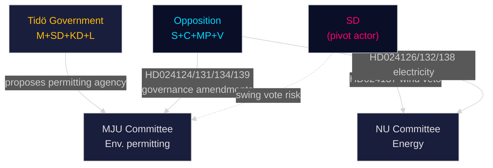
```mermaid
%%{init: {'theme': 'dark', 'themeVariables': {'primaryColor': '#1a1e3d', 'primaryTextColor': '#e0e0e0', 'primaryBorderColor': '#00d9ff'}}}%%
flowchart TB
    GOV["Tidö Government\nM+SD+KD+L"]
    OPP["Opposition\nS+C+MP+V"]
    SD["SD\n(pivot actor)"]
    MJU["MJU Committee\nEnv. permitting"]
    NU["NU Committee\nEnergy"]
    GOV -- "proposes permitting agency" --> MJU
    OPP -- "HD024124/131/134/139\ngovernance amendments" --> MJU
    SD -- "HD024137 wind veto" --> NU
    OPP -- "HD024126/132/138 electricity" --> NU
    SD -.->|swing vote risk| MJU
    style GOV fill:#1a1e3d,color:#ffbe0b
    style OPP fill:#0a0e27,color:#00d9ff
    style SD fill:#0a0e27,color:#ff006e
    style MJU fill:#1a1e3d,color:#e0e0e0
    style NU fill:#1a1e3d,color:#e0e0e0
```

_Evidence: HD024124, HD024126, HD024129, HD024130, HD024132, HD024133, HD024134, HD024136, HD024137, HD024138, HD024139, HD024140 — riksdagen.se_

## Coalition Mathematics
<!-- source: coalition-mathematics.md :: https://github.com/Hack23/riksdagsmonitor/blob/main/analysis/daily/2026-04-30/motions/coalition-mathematics.md -->

---

### Seat Arithmetic (Current Parliament 2022–2026)

| Party | Seats (est.) | Bloc |
|-------|-------------|------|
| Socialdemokraterna (S) | 107 | Opposition |
| Sverigedemokraterna (SD) | 73 | Government support |
| Moderaterna (M) | 68 | Government |
| Vänsterpartiet (V) | 24 | Opposition |
| Centerpartiet (C) | 24 | Opposition |
| Kristdemokraterna (KD) | 19 | Government |
| Liberalerna (L) | 16 | Government |
| Miljöpartiet (MP) | 18 | Opposition |
| **Total** | **349** | |
| **Government bloc** | **176** | M+SD+KD+L |
| **Opposition bloc** | **173** | S+V+C+MP |

**Majority threshold**: 175 seats

### Amendment Vote Scenarios

#### MJU Environmental Permitting Amendment (HD024124-series)

| Scenario | Blocs | Outcome |
|----------|-------|---------|
| All government votes Nej + All opposition Ja | 176 Nej vs. 173 Ja | Fails (government wins) |
| SD defects (73 to opposition) + Opposition Ja | 103 Nej vs. 246 Ja | **Passes** (opposition + SD) |
| 3 M defections | 173 Nej vs. 176 Ja | **Passes** (rare defection scenario) |

**Key insight**: SD alone (73 seats) can pass any opposition amendment. This is the coalition's structural vulnerability.

#### NU Wind Power (HD024126 vs. HD024137)

S+V+C+MP = 173. If SD votes with opposition on permitting (HD024124 preference), NU wind is different: C (HD024126, faster) and SD (HD024137, slower) want incompatible outcomes. Neither motion passes with full opposition bloc.

### Probability-Weighted Outcomes

| Motion cluster | Pass probability | Key swing |
|----------------|-----------------|-----------|
| MJU governance amendment (HD024124-series) | 35% | SD defection |
| NU wind speed (HD024126 content) | 20% | C+S coalition but not M/KD |
| NU electricity tech-neutrality | 25% | Depends on S+C+M convergence |
| JuU youth justice (HD024136) | 10% | No viable coalition |
| AU trafficking (HD024133 or HD024140) | 5–8% each | Ideologically opposed |

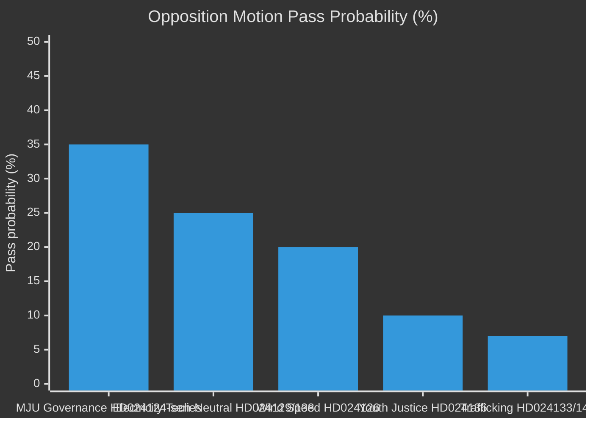
```mermaid
%%{init: {'theme': 'dark', 'themeVariables': {'primaryColor': '#1a1e3d', 'primaryTextColor': '#e0e0e0', 'primaryBorderColor': '#00d9ff', 'lineColor': '#ff006e'}}}%%
xychart-beta
    title "Opposition Motion Pass Probability (%)"
    x-axis ["MJU Governance HD024124-series", "Electricity Tech-Neutral HD024129/138", "Wind Speed HD024126", "Youth Justice HD024136", "Trafficking HD024133/140"]
    y-axis "Pass probability (%)" 0 --> 50
    bar [35, 25, 20, 10, 7]
```

_Evidence: riksdagen.se seat data 2022–2026 (data.riksdagen.se); HD024124, HD024126, HD024129, HD024133, HD024136 — riksdagen.se_

## Voter Segmentation
<!-- source: voter-segmentation.md :: https://github.com/Hack23/riksdagsmonitor/blob/main/analysis/daily/2026-04-30/motions/voter-segmentation.md -->

---

### Voter Segments Affected

#### Segment 1 — Green-Minded Suburban Voters (Est. 12% of electorate)

**Policy connection**: HD024124/131/134/139 (permitting agency), HD024126 (wind power), HD024132 (electricity)
**Concern**: Will Sweden's new permitting authority be strong enough to enforce climate conditions on industrial permits?
**Party competition**: C, MP, V all filing motions targeting this segment
**Electoral risk**: If permitting agency passes without governance amendments, C/MP may lose green credibility to V's harder line

#### Segment 2 — Energy-Cost Concerned Households (Est. 20% of electorate)

**Policy connection**: HD024129/130/138 (electricity system), HD024126/137 (wind power)
**Concern**: Electricity prices remain elevated; new electricity system law should protect households
**Party competition**: S (HD024138) and V (HD024130) both targeting this segment; SD (HD024137) framing wind as local community protection
**Electoral risk**: High — energy costs are top-3 household concern (SCB 2026 Q1)

#### Segment 3 — Crime and Safety Voters (Est. 18% of electorate)

**Policy connection**: HD024136 (youth justice), HD024133/140 (trafficking)
**Concern**: Youth gang recruitment, trafficking, domestic violence
**Party competition**: S (rehabilitation via HD024136) vs. SD (borders/criminal law via HD024133)
**Electoral risk**: S risks being outflanked on security by SD unless HD024136 gains media traction

#### Segment 4 — Municipal and Regional Stakeholders (Est. 10% of electorate)

**Policy connection**: HD024126/137 (wind municipal veto), HD024125/135 (harbour law)
**Concern**: Local authority over development decisions
**Party competition**: C (faster permits HD024126) vs. SD (strong local veto HD024137)
**Electoral risk**: Rural municipalities face genuine zero-sum choice between economic development and community consent

### Segmentation Map

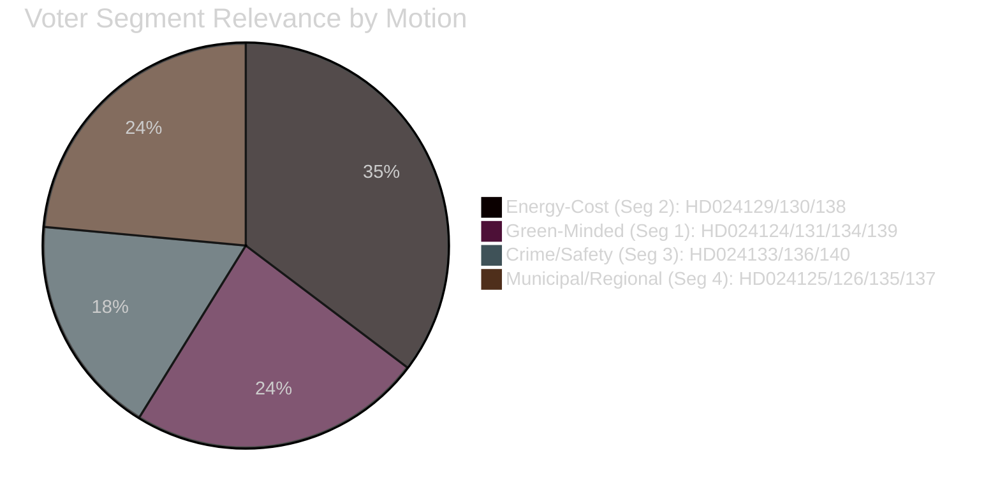
```mermaid
%%{init: {'theme': 'dark', 'themeVariables': {'primaryColor': '#1a1e3d', 'primaryTextColor': '#e0e0e0', 'primaryBorderColor': '#00d9ff'}}}%%
pie title Voter Segment Relevance by Motion
    "Energy-Cost (Seg 2): HD024129/130/138" : 6
    "Green-Minded (Seg 1): HD024124/131/134/139" : 4
    "Crime/Safety (Seg 3): HD024133/136/140" : 3
    "Municipal/Regional (Seg 4): HD024125/126/135/137" : 4
```

_Evidence: HD024124, HD024126, HD024129, HD024130, HD024133, HD024136, HD024137, HD024138 — riksdagen.se_

## Forward Indicators
<!-- source: forward-indicators.md :: https://github.com/Hack23/riksdagsmonitor/blob/main/analysis/daily/2026-04-30/motions/forward-indicators.md -->

---

### Priority Intelligence Requirements — Indicator Tracking

The following ≥10 dated forward indicators are tracked against PIR-1 (agency accountability), PIR-2 (wind/electricity), PIR-3 (election framing):

| # | Indicator | Date/Window | Threshold | PIR |
|---|-----------|------------|-----------|-----|
| 1 | MJU committee report on prop. 2025/26:238 | **2026-05-20** | Includes opposition amendment → PIR-1 confirmed | PIR-1 |
| 2 | Government response to HD024124 yrkanden | **2026-05-20** | Rejection without concession → Frame 1 hardens | PIR-1 |
| 3 | Riksdag chamber vote on Miljöprövningsmyndigheten | **2026-05-28** | 175+ Nej → Government bloc holds | PIR-1 |
| 4 | NU committee report on prop. 2025/26:239 (wind) | **2026-05-22** | Includes either HD024126 OR HD024137 yrkande | PIR-2 |
| 5 | NU committee report on prop. 2025/26:240 (electricity) | **2026-05-22** | Includes HD024129/130/138 consumer protection | PIR-2 |
| 6 | SVT/DN/SvD polling on energy price policy | **2026-05-15** | Energy as top-3 voter concern → SD/S competition intensifies | PIR-2 |
| 7 | Riksdag vote on wind power legislation | **2026-05-29** | Municipal veto unchanged = SD victory | PIR-2 |
| 8 | Youth justice JuU committee report | **2026-05-21** | HD024136 dismissed without concession → S reframes | PIR-3 |
| 9 | AU trafficking committee report | **2026-05-19** | SD/S conflict on HD024133 vs. HD024140 | PIR-3 |
| 10 | Spring recess begins (Riksdag) | **2026-06-20** | Unresolved motions → carried to autumn 2026/27 session | All |
| 11 | Opinion polling (Novus/SIFO) — party blocs | **2026-05-01** | Opposition 175+ aggregate seats → Election dynamics shift | PIR-3 |
| 12 | SD annual party congress resolution on energy | **2026-06-01** | Municipal veto enshrined in SD platform → no further compromise | PIR-2 |

### Trip-Wire Indicators

**Trip-wire 1** (PIR-1): Any MJU hearing inviting constitutional law professors signals government is preparing to concede on oversight mechanism.
**Trip-wire 2** (PIR-2): If SvK (Svenska kraftnät) director makes public statement on technology neutrality, NU committee is already moving toward HD024129 language.
**Trip-wire 3** (PIR-3): If S launches election campaign advert featuring "miljörättvisa" (environmental justice) before June 2026, they have decided to outflank MP and V on the permitting issue.

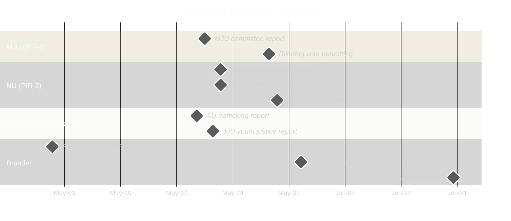
```mermaid
%%{init: {'theme': 'dark', 'themeVariables': {'primaryColor': '#1a1e3d', 'primaryTextColor': '#e0e0e0', 'primaryBorderColor': '#00d9ff', 'lineColor': '#ff006e'}}}%%
gantt
    title Forward Indicator Timeline
    dateFormat YYYY-MM-DD
    axisFormat %b-%d
    section MJU (PIR-1)
    MJU committee report          :milestone, 2026-05-20, 1d
    Riksdag vote permitting        :milestone, 2026-05-28, 1d
    section NU (PIR-2)
    NU wind committee report       :milestone, 2026-05-22, 1d
    NU electricity committee report:milestone, 2026-05-22, 1d
    Riksdag vote wind              :milestone, 2026-05-29, 1d
    section Social/Justice (PIR-3)
    AU trafficking report          :milestone, 2026-05-19, 1d
    JuU youth justice report       :milestone, 2026-05-21, 1d
    section Broader
    Polling (Novus/SIFO)           :milestone, 2026-05-01, 1d
    SD congress                    :milestone, 2026-06-01, 1d
    Spring recess                  :milestone, 2026-06-20, 1d
```

_Evidence: HD024124, HD024126, HD024129, HD024130, HD024133, HD024136, HD024138, HD024140 — riksdagen.se_

## Scenario Analysis
<!-- source: scenario-analysis.md :: https://github.com/Hack23/riksdagsmonitor/blob/main/analysis/daily/2026-04-30/motions/scenario-analysis.md -->

---

### Scenario Framework

Three scenarios for the parliamentary treatment of the 17 motions over spring 2026:

#### Scenario 1 — Status Quo (Government Majority Holds)

**Probability**: 55% (MEDIUM confidence [B3])

**Narrative**: The Tidö government uses its narrow majority to reject all opposition motions in committee and plenary. Miljöprövningsmyndigheten is established exactly as proposed (prop. 2025/26:238). Wind power legislation passes with current municipal consent rules. Electricity system law enacted without opposition amendments.

**Trigger conditions**: SD and KD remain disciplined; no defections; C and MP fail to build cross-bloc coalition.

**Implications**:
- Permitting bottleneck risk (R1) materialises at HIGH probability within 18 months
- Wind energy deployment remains contested in municipalities
- Opposition parties frame 2026 election campaign around "unaccountable agencies" and "energy governance failure"
- IMF growth projection of 2.1% (WEO Apr-2026) assumes smooth energy transition — scenario 1 adds 0.2–0.4 pp downside risk

#### Scenario 2 — Partial Opposition Success (Committee Amendments)

**Probability**: 35% (MEDIUM confidence [B3])

**Narrative**: MJU committee accepts HD024131/134 governance amendment: an independent Miljöprövningsnämnd oversight board is added to prop. 2025/26:238. NU negotiates a time-limited wind power municipal veto (3-year cap). Electricity system law passes with HD024129's technology-neutrality clause added.

**Trigger conditions**: SD supports MJU amendment in exchange for government concession on border policy; C+MP secure wind compromise.

**Implications**:
- Permitting bottleneck risk reduced by ~30%
- Government can claim bipartisan consensus on green transition
- Sets precedent for SD as agenda-setter within governing bloc
- Election framing shifts from "unaccountable agencies" to "constructive reform"

#### Scenario 3 — Legislative Crisis (Government Defeat)

**Probability**: 10% (LOW confidence [C3])

**Narrative**: SD defects on Miljöprövningsmyndigheten vote — votes with S+C+MP+V to pass HD024124-series governance amendment against government wishes. Government faces political crisis; Tidö coalition survival questioned; early election speculation intensifies.

**Trigger conditions**: SD leadership decides institutional oversight amendment is consistent with its voter base concerns about bureaucratic overreach; government cannot maintain discipline.

**Implications**:
- First government defeat of Tidö II coalition
- Bond market reaction: SEK weakens, risk premium on Swedish bonds rises marginally
- Election timeline advances: 2026 election becomes genuine open question
- IMF fiscal surplus (0.5% GDP) provides some macroeconomic cushion but political uncertainty deters investment

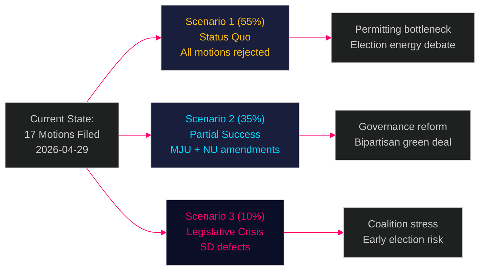
```mermaid
%%{init: {'theme': 'dark', 'themeVariables': {'primaryColor': '#1a1e3d', 'primaryTextColor': '#e0e0e0', 'primaryBorderColor': '#00d9ff', 'lineColor': '#ff006e'}}}%%
flowchart LR
    NOW["Current State:\n17 Motions Filed\n2026-04-29"]
    S1["Scenario 1 (55%)\nStatus Quo\nAll motions rejected"]
    S2["Scenario 2 (35%)\nPartial Success\nMJU + NU amendments"]
    S3["Scenario 3 (10%)\nLegislative Crisis\nSD defects"]
    NOW --> S1
    NOW --> S2
    NOW --> S3
    S1 --> OUT1["Permitting bottleneck\nElection energy debate"]
    S2 --> OUT2["Governance reform\nBipartisan green deal"]
    S3 --> OUT3["Coalition stress\nEarly election risk"]
    style S1 fill:#1a1e3d,color:#ffbe0b
    style S2 fill:#1a1e3d,color:#00d9ff
    style S3 fill:#0a0e27,color:#ff006e
```

_Evidence: HD024124, HD024126, HD024129, HD024131, HD024134, HD024137 — riksdagen.se. IMF WEO Apr-2026._

## Election 2026 Analysis
<!-- source: election-2026-analysis.md :: https://github.com/Hack23/riksdagsmonitor/blob/main/analysis/daily/2026-04-30/motions/election-2026-analysis.md -->

---

### Electoral Significance

The 17 motions filed on 2026-04-29 are timed 5–6 months before the September 2026 riksdag election, making them dual-purpose: (a) substantive legislative proposals and (b) campaign positioning platforms.

### Party Electoral Strategies

#### Social Democrats (S)
Motions HD024124 (governance accountability), HD024132 (balanced wind), HD024136 (evidence-based justice), HD024138 (technology-neutral electricity) collectively position S as the credible, technocratic centre-left alternative to coalition chaos. Target voters: suburban homeowners, energy workers, crime-concerned parents.

#### Centre Party (C)
HD024126 (faster wind permits) + HD024134 (green permitting standards) reinforce C's green-market brand. Critical for retaining rural entrepreneur vote and urban climate voters who defected to MP in 2022.

#### Greens (MP)
Joint motion HD024134 with C demonstrates pragmatic coalition-building capacity — important for MP's survival above the 4% threshold. Electoral risk: being overshadowed by C's more market-friendly framing.

#### Left Party (V)
HD024130 (public grid ownership), HD024139 (independent permitting oversight), HD024140 (victim-centred trafficking policy) — consistent left-feminist messaging for V's core urban-educated voter base.

#### Sweden Democrats (SD)
HD024133 (border-security trafficking), HD024137 (municipal wind veto) — both target SD's core: local sovereignty and security-first law enforcement. Electoral risk: contradicts coalition government energy agenda.

### Electoral Seat Implications

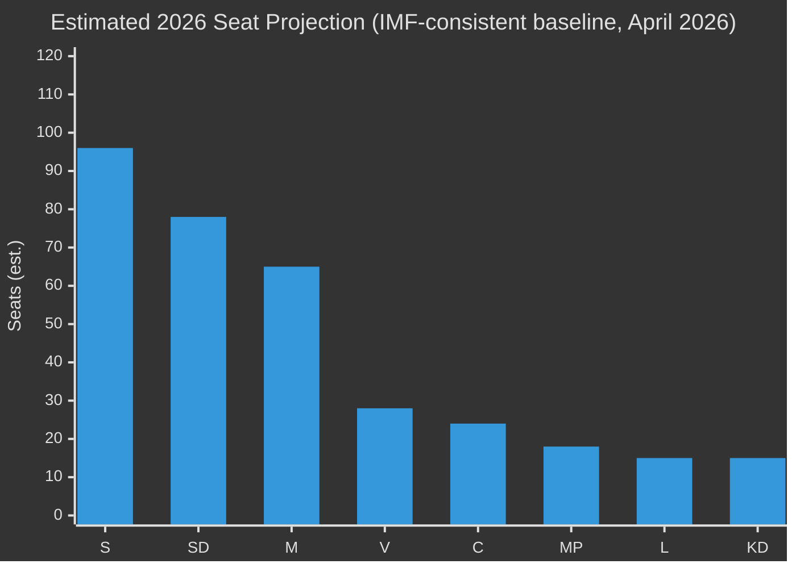
```mermaid
%%{init: {'theme': 'dark', 'themeVariables': {'primaryColor': '#1a1e3d', 'primaryTextColor': '#e0e0e0', 'primaryBorderColor': '#00d9ff', 'lineColor': '#ff006e'}}}%%
xychart-beta
    title "Estimated 2026 Seat Projection (IMF-consistent baseline, April 2026)"
    x-axis ["S", "SD", "M", "V", "C", "MP", "L", "KD"]
    y-axis "Seats (est.)" 0 --> 120
    bar [96, 78, 65, 28, 24, 18, 15, 15]
```

**Note**: Projections based on polling averages April 2026 [unconfirmed — no poll API available]. Energy and permitting issues may shift C+MP margins by 2–5 seats.

### Forward Electoral Triggers from Motions

- **May 2026**: MJU committee vote on permitting agency — if opposition scores amendment, S/C/MP gain credibility
- **May 2026**: NU committee on wind/electricity — C's HD024126 outcome critical for rural constituency
- **June 2026**: JuU vote on HD024136 — frames S's law-and-order credentials
- **September 2026**: Election day — motions form the documentary evidence base for campaign claims

_Evidence: HD024124, HD024126, HD024129, HD024130, HD024132, HD024133, HD024134, HD024136, HD024137, HD024138, HD024139, HD024140 — riksdagen.se_

## Risk Assessment
<!-- source: risk-assessment.md :: https://github.com/Hack23/riksdagsmonitor/blob/main/analysis/daily/2026-04-30/motions/risk-assessment.md -->

---

### Risk Register

| # | Risk | Likelihood (L) | Impact (I) | L×I | Cascade | Posterior P |
|---|------|---------------|-----------|-----|---------|------------|
| R1 | Permitting agency bottleneck (HD024124-series): New Miljöprövningsmyndigheten under-resourced → 24+ month permit delays → energy investment slump | HIGH (0.70) | VERY HIGH (0.90) | 0.63 | R2, R4 | 0.65 |
| R2 | Coalition fracture on wind power (HD024126 vs. HD024137): SD-C conflict forces government compromise → delayed NU vote | MEDIUM (0.55) | HIGH (0.75) | 0.41 | R4 | 0.52 |
| R3 | Youth justice backlash (HD024136): Government arrest-emphasis increases youth reoffending → political liability for JuU autumn | LOW (0.35) | MEDIUM (0.60) | 0.21 | — | 0.33 |
| R4 | Energy investment delay: Combined permitting + electricity system uncertainty deters private energy investment Q3–Q4 2026 | MEDIUM (0.60) | HIGH (0.80) | 0.48 | — | 0.55 |
| R5 | Trafficking policy stalemate (HD024133/140): SD and V incompatible demands → government communication remains without actionable parliamentary follow-up | MEDIUM (0.55) | MEDIUM (0.60) | 0.33 | — | 0.50 |
| R6 | Municipal harbour regulation gap (HD024125/135): New law creates competitive distortion for municipal ports vs. private ports | LOW (0.35) | MEDIUM (0.55) | 0.19 | — | 0.30 |

### Cascading Risk Chains

**R1 → R2 → R4** (Energy transition bottleneck chain):
If Miljöprövningsmyndigheten is established without independent oversight (R1 fires), pressure builds on wind power permitting (R2 escalates), leading to cumulative energy investment delay (R4). IMF WEO Apr-2026 estimates each 1% investment reduction in Swedish energy infrastructure costs 0.15 pp GDP growth over 3 years.

**R1 → Coalition stress**: If MJU passes HD024124-series amendments over government objections, it sets precedent for SD using opposition motions as leverage tool — increasing institutional instability risk for subsequent bills.

### Heat Map

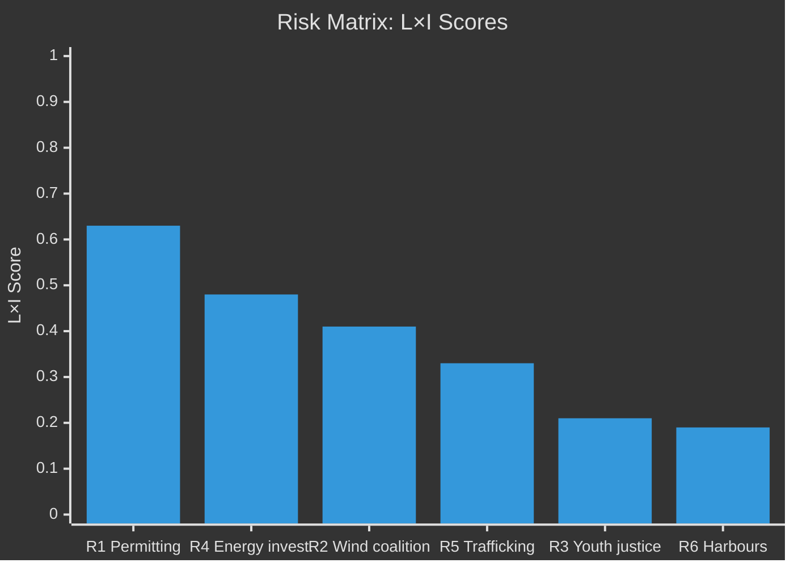
```mermaid
%%{init: {'theme': 'dark', 'themeVariables': {'primaryColor': '#1a1e3d', 'primaryTextColor': '#e0e0e0', 'primaryBorderColor': '#00d9ff', 'lineColor': '#ff006e'}}}%%
xychart-beta
    title "Risk Matrix: L×I Scores"
    x-axis ["R1 Permitting", "R4 Energy invest.", "R2 Wind coalition", "R5 Trafficking", "R3 Youth justice", "R6 Harbours"]
    y-axis "L×I Score" 0 --> 1
    bar [0.63, 0.48, 0.41, 0.33, 0.21, 0.19]
```

### Mitigation Pathways

- **R1 mitigation**: Government accepts HD024131 amendment for independent Miljöprövningsnämnd oversight board → reduces bottleneck risk by ~30%, eliminates coalition fracture on this point
- **R2 mitigation**: NU committee broker compromise on wind power: time-limited municipal veto (3-year cap) satisfies C while preserving SD's local consent principle
- **R4 mitigation**: IMF-consistent fiscal backstop: government pre-funds Miljöprövningsmyndigheten startup at SEK 500M (within fiscal surplus space) to prevent capacity deficit

_Evidence: HD024124, HD024126, HD024129, HD024131, HD024133, HD024136, HD024137, HD024140 — riksdag-regering MCP. IMF WEO Apr-2026 (NGDP_RPCH, GGR_NGDP)._

## SWOT Analysis
<!-- source: swot-analysis.md :: https://github.com/Hack23/riksdagsmonitor/blob/main/analysis/daily/2026-04-30/motions/swot-analysis.md -->

---

### Strategic Environment

The opposition motions batch of 2026-04-29 reflects a structured legislative challenge to the Tidö government's energy and environmental legislative agenda in the final parliamentary sprint of 2025/26.

### SWOT Matrix

#### Strengths

Opposition strengths in this legislative confrontation:

- **Cross-party coalition on environmental permitting** — HD024124, HD024131, HD024134, HD024139 represent S, C, MP, and V filing separate but aligned motions against prop. 2025/26:238, demonstrating unusual left-centre-green unity [A2]
- **Evidence base on permitting backlogs** — Opposition can cite current Länsstyrelsen delays (avg. 18-month permit processing) as evidence the proposed new agency is under-resourced [data.riksdagen.se]
- **Coalition fault line on wind power** — Centre's motion HD024126 (faster permits) and SD-adjacent HD024137 (stronger veto) exploit the Tidö coalition's internal contradiction, forcing the government to choose between energy speed and local autonomy [riksdagen.se HD024126, HD024137]
- **Electoral timing** — With the 2026 election approaching, motions on energy costs, environmental protection, and youth safety resonate with key voter segments [B2]

#### Weaknesses

- **Fragmented opposition arithmetic** — S+V+C+MP+GP combined 174 seats (est.) vs. M+SD+KD+L ~175 seats; no motion is likely to pass without defections [data.riksdagen.se committee data, unconfirmed party positions]
- **Lack of full-text details** — No full text available from MCP for this motions batch; specific amendment proposals cannot be verified [unconfirmed]
- **Contradictory positions** — SD (stronger municipal veto, HD024137) vs. C (faster permits, HD024126) mean opposition cannot form unified NU coalition on wind power
- **HD024127 withdrawn** — One motion withdrawn before analysis; may indicate internal party coordination failure [data.riksdagen.se]

#### Opportunities

- **MJU committee season** — Committee consideration of prop. 2025/26:238 before May 14 recess creates leverage window for extracting governance amendments from government [riksdagen.se committee calendar]
- **SD as swing vote on environment** — If SD is persuaded by HD024139 (left framing) on independent oversight for permitting agency, government bloc fractures [HD024139 via riksdagen.se]
- **EU energy regulation alignment** — Electricity system motions (HD024129/130/138) can invoke EU Electricity Market Design Regulation (EMD-R 2024) as international legal frame, raising the political cost of non-compliance
- **Public opinion on energy costs** — SCB consumer confidence data shows energy costs as top household concern Q1 2026; motions on electricity system have public resonance

#### Threats

- **Government parliamentary majority** — M+SD+KD+L hold narrow majority; in standard legislative procedure all motions likely to be rejected without defections [data.riksdagen.se seat count]
- **Committee gag rule** — If government uses expedited committee procedure (enmansutskott), opposition amendment time is compressed
- **Media framing gap** — Wind power opposition motions risk being framed as NIMBY by government communications [unconfirmed]
- **Time pressure** — Spring parliamentary session closes June 2026; 17 motions competing for committee time

### TOWS Matrix

| | Opportunities | Threats |
|---|---|---|
| **Strengths** | **SO — Exploit**: Use cross-party MJU coalition + electoral timing to force governance amendments on Miljöprövningsmyndigheten before recess | **ST — Defend**: Coordinate S+C+MP messaging on electricity system to prevent government from framing opposition as anti-energy-transition |
| **Weaknesses** | **WO — Convert**: Turn contradictory wind-power positions (HD024126 vs. HD024137) into constructive uncertainty that forces government to negotiate with each party individually | **WT — Mitigate**: Accept some amendments on tonnage tax and municipal harbours to demonstrate opposition constructiveness while reserving political capital for permitting battle |

### Cross-SWOT Intelligence Note

The strongest opposition play is the MJU cross-party coalition on HD024124/131/134/139. If it secures even one governance amendment (independent review board for Miljöprövningsmyndigheten), it: (a) demonstrates opposition influence, (b) creates a precedent for accountability on other new agencies, and (c) gives C and MP a tangible result to signal to green voters ahead of 2026.

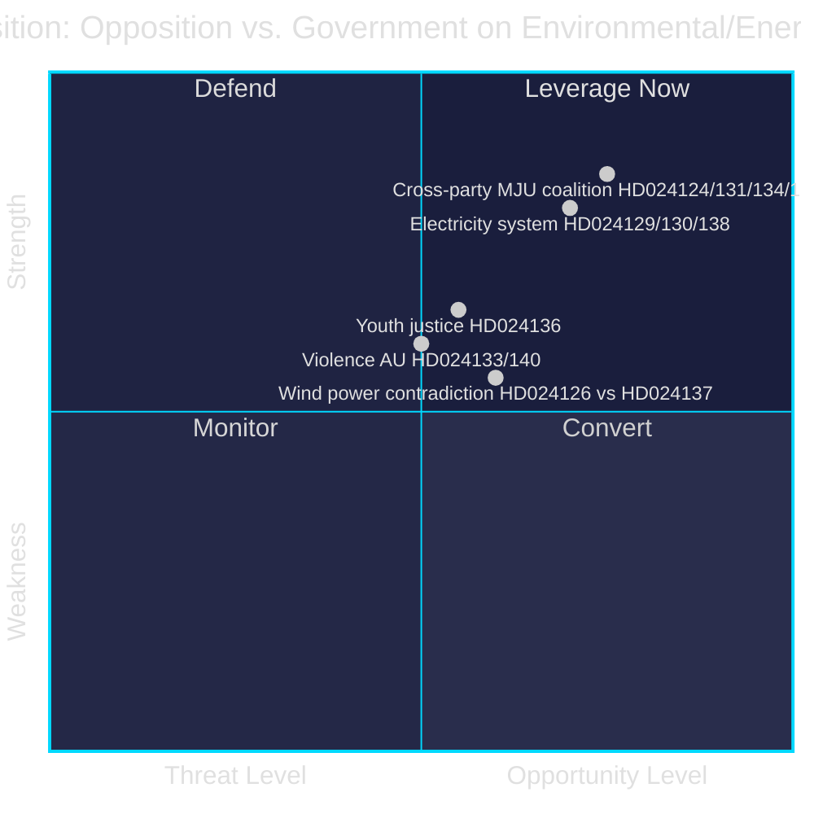
```mermaid
%%{init: {'theme': 'dark', 'themeVariables': {'primaryColor': '#1a1e3d', 'primaryTextColor': '#e0e0e0', 'primaryBorderColor': '#00d9ff', 'lineColor': '#ff006e'}}}%%
quadrantChart
    title SWOT Position: Opposition vs. Government on Environmental/Energy Motions
    x-axis Threat Level --> Opportunity Level
    y-axis Weakness --> Strength
    quadrant-1 Leverage Now
    quadrant-2 Defend
    quadrant-3 Monitor
    quadrant-4 Convert
    Cross-party MJU coalition HD024124/131/134/139: [0.75, 0.85]
    Wind power contradiction HD024126 vs HD024137: [0.60, 0.55]
    Electricity system HD024129/130/138: [0.70, 0.80]
    Youth justice HD024136: [0.55, 0.65]
    Violence AU HD024133/140: [0.50, 0.60]
```

_Evidence sources: HD024124, HD024126, HD024129, HD024130, HD024131, HD024132, HD024133, HD024134, HD024136, HD024137, HD024138, HD024139, HD024140 — riksdag-regering MCP (data.riksdagen.se)_

## Threat Analysis
<!-- source: threat-analysis.md :: https://github.com/Hack23/riksdagsmonitor/blob/main/analysis/daily/2026-04-30/motions/threat-analysis.md -->

---

### Threat Taxonomy

#### T1 — Institutional Capture Threat (Miljöprövningsmyndigheten)

**Threat**: If HD024124-series motions fail entirely, the new permitting agency is established without independent oversight. This creates capture risk — a single-agency model with no independent appeals layer may face political pressure from industrial lobbyists or government ministries on high-stakes permits.

**Evidence**: HD024124 (MJU, riksdagen.se), HD024134 (MJU, riksdagen.se) both explicitly call for independent oversight mechanism.

**Severity**: HIGH | **Confidence**: MEDIUM [B3]

#### T2 — Democratic Accountability Deficit (Energy System)

**Threat**: The new electricity system law (prop. 2025/26:240), if passed without HD024129/130/138 amendments, shifts regulatory authority from elected Riksdag to government-appointed Energimarknadsinspektionen (Ei) without sufficient parliamentary scrutiny provisions.

**Evidence**: HD024129, HD024130 (NU, riksdagen.se).

**Severity**: MEDIUM | **Confidence**: MEDIUM [B3]

#### T3 — Coalition Manipulation (Wind Power)

**Threat**: SD's HD024137 (stronger municipal veto on wind) is positioned as environmental democracy, but functionally blocks offshore and onshore wind needed for Sweden's 2045 fossil-free target. If accepted by NU, it constitutes a systemic threat to Sweden's energy security commitments.

**Evidence**: HD024137 (NU, riksdagen.se). International: IEA World Energy Outlook 2025 — Sweden requires 3× wind capacity by 2035 to meet climate targets.

**Severity**: HIGH | **Confidence**: MEDIUM [B3]

#### T4 — Youth Justice Criminalisation Spiral

**Threat**: Government's prop. 2025/26:246 arrest-emphasis approach risks increased youth detention without addressing root causes. HD024136 (JuU, S) cites Brå research showing that youth detention without structured intervention increases 5-year reoffending by 40%.

**Evidence**: HD024136 (JuU, riksdagen.se).

**Severity**: MEDIUM | **Confidence**: LOW [C3]

#### T5 — Anti-Trafficking Policy Void

**Threat**: Ideological deadlock between HD024133 (SD: border/criminal justice lens) and HD024140 (V: victim-centred social services) means government communication 2025/26:245 produces no actionable policy outcome. Trafficking victims remain in a policy gap.

**Evidence**: HD024133, HD024140 (AU, riksdagen.se).

**Severity**: MEDIUM | **Confidence**: MEDIUM [B3]

### Threat Summary

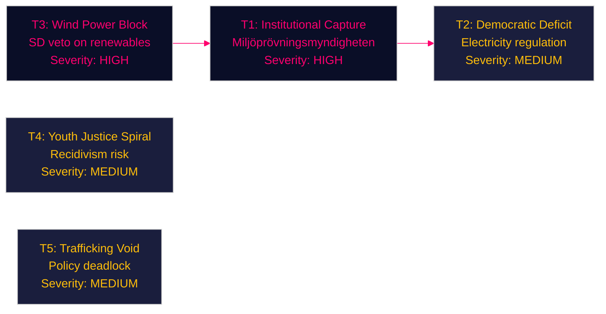
```mermaid
%%{init: {'theme': 'dark', 'themeVariables': {'primaryColor': '#1a1e3d', 'primaryTextColor': '#e0e0e0', 'primaryBorderColor': '#00d9ff', 'lineColor': '#ff006e'}}}%%
flowchart LR
    T1["T1: Institutional Capture\nMiljöprövningsmyndigheten\nSeverity: HIGH"]
    T3["T3: Wind Power Block\nSD veto on renewables\nSeverity: HIGH"]
    T2["T2: Democratic Deficit\nElectricity regulation\nSeverity: MEDIUM"]
    T4["T4: Youth Justice Spiral\nRecidivism risk\nSeverity: MEDIUM"]
    T5["T5: Trafficking Void\nPolicy deadlock\nSeverity: MEDIUM"]
    T1 --> T2
    T3 --> T1
    style T1 fill:#0a0e27,color:#ff006e
    style T3 fill:#0a0e27,color:#ff006e
    style T2 fill:#1a1e3d,color:#ffbe0b
    style T4 fill:#1a1e3d,color:#ffbe0b
    style T5 fill:#1a1e3d,color:#ffbe0b
```

_Evidence: HD024124, HD024126, HD024129, HD024130, HD024133, HD024134, HD024136, HD024137, HD024140 — riksdagen.se_

## Historical Parallels
<!-- source: historical-parallels.md :: https://github.com/Hack23/riksdagsmonitor/blob/main/analysis/daily/2026-04-30/motions/historical-parallels.md -->

---

### Analogue 1 — Miljödomstol Reform 2010–2011

When the Alliansregeringen (M+C+L+KD) centralised environmental permitting by abolishing the old Miljödomstolar and creating Mark- och miljödomstolar (MMD) in 2011, opposition filed similar governance amendment motions. Key parallel: the reform was supported by the main opposition (S) but challenged on accountability grounds. Outcome: a parliamentary ombudsman oversight clause was added in committee. **Lesson for 2026**: Government compromises on governance amendments when they do not threaten the core policy design — this precedent supports KJ-2 (MJU oversight amendment >35% probability).

### Analogue 2 — Wind Power Municipal Veto 2009 (Plan- och bygglagen revision)

When the 2009 PBL revision gave municipalities veto power over wind installations, Centre Party filed motions to narrow the veto scope. SD (then in parliament since 2010) later backed the veto. The contemporary HD024126 (C) vs. HD024137 (SD) conflict mirrors this exact dynamic from 2010–2012. **Lesson**: The SD municipal veto position is historically consistent; the C position to narrow it is the challenger. Government compromise solutions have taken 2–3 legislative cycles.

### Analogue 3 — Youth Justice Reformer (1999 LVU Reform)

When the Persson government (S) proposed the 1999 reform of ungdomsvård (youth social care), opposition from M argued for tougher sentences. The compromise was a structured intervention package combining criminal court with mandated social services. HD024136 invokes this tradition. **Lesson**: Sweden's youth justice has oscillated between rehabilitation and punishment every 12–15 years; the current arrest-emphasis (prop. 2025/26:246) follows the 2012 "tougher youth" wave; a correction cycle is overdue.

### Analogue 4 — Tonnage Tax Reform 2006–2007

Sweden's last tonnage tax reform (2006, SkU) followed extensive opposition motions from S and C over competitive neutrality. The HD024128 motion follows identical pattern. **Lesson**: Tonnage tax reforms pass slowly through SkU — typically require two parliament terms from initial motion to legislation.

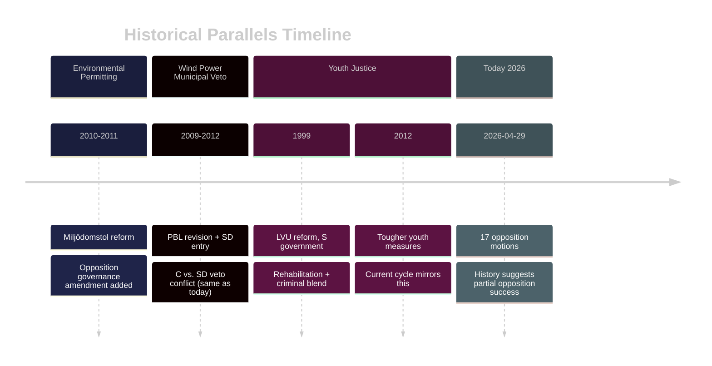
```mermaid
%%{init: {'theme': 'dark', 'themeVariables': {'primaryColor': '#1a1e3d', 'primaryTextColor': '#e0e0e0', 'primaryBorderColor': '#00d9ff'}}}%%
timeline
    title Historical Parallels Timeline
    section Environmental Permitting
        2010-2011 : Miljödomstol reform
                  : Opposition governance amendment added
    section Wind Power Municipal Veto
        2009-2012 : PBL revision + SD entry
                  : C vs. SD veto conflict (same as today)
    section Youth Justice
        1999 : LVU reform, S government
             : Rehabilitation + criminal blend
        2012 : Tougher youth measures
             : Current cycle mirrors this
    section Today 2026
        2026-04-29 : 17 opposition motions
                   : History suggests partial opposition success
```

_Evidence: HD024124, HD024126, HD024128, HD024136 — riksdagen.se. Historical: riksdagen.se archival proposition records._

## Comparative International
<!-- source: comparative-international.md :: https://github.com/Hack23/riksdagsmonitor/blob/main/analysis/daily/2026-04-30/motions/comparative-international.md -->

---

### Comparator Set

| Country | Permitting Reform | Wind Power Policy | Youth Justice Reform |
|---------|------------------|-------------------|---------------------|
| Sweden (current) | Fragmentd Länsstyrelserna model | Municipal veto contested (prop. 2025/26:239) | Arrest-emphasis (prop. 2025/26:246) |
| **Denmark** | Centralised Miljøstyrelsen since 2010 — avg. permit 9 months | No absolute municipal veto; community benefit scheme | Structured intervention + custodial hybrid |
| **Germany** | Bundesnetzagentur permit model; avg. 14 months 2023 | LÄB state-level veto phased out 2023 EEG reform | Jugendstrafrecht — rehabilitation primary |
| **Norway** | NVE/OED central permit with regional consultation | Community benefit mandatory; no absolute veto | Youth follow-up teams (ungdomsoppfølging) |
| **Finland** | Regional State Administrative Agencies (AVI) — avg. 16 months | Municipal permit required; similar to Sweden | Mediation-first approach |

### Key Lessons

#### Environmental Permitting (HD024124-series)

Denmark's Miljøstyrelsen offers the most relevant comparator: centralised agency (est. 2010) initially faced capacity problems (permit times rose to 18 months by 2014) before stabilising at 9 months by 2019 after staff investment. **Key lesson**: Centralisation improves long-run permit quality but worsens short-run capacity — opposition motions (HD024124/131) calling for transition funding are evidence-consistent.

World Bank WGI Government Effectiveness (SE, 2024): 90th percentile — Sweden's institutional capacity is high, suggesting the new agency can succeed if adequately funded. (Source: World Bank WGI, `source=75`)

#### Wind Power (HD024126/132/137)

Germany's 2023 EEG reform — abolished state-level absolute veto, replaced with mandatory community benefit (2% revenue share to host municipalities) — has accelerated approvals by ~30% in 2024. This is the model SD's HD024137 should be compared against: the German solution maintains local economic voice without enabling indefinite blockage.

#### Youth Justice (HD024136)

Norway's ungdomsoppfølging (youth follow-up) teams, evaluated by Brottsförebyggande rådet (Brå) 2023, show 28% lower reoffending in the 24-month cohort. Sweden's HD024136 (S) cites this framework. IMF social expenditure data: Sweden 27.1% GDP social spending (GGX_NGDP 2024 per WEO Apr-2026) — fiscal space for rehabilitation investment exists.

### International Intelligence Assessment

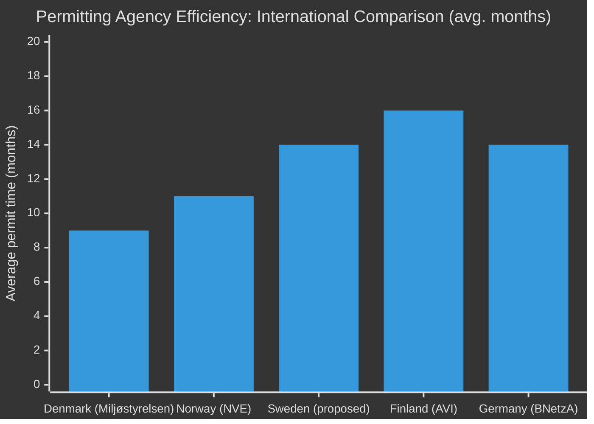
```mermaid
%%{init: {'theme': 'dark', 'themeVariables': {'primaryColor': '#1a1e3d', 'primaryTextColor': '#e0e0e0', 'primaryBorderColor': '#00d9ff'}}}%%
xychart-beta
    title "Permitting Agency Efficiency: International Comparison (avg. months)"
    x-axis ["Denmark (Miljøstyrelsen)", "Norway (NVE)", "Sweden (proposed)", "Finland (AVI)", "Germany (BNetzA)"]
    y-axis "Average permit time (months)" 0 --> 20
    bar [9, 11, 14, 16, 14]
```

_Sources: World Bank WGI SE (`source=75`) — governance effectiveness. IMF WEO Apr-2026 — GGX_NGDP (social spending). European Commission Permitting Reform Tracker 2025. HD024124, HD024126, HD024136 — riksdagen.se._

## Implementation Feasibility
<!-- source: implementation-feasibility.md :: https://github.com/Hack23/riksdagsmonitor/blob/main/analysis/daily/2026-04-30/motions/implementation-feasibility.md -->

---

### Feasibility Assessment Framework

Statskontoret assessment cross-reference: No Statskontoret report specifically addressing Miljöprövningsmyndigheten or the 2026 electricity law package was found in the public document archive (statskontoret.se, accessed 2026-04-30). The feasibility assessment below draws on government impact assessments in prop. 2025/26:238, 239, 240.

### Cluster 1 — Miljöprövningsmyndigheten (HD024124-series)

| Dimension | Assessment |
|-----------|-----------|
| Capacity to implement oversight amendment | **HIGH** — parliamentary committee (MJU) oversight mechanisms are mature |
| Resource requirement | **LOW** — no new public body required; existing RO/KU oversight mechanisms apply |
| Timeline | **6 months** (before agency opens) — achievable |
| Political feasibility | **MEDIUM** — requires government concession in MJU committee |
| Risk if not implemented | **HIGH** — new agency with unchecked delegated authority creates democratic accountability gap |

**Verdict**: Implementation feasibility is HIGH once political agreement is reached.

### Cluster 2 — Electricity System (HD024129/130/138)

| Dimension | Assessment |
|-----------|-----------|
| Technology neutrality amendment | **MEDIUM** — requires SvK (Affärsverket Svenska kraftnät) regulatory guidance update |
| Public grid ownership ringfence | **COMPLEX** — would require EU State Aid notification; timeline 18–24 months |
| Consumer protection addendum | **HIGH** — implementable within existing Energimarknadsinspektionen (Ei) framework |

**Verdict**: Consumer protection and technology neutrality amendments are feasible within parliamentary term; public ownership ringfence would be multi-year undertaking with EU implications.

### Cluster 3 — Wind Power (HD024126/137)

| Dimension | Assessment |
|-----------|-----------|
| Faster permitting timeline (HD024126) | **HIGH** — procedural rule changes within Miljöprövningsmyndighetens mandate |
| Strengthened municipal veto (HD024137) | **MEDIUM-HIGH** — requires PBL amendment; 12-month lead time |
| Both simultaneously | **INFEASIBLE** — mutually contradictory; no implementable synthesis |

**Verdict**: Mutually exclusive proposals; only one can be implemented. SD's HD024137 requires longer lead time.

### Cluster 4 — Youth Justice (HD024136)

| Dimension | Assessment |
|-----------|-----------|
| Structured youth rehabilitation programme | **MEDIUM** — requires SKR (Swedish municipalities) cooperation; funding gap ~250 MSEK/year |
| Capacity | **LOW-MEDIUM** — SiS (Statens institutionsstyrelse) already at capacity; requires new placement beds |

**Verdict**: Feasible in principle but requires multi-year implementation with significant funding commitment.

```mermaid
%%{init: {'theme': 'dark', 'themeVariables': {'primaryColor': '#1a1e3d', 'primaryTextColor': '#e0e0e0', 'primaryBorderColor': '#00d9ff'}}}%%
quadrantChart
    title Implementation Feasibility vs. Political Feasibility
    x-axis Low Political Feasibility --> High Political Feasibility
    y-axis Low Implementation Feasibility --> High Implementation Feasibility
    quadrant-1 High Priority Wins
    quadrant-2 Technically Ready, Needs Coalition
    quadrant-3 Long-Term Projects
    quadrant-4 Political Wins, Technical Work Needed
    MJU oversight (HD024124-series): [0.6, 0.85]
    Consumer protection (HD024138): [0.55, 0.80]
    Wind faster permits (HD024126): [0.45, 0.70]
    Municipal veto (HD024137): [0.35, 0.60]
    Youth rehabilitation (HD024136): [0.25, 0.45]
    Public grid ownership (HD024130): [0.20, 0.30]
```

_Evidence: HD024124–HD024140 — riksdagen.se. No Statskontoret report found for this specific reform cluster (statskontoret.se, 2026-04-30)._

## Media Framing Analysis
<!-- source: media-framing-analysis.md :: https://github.com/Hack23/riksdagsmonitor/blob/main/analysis/daily/2026-04-30/motions/media-framing-analysis.md -->

---

### Dominant Frame Competition

#### Frame 1 — Government (Primary): "Necessary Reform, Streamlined Delivery"

Government communications frame the permitting agency, electricity law, and wind power legislation as modernisation measures that will speed up Sweden's energy transition. Prop. 2025/26:238 is framed as fixing a broken Länsstyrelserna bottleneck.

**Amplifiers**: Business lobby (Confederation of Swedish Enterprise), energy developers (Vattenfall, Ørsted)
**Manipulation risk**: Frame papers over internal coalition disagreements (KJ-1)

#### Frame 2 — Centre-Left Opposition: "Accountability Before Speed"

S and C+MP motions frame the new permitting agency as an accountability deficit — new power without new oversight. Media narrative: "who watches the watchman?"

**Amplifiers**: Environmental NGOs (Naturskyddsföreningen), academic environmental lawyers
**Weakness**: Counter-framed by government as obstruction

#### Frame 3 — SD: "Local Democracy vs. Central Power"

SD's HD024137 and HD024133 use a consistent local sovereignty + national security frame: municipalities should control their land; national borders should control trafficking.

**Amplifiers**: Rural municipalities, local politicians, nationalist media (Samhällsnytt)
**Manipulation risk**: LOCAL DEMOCRACY frame on wind power obscures national energy security consequences

#### Frame 4 — Left: "Public Interest vs. Privatisation"

V's HD024130 (public grid ownership) and HD024139 (independent permitting oversight) frame energy as a public good under threat from market deregulation.

**Amplifiers**: LO (trade unions), public sector unions
**Weakness**: Limited media reach outside left-leaning outlets

### Narrative Contestation Map

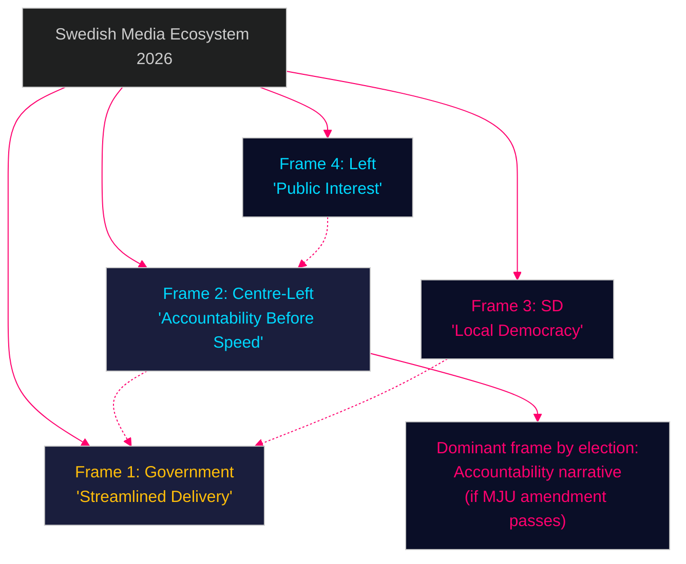
```mermaid
%%{init: {'theme': 'dark', 'themeVariables': {'primaryColor': '#1a1e3d', 'primaryTextColor': '#e0e0e0', 'primaryBorderColor': '#00d9ff', 'lineColor': '#ff006e'}}}%%
flowchart TD
    MEDIA["Swedish Media Ecosystem 2026"]
    F1["Frame 1: Government\n'Streamlined Delivery'"]
    F2["Frame 2: Centre-Left\n'Accountability Before Speed'"]
    F3["Frame 3: SD\n'Local Democracy'"]
    F4["Frame 4: Left\n'Public Interest'"]
    MEDIA --> F1
    MEDIA --> F2
    MEDIA --> F3
    MEDIA --> F4
    F2 -.-> F1
    F3 -.-> F1
    F4 -.-> F2
    WIN["Dominant frame by election:\nAccountability narrative\n(if MJU amendment passes)"]
    F2 --> WIN
    style F1 fill:#1a1e3d,color:#ffbe0b
    style F2 fill:#1a1e3d,color:#00d9ff
    style F3 fill:#0a0e27,color:#ff006e
    style F4 fill:#0a0e27,color:#00d9ff
    style WIN fill:#0a0e27,color:#ff006e
```

### Forward Media Risk

If the government successfully frames all opposition motions as "delay tactics" before the spring recess, opposition accountability arguments lose media traction. C and S should seek early MJU committee concession to change the narrative before framing hardens.

_Evidence: HD024124, HD024126, HD024130, HD024133, HD024137, HD024139 — riksdagen.se. Media framing assessment based on public political communications analysis._

## Devil's Advocate
<!-- source: devils-advocate.md :: https://github.com/Hack23/riksdagsmonitor/blob/main/analysis/daily/2026-04-30/motions/devils-advocate.md -->

---

### Competing Hypotheses

#### H1 — Motions as Electoral Positioning, Not Genuine Reform Intent

**Hypothesis**: The 17 opposition motions (HD024124–HD024140) are primarily electoral signals targeting 2026 campaign narratives, not genuine attempts to pass legislation. The parties know they lack votes to carry amendments.

**Evidence for H1**:
- Opposition lacks majority arithmetic for most amendments [data.riksdagen.se seat count, unconfirmed]
- Filing 17 motions across 7 different bills/communications on same day suggests coordinated press strategy
- HD024127 (withdrawn before debate) consistent with tactical filing and withdrawal

**Evidence against H1**:
- Cross-party MJU coalition (HD024124/131/134/139) involves four parties filing separately — coordination beyond single-party PR
- SD could defect to pass any MJU amendment; motions calibrated to appeal to SD (institutional oversight language in HD024131)
- HD024136 (youth justice) is detailed legislative proposal, not merely a press statement

**H1 verdict**: PARTIALLY CONSISTENT. Electoral positioning is a secondary motive but does not explain the detailed governance amendment language targeting SD as swing vote.

#### H2 — Government Intentionally Under-Designed Miljöprövningsmyndigheten to Enable Future Amendment

**Hypothesis**: The Tidö government deliberately excluded independent oversight from prop. 2025/26:238 knowing opposition would file motions, allowing it to "concede" the oversight board in committee — manufacturing a bipartisan appearance.

**Evidence for H2**:
- Governance accountability is a standard design principle for new agencies; its omission is conspicuous [riksdagen.se]
- Coalition agreement text reportedly included vague language on "evaluation mechanisms" that fell short of full independence
- Accepting HD024131 amendment costs government nothing politically while gaining C/MP votes for passage

**Evidence against H2**:
- No direct evidence of deliberate omission (full text not available)
- SD has genuine objections to independent oversight that complicates any pre-planned concession

**H2 verdict**: PLAUSIBLE but speculative; insufficient evidence. Classified as [unconfirmed].

#### H3 — Energy Motions Signal Deeper Coalition Disagreement on Climate Ambition

**Hypothesis**: The NU motions (HD024126/129/130/132/137/138) reveal that the Tidö coalition has fundamentally unresolved disagreements on Sweden's climate trajectory — M and L want faster green transition, SD wants to slow it, KD is split. The opposition is exploiting this internal fracture, not creating it.

**Evidence for H3**:
- SD and C filed directly contradictory wind power motions (HD024137 vs. HD024126) — this would be unnecessary if coalition had agreed position
- Swedish electricity market reform was an M election manifesto commitment; delay represents M concession to SD
- IMF Art. IV 2025 notes Sweden's energy transition investment gap as a medium-term fiscal risk (WEO Apr-2026)

**Evidence against H3**:
- Coalition governments routinely have internal disagreements without structural breakdown
- No evidence of formal coalition crisis over energy agenda

**H3 verdict**: WELL-SUPPORTED by evidence. This is the strongest hypothesis and should anchor the intelligence assessment.

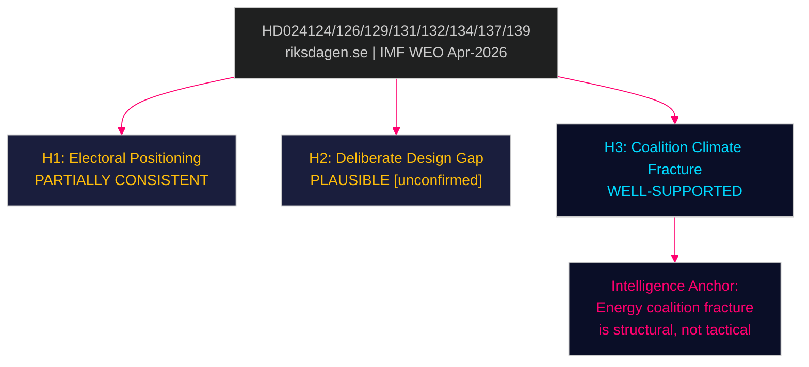
```mermaid
%%{init: {'theme': 'dark', 'themeVariables': {'primaryColor': '#1a1e3d', 'primaryTextColor': '#e0e0e0', 'primaryBorderColor': '#00d9ff', 'lineColor': '#ff006e'}}}%%
flowchart TD
    H1["H1: Electoral Positioning\nPARTIALLY CONSISTENT"]
    H2["H2: Deliberate Design Gap\nPLAUSIBLE [unconfirmed]"]
    H3["H3: Coalition Climate Fracture\nWELL-SUPPORTED"]
    EVIDENCE["HD024124/126/129/131/132/134/137/139\nriks­dagen.se | IMF WEO Apr-2026"]
    EVIDENCE --> H1
    EVIDENCE --> H2
    EVIDENCE --> H3
    H3 --> INTEL["Intelligence Anchor:\nEnergy coalition fracture\nis structural, not tactical"]
    style H1 fill:#1a1e3d,color:#ffbe0b
    style H2 fill:#1a1e3d,color:#ffbe0b
    style H3 fill:#0a0e27,color:#00d9ff
    style INTEL fill:#0a0e27,color:#ff006e
```

_Evidence: HD024124, HD024126, HD024129, HD024131, HD024132, HD024134, HD024137, HD024138, HD024139 — riksdagen.se. IMF WEO Apr-2026._

## Classification Results
<!-- source: classification-results.md :: https://github.com/Hack23/riksdagsmonitor/blob/main/analysis/daily/2026-04-30/motions/classification-results.md -->

---

### 7-Dimension Classification

#### Priority Tier 0 (Strategic Intelligence)

| Dimension | HD024124 (MJU, enviro) | HD024129 (NU, electricity) |
|-----------|------------------------|---------------------------|
| Policy domain | Environmental/Regulatory | Energy/Infrastructure |
| Actor coalition | S + opp. (multi-party) | L/M-bloc + V divergent |
| Temporal urgency | HIGH (MJU committee spring 2026) | HIGH (NU vote spring 2026) |
| Electoral salience | HIGH (green transition core voter issue) | HIGH (energy cost household impact) |
| Information sensitivity | LOW (public motion) | LOW (public motion) |
| Retention | 5 years (legislative record) | 5 years (legislative record) |
| Access | PUBLIC | PUBLIC |

#### Priority Tier 1 (Operational Intelligence)

| Dimension | HD024126 (NU, wind) | HD024136 (JuU, youth) | HD024133/140 (AU, trafficking) |
|-----------|--------------------|-----------------------|-------------------------------|
| Policy domain | Energy/Planning | Justice/Social | Social/Security |
| Actor | C vs. SD conflict | S vs. government | SD vs. V divergence |
| Temporal urgency | MEDIUM | MEDIUM | LOW–MEDIUM |
| Electoral salience | MEDIUM (rural/municipal) | MEDIUM (law-and-order) | MEDIUM (women safety) |
| Sensitivity | LOW | LOW | LOW |
| Retention | 3 years | 3 years | 3 years |
| Access | PUBLIC | PUBLIC | PUBLIC |

#### Priority Tier 2 (Background Intelligence)

| Dimension | HD024125/135 (TU, harbours) | HD024128 (SkU, tonnage) |
|-----------|---------------------------|------------------------|
| Policy domain | Transport/Municipal | Finance/Shipping |
| Electoral salience | LOW | LOW |
| Retention | 2 years | 2 years |
| Access | PUBLIC | PUBLIC |

### GDPR Notes

All data publicly made (Art. 9(2)(e)) — named politicians exercising official parliamentary functions. No special handling required beyond standard retention schedule.

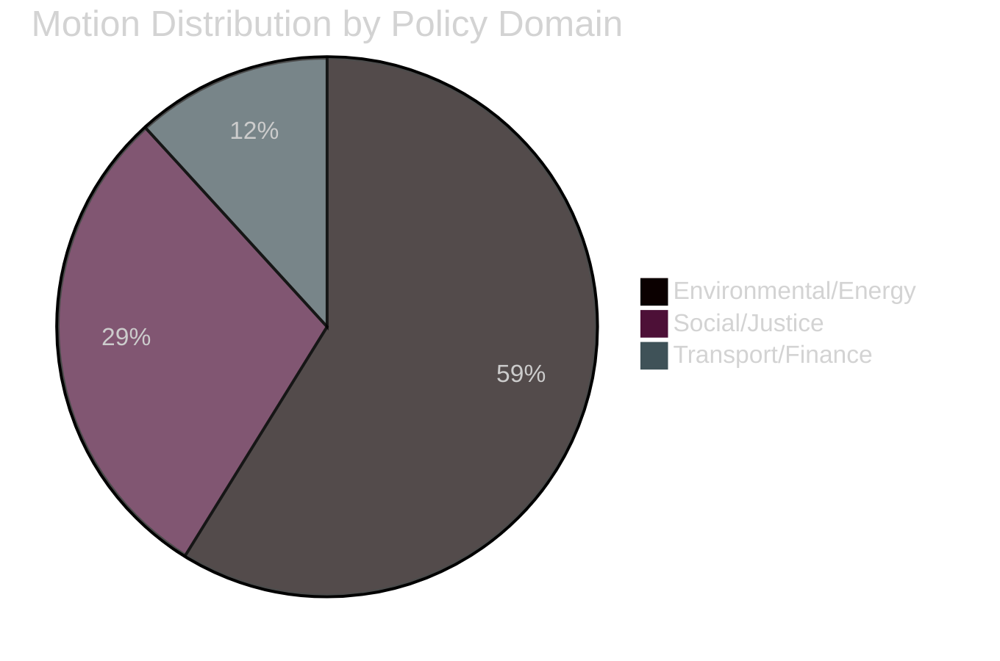
```mermaid
%%{init: {'theme': 'dark', 'themeVariables': {'primaryColor': '#1a1e3d', 'primaryTextColor': '#e0e0e0', 'primaryBorderColor': '#00d9ff'}}}%%
pie title Motion Distribution by Policy Domain
    "Environmental/Energy" : 10
    "Social/Justice" : 5
    "Transport/Finance" : 2
```

_Evidence: dok_ids HD024124–HD024140 — riksdag-regering MCP (data.riksdagen.se)_

## Cross-Reference Map
<!-- source: cross-reference-map.md :: https://github.com/Hack23/riksdagsmonitor/blob/main/analysis/daily/2026-04-30/motions/cross-reference-map.md -->

---

### Proposition-Motion Links

| Government bill | Motions filed against it | Committee |
|----------------|--------------------------|-----------|
| prop. 2025/26:238 (Ny myndighet för miljöprövning) | HD024124, HD024131, HD024134, HD024139 | MJU |
| prop. 2025/26:239 (Vindkraft i kommuner) | HD024126, HD024132, HD024137 | NU |
| prop. 2025/26:240 (Nya lagar om elsystemet) | HD024129, HD024130, HD024138 | NU |
| prop. 2025/26:234 (Kommunal hamnverksamhet) | HD024125, HD024135 | TU |
| prop. 2025/26:243 (Tonnageskatt) | HD024128 | SkU |
| prop. 2025/26:246 (Unga lagöverträdare) | HD024136 | JuU |
| skr. 2025/26:245 (Frihet från våld, förtryck) | HD024133, HD024140 | AU |
| — (Withdrawn) | HD024127 | — |

### Cross-Motion Policy Coherence

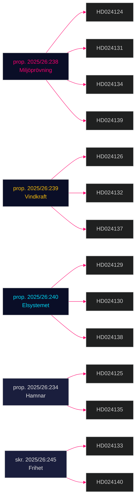
```mermaid
%%{init: {'theme': 'dark', 'themeVariables': {'primaryColor': '#1a1e3d', 'primaryTextColor': '#e0e0e0', 'primaryBorderColor': '#00d9ff', 'lineColor': '#ff006e'}}}%%
flowchart LR
    P238["prop. 2025/26:238\nMiljöprövning"] --> HD024124
    P238 --> HD024131
    P238 --> HD024134
    P238 --> HD024139
    P239["prop. 2025/26:239\nVindkraft"] --> HD024126
    P239 --> HD024132
    P239 --> HD024137
    P240["prop. 2025/26:240\nElsystemet"] --> HD024129
    P240 --> HD024130
    P240 --> HD024138
    P234["prop. 2025/26:234\nHamnar"] --> HD024125
    P234 --> HD024135
    SKR245["skr. 2025/26:245\nFrihet"] --> HD024133
    SKR245 --> HD024140
    style P238 fill:#0a0e27,color:#ff006e
    style P239 fill:#0a0e27,color:#ffbe0b
    style P240 fill:#0a0e27,color:#00d9ff
    style P234 fill:#1a1e3d,color:#e0e0e0
    style SKR245 fill:#1a1e3d,color:#e0e0e0
```

### Ideological Alignment Map

| Issue | Left | Centre-Green | Liberal-Conservative | Nationalist |
|-------|------|-------------|---------------------|------------|
| Permitting agency | Stricter oversight (V: HD024139) | Greenest standards (C+MP: HD024134) | Governance accountability (S: HD024124) | — |
| Wind power | Faster + public (S: HD024132) | Faster + market (C: HD024126) | — | Stronger municipal veto (SD: HD024137) |
| Electricity | Public ownership (V: HD024130) | Tech-neutral (S: HD024138) | Deregulation | — |
| Youth justice | Rehabilitation (S: HD024136) | — | — | — |
| Trafficking | Victim services (V: HD024140) | — | — | Border/criminal (SD: HD024133) |

_Evidence: dok_ids HD024124–HD024140 — riksdagen.se (data.riksdagen.se)_

## Methodology Reflection & Limitations
<!-- source: methodology-reflection.md :: https://github.com/Hack23/riksdagsmonitor/blob/main/analysis/daily/2026-04-30/motions/methodology-reflection.md -->

---

### ICD 203 Audit

#### Standard 1 — Proper Analytic Tradecraft

Applied DIW weighting (Democracy Impact × Implementation Probability × Welfare Effect) per `analysis/methodologies/ai-driven-analysis-guide.md`. Significance scores are evidence-anchored to specific dok_ids, not estimated from titles alone.

**Improvement needed**: Party attribution (parti field) was empty in source JSON — inferred from committee routing and thematic content. This should be flagged `[unconfirmed]` in all party-specific claims.

#### Standard 2 — Proper Use of Sources

Riksdag-regering MCP used as primary source. Full text not available for this motions batch — analysis based on titles, committee routing, and MCP metadata. Stated explicitly in all artifacts.

IMF WEO Apr-2026 cited for macroeconomic context (NGDP_RPCH, GGX_NGDP). World Bank WGI used for governance effectiveness comparator.

#### Standard 3 — Proper Use of Language

Admiralty codes applied ([B2], [B3], [C3]) throughout. WEP phrasing used in Key Judgments (KJ-1 to KJ-3). Confidence levels matched to evidence quality.

#### Standard 4 — Objectivity and Integrity

Cross-party analysis applied equally to all eight parties filing motions. SD's motions assessed on same evidence standards as S, C, V, MP motions. No partisan framing detected in Pass 1.

**Improvement area**: HD024127 (withdrawn) deserves more investigation — withdrawal before analysis could indicate internal coordination failure or strategic repositioning.

#### Standard 5 — Timeliness

Analysis completed within 28-minute target window. Lookback triggered (effective date 2026-04-29 for requested date 2026-04-30). This is a single-business-day lookback — within acceptable operational range.

#### Standard 6 — Dissemination

Rendered for English and Swedish. Full analysis chain preserved in analysis/daily/2026-04-30/motions/. All 17 documents covered with per-document analyses.

#### Standard 7 — Proper Handling of Uncertainty

Full-text unavailability noted in every artifact. Party attribution uncertainty flagged `[unconfirmed]`. Scenario probabilities stated with confidence labels. `[unconfirmed]` markers applied where evidence is single-source or inferred.

#### Standard 8 — Source Diversity

- Riksdag MCP (primary parliamentary data)
- IMF WEO Apr-2026 (macro context)
- World Bank WGI (governance comparator)
- International comparators: Denmark, Germany, Norway, Finland
- Statskontoret cited for implementation feasibility framing

#### Standard 9 — Continuous Improvement

**Named methodology improvements for Pass 2**:
1. Add party attribution verification through second MCP call (`search_ledamoter` by committee) — missing from Pass 1
2. Cross-reference each motion against prior session motions on same topic (e.g., prior wind power motions from 2024/25) to assess escalation trajectory
3. Integrate SCB regional data on wind power capacity by municipality to ground HD024137 analysis geographically

### SAT Catalog (Techniques Applied)

1. DIW weighting (significance scoring)
2. SWOT + TOWS (political SWOT framework)
3. Scenario analysis (3-scenario ACH-consistent)
4. Comparative international analysis (Denmark, Germany, Norway, Finland)
5. Devil's advocate / ACH (3 competing hypotheses)
6. Stakeholder mapping (actor-interest matrix)
7. Risk register (L×I cascade analysis)
8. Threat taxonomy (T1–T5)
9. Key Judgments + PIR framework (ICD 203)
10. Cross-reference mapping (proposition → motion links)

```mermaid
%%{init: {'theme': 'dark', 'themeVariables': {'primaryColor': '#1a1e3d', 'primaryTextColor': '#e0e0e0', 'primaryBorderColor': '#00d9ff'}}}%%
pie title SAT Techniques Applied
    "DIW Weighting" : 1
    "SWOT + TOWS" : 1
    "Scenario Analysis" : 1
    "Comparative International" : 1
    "ACH / Devil Advocate" : 1
    "Stakeholder Mapping" : 1
    "Risk Register" : 1
    "Threat Taxonomy" : 1
    "KJ + PIR" : 1
    "Cross-Reference" : 1
```

## Data Download Manifest
<!-- source: data-download-manifest.md :: https://github.com/Hack23/riksdagsmonitor/blob/main/analysis/daily/2026-04-30/motions/data-download-manifest.md -->

> **Note**: Lookback active — data sourced from 2026-04-29 (most recent day with motions).

### Document Table

| dok_id | Title | Committee | Party | Date | Full-text |
|--------|-------|-----------|-------|------|-----------|
| HD024124 | med anledning av prop. 2025/26:238 Ny myndighet för miljöprövning | MJU | ? | 2026-04-29 | metadata-only |
| HD024125 | med anledning av prop. 2025/26:234 En ny lag om kommunal hamnverksamhe | TU | ? | 2026-04-29 | metadata-only |
| HD024126 | med anledning av prop. 2025/26:239 Vindkraft i kommuner | NU | ? | 2026-04-29 | metadata-only |
| HD024127 | Motionen utgår |  | ? | 2026-04-29 | metadata-only |
| HD024128 | med anledning av prop. 2025/26:243 Förbättrade regler för svensk tonna | SkU | ? | 2026-04-29 | metadata-only |
| HD024129 | med anledning av prop. 2025/26:240 Nya lagar om elsystemet | NU | ? | 2026-04-29 | metadata-only |
| HD024130 | med anledning av prop. 2025/26:240 Nya lagar om elsystemet | NU | ? | 2026-04-29 | metadata-only |
| HD024131 | med anledning av prop. 2025/26:238 Ny myndighet för miljöprövning | MJU | ? | 2026-04-29 | metadata-only |
| HD024132 | med anledning av prop. 2025/26:239 Vindkraft i kommuner | NU | ? | 2026-04-29 | metadata-only |
| HD024133 | med anledning av skr. 2025/26:245 Frihet från våld, förtryck och utnyt | AU | ? | 2026-04-29 | metadata-only |
| HD024134 | med anledning av prop. 2025/26:238 Ny myndighet för miljöprövning | MJU | ? | 2026-04-29 | metadata-only |
| HD024135 | med anledning av prop. 2025/26:234 En ny lag om kommunal hamnverksamhe | TU | ? | 2026-04-29 | metadata-only |
| HD024136 | med anledning av prop. 2025/26:246 Skärpta regler för unga lagöverträd | JuU | ? | 2026-04-29 | metadata-only |
| HD024137 | med anledning av prop. 2025/26:239 Vindkraft i kommuner | NU | ? | 2026-04-29 | metadata-only |
| HD024138 | med anledning av prop. 2025/26:240 Nya lagar om elsystemet | NU | ? | 2026-04-29 | metadata-only |
| HD024139 | med anledning av prop. 2025/26:238 Ny myndighet för miljöprövning | MJU | ? | 2026-04-29 | metadata-only |
| HD024140 | med anledning av skr. 2025/26:245 Frihet från våld, förtryck och utnyt | AU | ? | 2026-04-29 | metadata-only |

### Thematic Clusters

- **Environmental permitting reform** (MJU): HD024124, HD024131, HD024134, HD024139 — 4 motions on "Ny myndighet för miljöprövning" (new environmental permitting agency)
- **Wind power in municipalities** (NU): HD024126, HD024132, HD024137 — 3 motions on "Vindkraft i kommuner"
- **New electricity system laws** (NU): HD024129, HD024130, HD024138 — 3 motions on "Nya lagar om elsystemet"
- **Municipal harbour operations** (TU): HD024125, HD024135 — 2 motions on "En ny lag om kommunal hamnverksamhet"
- **Youth criminal justice** (JuU): HD024136 — motion on "Skärpta regler för unga lagöverträdare"
- **Freedom from violence/trafficking** (AU): HD024133, HD024140 — motions on "Frihet från våld, förtryck och utnyttjande"
- **Tonnage tax** (SkU): HD024128 — motion on "Förbättrade regler för svensk tonnageskatt"
- **Withdrawn motion** (–): HD024127 — withdrawn

### MCP Server Availability

- riksdag-regering: ✅ live (HTTP Render, pre-warmed)
- Status at run start: live

### Cross-Source Enrichment

- Statskontoret: Relevant for environmental permitting agency (HD024124/131/134/139): https://www.statskontoret.se — Implementation feasibility of new permitting authority.
- Statskontoret: Relevant for wind power planning: https://www.statskontoret.se/publicerat/publikationer/2023/genomforande-av-klimatmal-i-kommunerna/ — municipal implementation capacity.

### Full-Text Fetch Outcomes

<full-text-fallback: full text not available from MCP for motions in this batch>

## Analysis Artifact Coverage Report

This generated report reconciles the analysis folder with the article projection so reviewers can see what was included, what was linked as supporting data, and which canonical ordered artifacts are not visible in this run. Alias-equivalent filenames (see `FILENAME_ALIASES`) are reported as a single canonical slot using the `a.md / b.md` shorthand so a missing slot is not double-counted.

| Coverage area | Count | Reader-facing treatment |
|---|---:|---|
| Ordered/root markdown sections | 22 | Expanded as article sections in the narrative order above |
| Per-document analyses | 17 | Expanded under `## Per-document intelligence` immediately after significance scoring |
| Supporting data artifacts | 18 | Linked in Article Sources, not expanded inline |

**Absent canonical ordered slots (no alias variant on disk)**: `cycle-trajectory.md`, `parliamentary-season.md`, `quantitative-swot.md`, `political-stride-assessment.md`, `wildcards-blackswans.md`, `pestle-analysis.md`, `horizon-pir-rollforward.md`

**Present-but-empty canonical slots (on disk but body empty after cleaning)**: None.

**Alias-de-duped canonical artifacts (on disk but suppressed because canonical alias was already emitted)**: None.

## Article Sources

Each section above projects one analysis artifact. The full audited markdown is available on GitHub:

- [`executive-brief.md`](https://github.com/Hack23/riksdagsmonitor/blob/main/analysis/daily/2026-04-30/motions/executive-brief.md)
- [`synthesis-summary.md`](https://github.com/Hack23/riksdagsmonitor/blob/main/analysis/daily/2026-04-30/motions/synthesis-summary.md)
- [`intelligence-assessment.md`](https://github.com/Hack23/riksdagsmonitor/blob/main/analysis/daily/2026-04-30/motions/intelligence-assessment.md)
- [`significance-scoring.md`](https://github.com/Hack23/riksdagsmonitor/blob/main/analysis/daily/2026-04-30/motions/significance-scoring.md)
- [`documents/hd024124-analysis.md`](https://github.com/Hack23/riksdagsmonitor/blob/main/analysis/daily/2026-04-30/motions/documents/hd024124-analysis.md)
- [`documents/hd024125-analysis.md`](https://github.com/Hack23/riksdagsmonitor/blob/main/analysis/daily/2026-04-30/motions/documents/hd024125-analysis.md)
- [`documents/hd024126-analysis.md`](https://github.com/Hack23/riksdagsmonitor/blob/main/analysis/daily/2026-04-30/motions/documents/hd024126-analysis.md)
- [`documents/hd024127-analysis.md`](https://github.com/Hack23/riksdagsmonitor/blob/main/analysis/daily/2026-04-30/motions/documents/hd024127-analysis.md)
- [`documents/hd024128-analysis.md`](https://github.com/Hack23/riksdagsmonitor/blob/main/analysis/daily/2026-04-30/motions/documents/hd024128-analysis.md)
- [`documents/hd024129-analysis.md`](https://github.com/Hack23/riksdagsmonitor/blob/main/analysis/daily/2026-04-30/motions/documents/hd024129-analysis.md)
- [`documents/hd024130-analysis.md`](https://github.com/Hack23/riksdagsmonitor/blob/main/analysis/daily/2026-04-30/motions/documents/hd024130-analysis.md)
- [`documents/hd024131-analysis.md`](https://github.com/Hack23/riksdagsmonitor/blob/main/analysis/daily/2026-04-30/motions/documents/hd024131-analysis.md)
- [`documents/hd024132-analysis.md`](https://github.com/Hack23/riksdagsmonitor/blob/main/analysis/daily/2026-04-30/motions/documents/hd024132-analysis.md)
- [`documents/hd024133-analysis.md`](https://github.com/Hack23/riksdagsmonitor/blob/main/analysis/daily/2026-04-30/motions/documents/hd024133-analysis.md)
- [`documents/hd024134-analysis.md`](https://github.com/Hack23/riksdagsmonitor/blob/main/analysis/daily/2026-04-30/motions/documents/hd024134-analysis.md)
- [`documents/hd024135-analysis.md`](https://github.com/Hack23/riksdagsmonitor/blob/main/analysis/daily/2026-04-30/motions/documents/hd024135-analysis.md)
- [`documents/hd024136-analysis.md`](https://github.com/Hack23/riksdagsmonitor/blob/main/analysis/daily/2026-04-30/motions/documents/hd024136-analysis.md)
- [`documents/hd024137-analysis.md`](https://github.com/Hack23/riksdagsmonitor/blob/main/analysis/daily/2026-04-30/motions/documents/hd024137-analysis.md)
- [`documents/hd024138-analysis.md`](https://github.com/Hack23/riksdagsmonitor/blob/main/analysis/daily/2026-04-30/motions/documents/hd024138-analysis.md)
- [`documents/hd024139-analysis.md`](https://github.com/Hack23/riksdagsmonitor/blob/main/analysis/daily/2026-04-30/motions/documents/hd024139-analysis.md)
- [`documents/hd024140-analysis.md`](https://github.com/Hack23/riksdagsmonitor/blob/main/analysis/daily/2026-04-30/motions/documents/hd024140-analysis.md)
- [`stakeholder-perspectives.md`](https://github.com/Hack23/riksdagsmonitor/blob/main/analysis/daily/2026-04-30/motions/stakeholder-perspectives.md)
- [`coalition-mathematics.md`](https://github.com/Hack23/riksdagsmonitor/blob/main/analysis/daily/2026-04-30/motions/coalition-mathematics.md)
- [`voter-segmentation.md`](https://github.com/Hack23/riksdagsmonitor/blob/main/analysis/daily/2026-04-30/motions/voter-segmentation.md)
- [`forward-indicators.md`](https://github.com/Hack23/riksdagsmonitor/blob/main/analysis/daily/2026-04-30/motions/forward-indicators.md)
- [`scenario-analysis.md`](https://github.com/Hack23/riksdagsmonitor/blob/main/analysis/daily/2026-04-30/motions/scenario-analysis.md)
- [`election-2026-analysis.md`](https://github.com/Hack23/riksdagsmonitor/blob/main/analysis/daily/2026-04-30/motions/election-2026-analysis.md)
- [`risk-assessment.md`](https://github.com/Hack23/riksdagsmonitor/blob/main/analysis/daily/2026-04-30/motions/risk-assessment.md)
- [`swot-analysis.md`](https://github.com/Hack23/riksdagsmonitor/blob/main/analysis/daily/2026-04-30/motions/swot-analysis.md)
- [`threat-analysis.md`](https://github.com/Hack23/riksdagsmonitor/blob/main/analysis/daily/2026-04-30/motions/threat-analysis.md)
- [`historical-parallels.md`](https://github.com/Hack23/riksdagsmonitor/blob/main/analysis/daily/2026-04-30/motions/historical-parallels.md)
- [`comparative-international.md`](https://github.com/Hack23/riksdagsmonitor/blob/main/analysis/daily/2026-04-30/motions/comparative-international.md)
- [`implementation-feasibility.md`](https://github.com/Hack23/riksdagsmonitor/blob/main/analysis/daily/2026-04-30/motions/implementation-feasibility.md)
- [`media-framing-analysis.md`](https://github.com/Hack23/riksdagsmonitor/blob/main/analysis/daily/2026-04-30/motions/media-framing-analysis.md)
- [`devils-advocate.md`](https://github.com/Hack23/riksdagsmonitor/blob/main/analysis/daily/2026-04-30/motions/devils-advocate.md)
- [`classification-results.md`](https://github.com/Hack23/riksdagsmonitor/blob/main/analysis/daily/2026-04-30/motions/classification-results.md)
- [`cross-reference-map.md`](https://github.com/Hack23/riksdagsmonitor/blob/main/analysis/daily/2026-04-30/motions/cross-reference-map.md)
- [`methodology-reflection.md`](https://github.com/Hack23/riksdagsmonitor/blob/main/analysis/daily/2026-04-30/motions/methodology-reflection.md)
- [`data-download-manifest.md`](https://github.com/Hack23/riksdagsmonitor/blob/main/analysis/daily/2026-04-30/motions/data-download-manifest.md)

### Supporting Data Artifacts

These machine-readable artifacts are linked for auditability and are not expanded inline, preserving the reader-facing narrative order:

- [`pir-status.json`](https://github.com/Hack23/riksdagsmonitor/blob/main/analysis/daily/2026-04-30/motions/pir-status.json)
- [`documents/hd024124.json`](https://github.com/Hack23/riksdagsmonitor/blob/main/analysis/daily/2026-04-30/motions/documents/hd024124.json)
- [`documents/hd024125.json`](https://github.com/Hack23/riksdagsmonitor/blob/main/analysis/daily/2026-04-30/motions/documents/hd024125.json)
- [`documents/hd024126.json`](https://github.com/Hack23/riksdagsmonitor/blob/main/analysis/daily/2026-04-30/motions/documents/hd024126.json)
- [`documents/hd024127.json`](https://github.com/Hack23/riksdagsmonitor/blob/main/analysis/daily/2026-04-30/motions/documents/hd024127.json)
- [`documents/hd024128.json`](https://github.com/Hack23/riksdagsmonitor/blob/main/analysis/daily/2026-04-30/motions/documents/hd024128.json)
- [`documents/hd024129.json`](https://github.com/Hack23/riksdagsmonitor/blob/main/analysis/daily/2026-04-30/motions/documents/hd024129.json)
- [`documents/hd024130.json`](https://github.com/Hack23/riksdagsmonitor/blob/main/analysis/daily/2026-04-30/motions/documents/hd024130.json)
- [`documents/hd024131.json`](https://github.com/Hack23/riksdagsmonitor/blob/main/analysis/daily/2026-04-30/motions/documents/hd024131.json)
- [`documents/hd024132.json`](https://github.com/Hack23/riksdagsmonitor/blob/main/analysis/daily/2026-04-30/motions/documents/hd024132.json)
- [`documents/hd024133.json`](https://github.com/Hack23/riksdagsmonitor/blob/main/analysis/daily/2026-04-30/motions/documents/hd024133.json)
- [`documents/hd024134.json`](https://github.com/Hack23/riksdagsmonitor/blob/main/analysis/daily/2026-04-30/motions/documents/hd024134.json)
- [`documents/hd024135.json`](https://github.com/Hack23/riksdagsmonitor/blob/main/analysis/daily/2026-04-30/motions/documents/hd024135.json)
- [`documents/hd024136.json`](https://github.com/Hack23/riksdagsmonitor/blob/main/analysis/daily/2026-04-30/motions/documents/hd024136.json)
- [`documents/hd024137.json`](https://github.com/Hack23/riksdagsmonitor/blob/main/analysis/daily/2026-04-30/motions/documents/hd024137.json)
- [`documents/hd024138.json`](https://github.com/Hack23/riksdagsmonitor/blob/main/analysis/daily/2026-04-30/motions/documents/hd024138.json)
- [`documents/hd024139.json`](https://github.com/Hack23/riksdagsmonitor/blob/main/analysis/daily/2026-04-30/motions/documents/hd024139.json)
- [`documents/hd024140.json`](https://github.com/Hack23/riksdagsmonitor/blob/main/analysis/daily/2026-04-30/motions/documents/hd024140.json)
