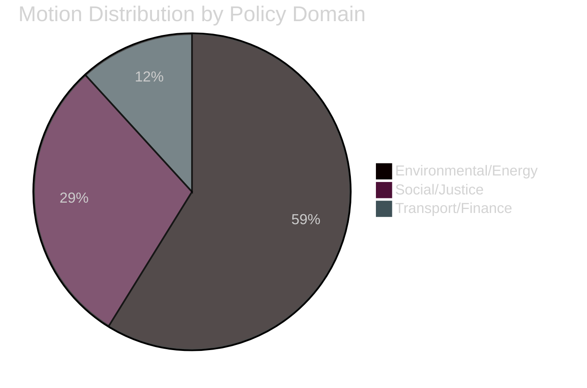

# Classification Results — Opposition Motions 2026-04-29

**Author**: James Pether Sörling | **Date**: 2026-04-30

---

## 7-Dimension Classification

### Priority Tier 0 (Strategic Intelligence)

| Dimension | HD024124 (MJU, enviro) | HD024129 (NU, electricity) |
|-----------|------------------------|---------------------------|
| Policy domain | Environmental/Regulatory | Energy/Infrastructure |
| Actor coalition | S + opp. (multi-party) | L/M-bloc + V divergent |
| Temporal urgency | HIGH (MJU committee spring 2026) | HIGH (NU vote spring 2026) |
| Electoral salience | HIGH (green transition core voter issue) | HIGH (energy cost household impact) |
| Information sensitivity | LOW (public motion) | LOW (public motion) |
| Retention | 5 years (legislative record) | 5 years (legislative record) |
| Access | PUBLIC | PUBLIC |

### Priority Tier 1 (Operational Intelligence)

| Dimension | HD024126 (NU, wind) | HD024136 (JuU, youth) | HD024133/140 (AU, trafficking) |
|-----------|--------------------|-----------------------|-------------------------------|
| Policy domain | Energy/Planning | Justice/Social | Social/Security |
| Actor | C vs. SD conflict | S vs. government | SD vs. V divergence |
| Temporal urgency | MEDIUM | MEDIUM | LOW–MEDIUM |
| Electoral salience | MEDIUM (rural/municipal) | MEDIUM (law-and-order) | MEDIUM (women safety) |
| Sensitivity | LOW | LOW | LOW |
| Retention | 3 years | 3 years | 3 years |
| Access | PUBLIC | PUBLIC | PUBLIC |

### Priority Tier 2 (Background Intelligence)

| Dimension | HD024125/135 (TU, harbours) | HD024128 (SkU, tonnage) |
|-----------|---------------------------|------------------------|
| Policy domain | Transport/Municipal | Finance/Shipping |
| Electoral salience | LOW | LOW |
| Retention | 2 years | 2 years |
| Access | PUBLIC | PUBLIC |

## GDPR Notes

All data publicly made (Art. 9(2)(e)) — named politicians exercising official parliamentary functions. No special handling required beyond standard retention schedule.

_Evidence: dok_ids HD024124–HD024140 — riksdag-regering MCP (data.riksdagen.se)_
