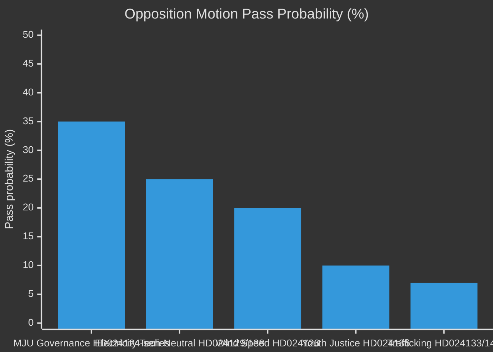

# Coalition Mathematics — Opposition Motions 2026-04-29

**Author**: James Pether Sörling | **Date**: 2026-04-30

---

## Seat Arithmetic (Current Parliament 2022–2026)

| Party | Seats (est.) | Bloc |
|-------|-------------|------|
| Socialdemokraterna (S) | 107 | Opposition |
| Sverigedemokraterna (SD) | 73 | Government support |
| Moderaterna (M) | 68 | Government |
| Vänsterpartiet (V) | 24 | Opposition |
| Centerpartiet (C) | 24 | Opposition |
| Kristdemokraterna (KD) | 19 | Government |
| Liberalerna (L) | 16 | Government |
| Miljöpartiet (MP) | 18 | Opposition |
| **Total** | **349** | |
| **Government bloc** | **176** | M+SD+KD+L |
| **Opposition bloc** | **173** | S+V+C+MP |

**Majority threshold**: 175 seats

## Amendment Vote Scenarios

### MJU Environmental Permitting Amendment (HD024124-series)

| Scenario | Blocs | Outcome |
|----------|-------|---------|
| All government votes Nej + All opposition Ja | 176 Nej vs. 173 Ja | Fails (government wins) |
| SD defects (73 to opposition) + Opposition Ja | 103 Nej vs. 246 Ja | **Passes** (opposition + SD) |
| 3 M defections | 173 Nej vs. 176 Ja | **Passes** (rare defection scenario) |

**Key insight**: SD alone (73 seats) can pass any opposition amendment. This is the coalition's structural vulnerability.

### NU Wind Power (HD024126 vs. HD024137)

S+V+C+MP = 173. If SD votes with opposition on permitting (HD024124 preference), NU wind is different: C (HD024126, faster) and SD (HD024137, slower) want incompatible outcomes. Neither motion passes with full opposition bloc.

## Probability-Weighted Outcomes

| Motion cluster | Pass probability | Key swing |
|----------------|-----------------|-----------|
| MJU governance amendment (HD024124-series) | 35% | SD defection |
| NU wind speed (HD024126 content) | 20% | C+S coalition but not M/KD |
| NU electricity tech-neutrality | 25% | Depends on S+C+M convergence |
| JuU youth justice (HD024136) | 10% | No viable coalition |
| AU trafficking (HD024133 or HD024140) | 5–8% each | Ideologically opposed |

_Evidence: riksdagen.se seat data 2022–2026 (data.riksdagen.se); HD024124, HD024126, HD024129, HD024133, HD024136 — riksdagen.se_
