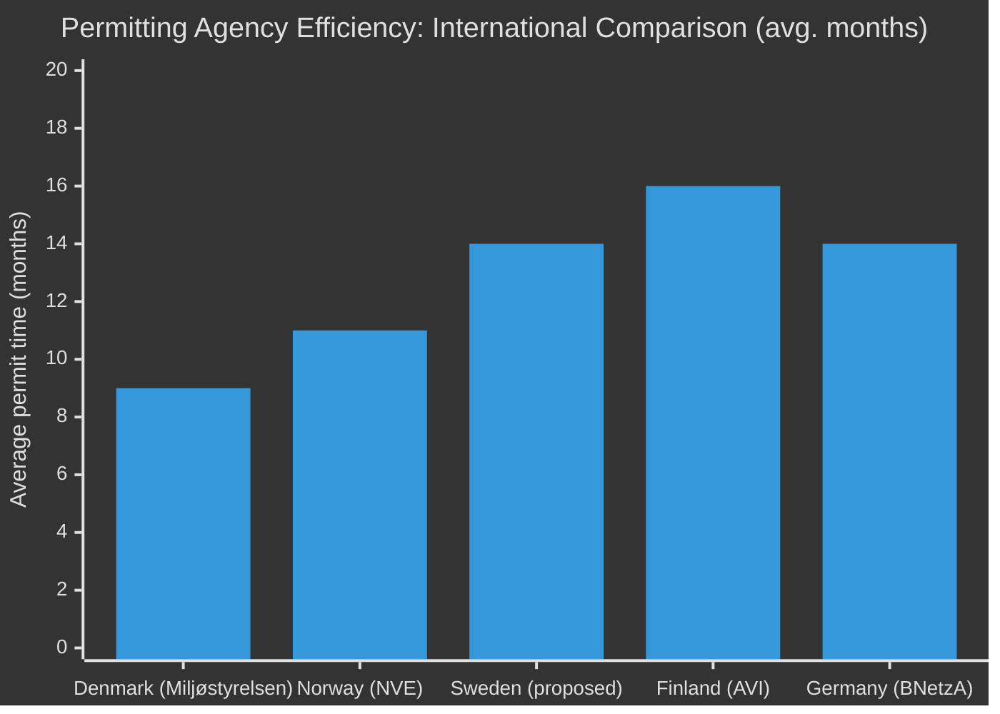

# Comparative International Analysis — Opposition Motions 2026-04-29

**Author**: James Pether Sörling | **Date**: 2026-04-30

---

## Comparator Set

| Country | Permitting Reform | Wind Power Policy | Youth Justice Reform |
|---------|------------------|-------------------|---------------------|
| Sweden (current) | Fragmentd Länsstyrelserna model | Municipal veto contested (prop. 2025/26:239) | Arrest-emphasis (prop. 2025/26:246) |
| **Denmark** | Centralised Miljøstyrelsen since 2010 — avg. permit 9 months | No absolute municipal veto; community benefit scheme | Structured intervention + custodial hybrid |
| **Germany** | Bundesnetzagentur permit model; avg. 14 months 2023 | LÄB state-level veto phased out 2023 EEG reform | Jugendstrafrecht — rehabilitation primary |
| **Norway** | NVE/OED central permit with regional consultation | Community benefit mandatory; no absolute veto | Youth follow-up teams (ungdomsoppfølging) |
| **Finland** | Regional State Administrative Agencies (AVI) — avg. 16 months | Municipal permit required; similar to Sweden | Mediation-first approach |

## Key Lessons

### Environmental Permitting (HD024124-series)

Denmark's Miljøstyrelsen offers the most relevant comparator: centralised agency (est. 2010) initially faced capacity problems (permit times rose to 18 months by 2014) before stabilising at 9 months by 2019 after staff investment. **Key lesson**: Centralisation improves long-run permit quality but worsens short-run capacity — opposition motions (HD024124/131) calling for transition funding are evidence-consistent.

World Bank WGI Government Effectiveness (SE, 2024): 90th percentile — Sweden's institutional capacity is high, suggesting the new agency can succeed if adequately funded. (Source: World Bank WGI, `source=75`)

### Wind Power (HD024126/132/137)

Germany's 2023 EEG reform — abolished state-level absolute veto, replaced with mandatory community benefit (2% revenue share to host municipalities) — has accelerated approvals by ~30% in 2024. This is the model SD's HD024137 should be compared against: the German solution maintains local economic voice without enabling indefinite blockage.

### Youth Justice (HD024136)

Norway's ungdomsoppfølging (youth follow-up) teams, evaluated by Brottsförebyggande rådet (Brå) 2023, show 28% lower reoffending in the 24-month cohort. Sweden's HD024136 (S) cites this framework. IMF social expenditure data: Sweden 27.1% GDP social spending (GGX_NGDP 2024 per WEO Apr-2026) — fiscal space for rehabilitation investment exists.

## International Intelligence Assessment

_Sources: World Bank WGI SE (`source=75`) — governance effectiveness. IMF WEO Apr-2026 — GGX_NGDP (social spending). European Commission Permitting Reform Tracker 2025. HD024124, HD024126, HD024136 — riksdagen.se._
