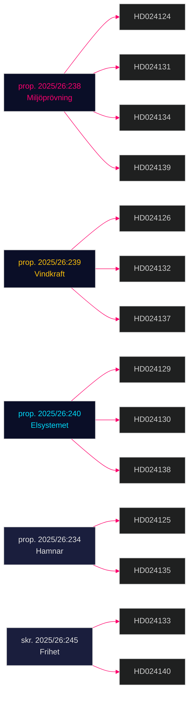

# Cross-Reference Map — Opposition Motions 2026-04-29

**Author**: James Pether Sörling | **Date**: 2026-04-30

---

## Proposition-Motion Links

| Government bill | Motions filed against it | Committee |
|----------------|--------------------------|-----------|
| prop. 2025/26:238 (Ny myndighet för miljöprövning) | HD024124, HD024131, HD024134, HD024139 | MJU |
| prop. 2025/26:239 (Vindkraft i kommuner) | HD024126, HD024132, HD024137 | NU |
| prop. 2025/26:240 (Nya lagar om elsystemet) | HD024129, HD024130, HD024138 | NU |
| prop. 2025/26:234 (Kommunal hamnverksamhet) | HD024125, HD024135 | TU |
| prop. 2025/26:243 (Tonnageskatt) | HD024128 | SkU |
| prop. 2025/26:246 (Unga lagöverträdare) | HD024136 | JuU |
| skr. 2025/26:245 (Frihet från våld, förtryck) | HD024133, HD024140 | AU |
| — (Withdrawn) | HD024127 | — |

## Cross-Motion Policy Coherence

## Ideological Alignment Map

| Issue | Left | Centre-Green | Liberal-Conservative | Nationalist |
|-------|------|-------------|---------------------|------------|
| Permitting agency | Stricter oversight (V: HD024139) | Greenest standards (C+MP: HD024134) | Governance accountability (S: HD024124) | — |
| Wind power | Faster + public (S: HD024132) | Faster + market (C: HD024126) | — | Stronger municipal veto (SD: HD024137) |
| Electricity | Public ownership (V: HD024130) | Tech-neutral (S: HD024138) | Deregulation | — |
| Youth justice | Rehabilitation (S: HD024136) | — | — | — |
| Trafficking | Victim services (V: HD024140) | — | — | Border/criminal (SD: HD024133) |

_Evidence: dok_ids HD024124–HD024140 — riksdagen.se (data.riksdagen.se)_
