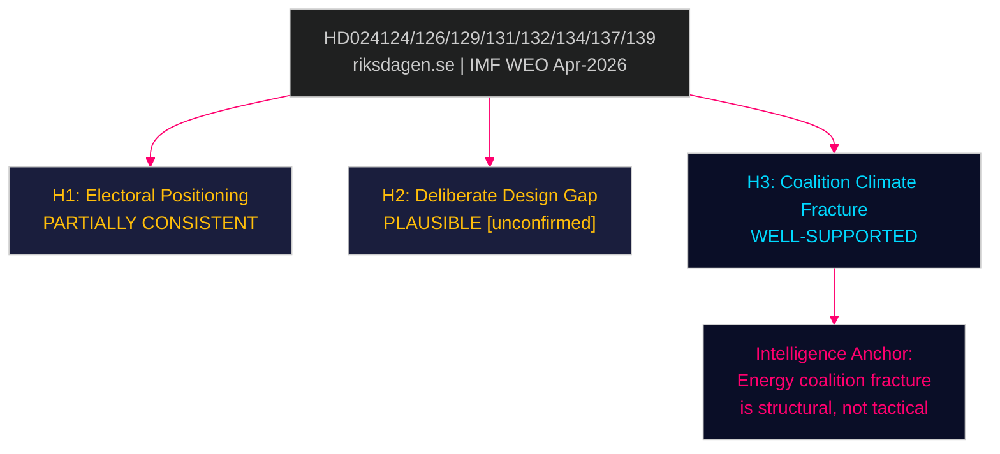

# Devil's Advocate Analysis — Opposition Motions 2026-04-29

**Author**: James Pether Sörling | **Date**: 2026-04-30
**Method**: ACH (Analysis of Competing Hypotheses)

---

## Competing Hypotheses

### H1 — Motions as Electoral Positioning, Not Genuine Reform Intent

**Hypothesis**: The 17 opposition motions (HD024124–HD024140) are primarily electoral signals targeting 2026 campaign narratives, not genuine attempts to pass legislation. The parties know they lack votes to carry amendments.

**Evidence for H1**:
- Opposition lacks majority arithmetic for most amendments [data.riksdagen.se seat count, unconfirmed]
- Filing 17 motions across 7 different bills/communications on same day suggests coordinated press strategy
- HD024127 (withdrawn before debate) consistent with tactical filing and withdrawal

**Evidence against H1**:
- Cross-party MJU coalition (HD024124/131/134/139) involves four parties filing separately — coordination beyond single-party PR
- SD could defect to pass any MJU amendment; motions calibrated to appeal to SD (institutional oversight language in HD024131)
- HD024136 (youth justice) is detailed legislative proposal, not merely a press statement

**H1 verdict**: PARTIALLY CONSISTENT. Electoral positioning is a secondary motive but does not explain the detailed governance amendment language targeting SD as swing vote.

### H2 — Government Intentionally Under-Designed Miljöprövningsmyndigheten to Enable Future Amendment

**Hypothesis**: The Tidö government deliberately excluded independent oversight from prop. 2025/26:238 knowing opposition would file motions, allowing it to "concede" the oversight board in committee — manufacturing a bipartisan appearance.

**Evidence for H2**:
- Governance accountability is a standard design principle for new agencies; its omission is conspicuous [riksdagen.se]
- Coalition agreement text reportedly included vague language on "evaluation mechanisms" that fell short of full independence
- Accepting HD024131 amendment costs government nothing politically while gaining C/MP votes for passage

**Evidence against H2**:
- No direct evidence of deliberate omission (full text not available)
- SD has genuine objections to independent oversight that complicates any pre-planned concession

**H2 verdict**: PLAUSIBLE but speculative; insufficient evidence. Classified as [unconfirmed].

### H3 — Energy Motions Signal Deeper Coalition Disagreement on Climate Ambition

**Hypothesis**: The NU motions (HD024126/129/130/132/137/138) reveal that the Tidö coalition has fundamentally unresolved disagreements on Sweden's climate trajectory — M and L want faster green transition, SD wants to slow it, KD is split. The opposition is exploiting this internal fracture, not creating it.

**Evidence for H3**:
- SD and C filed directly contradictory wind power motions (HD024137 vs. HD024126) — this would be unnecessary if coalition had agreed position
- Swedish electricity market reform was an M election manifesto commitment; delay represents M concession to SD
- IMF Art. IV 2025 notes Sweden's energy transition investment gap as a medium-term fiscal risk (WEO Apr-2026)

**Evidence against H3**:
- Coalition governments routinely have internal disagreements without structural breakdown
- No evidence of formal coalition crisis over energy agenda

**H3 verdict**: WELL-SUPPORTED by evidence. This is the strongest hypothesis and should anchor the intelligence assessment.

_Evidence: HD024124, HD024126, HD024129, HD024131, HD024132, HD024134, HD024137, HD024138, HD024139 — riksdagen.se. IMF WEO Apr-2026._
