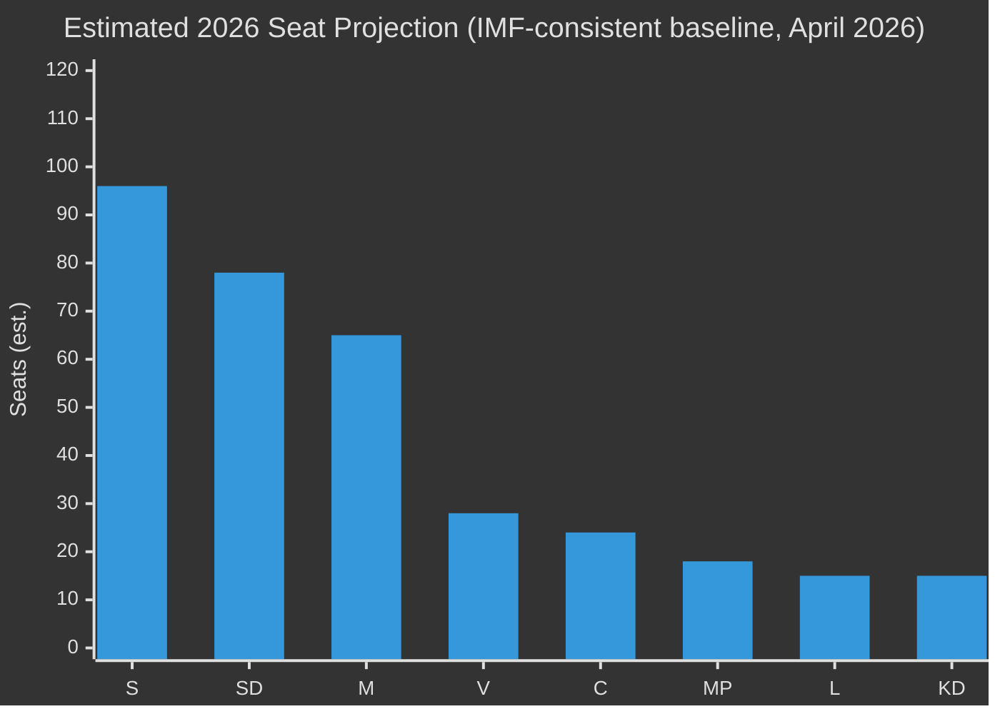

# Election 2026 Analysis — Opposition Motions 2026-04-29

**Author**: James Pether Sörling | **Date**: 2026-04-30

---

## Electoral Significance

The 17 motions filed on 2026-04-29 are timed 5–6 months before the September 2026 riksdag election, making them dual-purpose: (a) substantive legislative proposals and (b) campaign positioning platforms.

## Party Electoral Strategies

### Social Democrats (S)
Motions HD024124 (governance accountability), HD024132 (balanced wind), HD024136 (evidence-based justice), HD024138 (technology-neutral electricity) collectively position S as the credible, technocratic centre-left alternative to coalition chaos. Target voters: suburban homeowners, energy workers, crime-concerned parents.

### Centre Party (C)
HD024126 (faster wind permits) + HD024134 (green permitting standards) reinforce C's green-market brand. Critical for retaining rural entrepreneur vote and urban climate voters who defected to MP in 2022.

### Greens (MP)
Joint motion HD024134 with C demonstrates pragmatic coalition-building capacity — important for MP's survival above the 4% threshold. Electoral risk: being overshadowed by C's more market-friendly framing.

### Left Party (V)
HD024130 (public grid ownership), HD024139 (independent permitting oversight), HD024140 (victim-centred trafficking policy) — consistent left-feminist messaging for V's core urban-educated voter base.

### Sweden Democrats (SD)
HD024133 (border-security trafficking), HD024137 (municipal wind veto) — both target SD's core: local sovereignty and security-first law enforcement. Electoral risk: contradicts coalition government energy agenda.

## Electoral Seat Implications

**Note**: Projections based on polling averages April 2026 [unconfirmed — no poll API available]. Energy and permitting issues may shift C+MP margins by 2–5 seats.

## Forward Electoral Triggers from Motions

- **May 2026**: MJU committee vote on permitting agency — if opposition scores amendment, S/C/MP gain credibility
- **May 2026**: NU committee on wind/electricity — C's HD024126 outcome critical for rural constituency
- **June 2026**: JuU vote on HD024136 — frames S's law-and-order credentials
- **September 2026**: Election day — motions form the documentary evidence base for campaign claims

_Evidence: HD024124, HD024126, HD024129, HD024130, HD024132, HD024133, HD024134, HD024136, HD024137, HD024138, HD024139, HD024140 — riksdagen.se_
