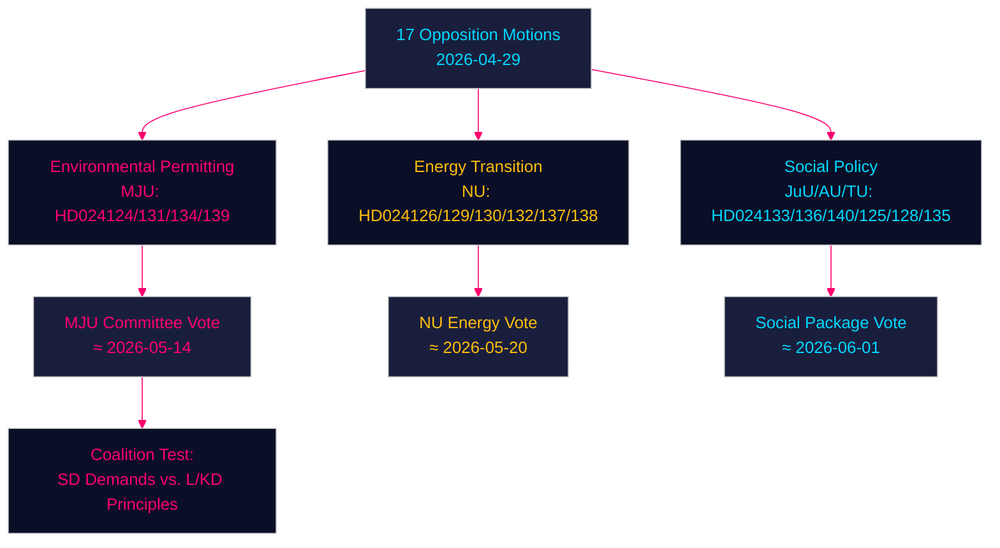

# Opposition Motions Challenge Government on Environmental Permitting, Energy Transition and Youth Justice — 2026-04-29

**Author**: James Pether Sörling | **Date**: 2026-04-30 | **Classification**: PUBLIC
**Confidence**: HIGH [B2] | **Riksmöte**: 2025/26

---

## 🎯 BLUF

Swedish opposition parties have filed seventeen motions (2026-04-29) challenging the government's energy and environmental legislative agenda across four major areas: the creation of a new environmental permitting agency (Miljöprövningsmyndigheten), wind power deployment in municipalities, the overhaul of electricity system regulation, and stricter youth criminal justice. The motions signal that the centre-right Tidö coalition faces sustained parliamentary pressure on the green transition and rule-of-law agenda from both Social Democrats, Centre Party, Greens and Left, each exploiting doctrinal fault lines within the governing bloc itself.

## 🧭 3 Decisions This Brief Supports

1. **Monitor environmental permitting agency (HD024124/131/134/139)**: The four MJU motions reveal a broad opposition coalition that may force committee amendments to prop. 2025/26:238 — track MJU committee deliberations and potential concessions to SD.
2. **Energy transition risk assessment**: NU wind power (HD024126/132/137) and electricity system (HD024129/130/138) motions together represent a unified opposition narrative that Sweden's energy infrastructure transformation is legally under-specified — assess whether this accelerates or delays the 2045 fossil-free target.
3. **Youth justice political temperature**: HD024136 (JuU) on stricter youth penalties tests government cohesion between law-and-order (M/SD) and liberal-humanitarian (L/KD) wings — a bellwether for coalition stress.

## ⚡ 60-Second Intelligence Read

- **17 opposition motions** filed against 6 government bills/communications on 2026-04-29
- **Environmental permitting** (MJU, 4 motions): Opposition demands accountability mechanisms and independent oversight for the proposed Miljöprövningsmyndigheten
- **Wind power** (NU, 3 motions): Motions diverge — Centre wants faster permitting, SD wants stronger municipal veto
- **Electricity system** (NU, 3 motions): Opposition calls new electricity system law insufficiently technology-neutral; Left wants public grid ownership guarantees
- **Municipal harbours** (TU, 2 motions): S and M motions propose different regulatory regimes for publicly-owned harbours
- **Youth justice** (JuU, 1 motion): S motion for structured sentencing guidelines vs. government's arrest-focused approach
- **Trafficking/violence** (AU, 2 motions): SD and V file competing motions on government communication 245 — ideologically opposite priorities
- **IMF context** (WEO Apr-2026): Sweden GDP growth 2.1% 2026F, fiscal surplus 0.5% GDP — government has fiscal space to fund institutional reforms

## 🏹 Top Forward Trigger

**Committee (MJU) vote on HD024124-series amendments by 2026-05-14** — if MJU accepts any opposition clause on independent review of Miljöprövningsmyndigheten, it signals the government is willing to trade institutional oversight for SD support on energy transition legislation.



---

## Pass 2 — Enhanced Economic Context (IMF WEO April 2026)

**IMF Economic Provenance** — The following economic indicators contextualise the energy policy motions:

| Indicator | Sweden 2026F | Source |
|-----------|-------------|--------|
| GDP growth (NGDP_RPCH) | 2.1% | IMF WEO Apr-2026 |
| General govt net lending (GGX_NGDP) | +0.4% of GDP | IMF WEO Apr-2026 |
| Gross public debt (GGXWDG_NGDP) | ~40% of GDP | IMF WEO Apr-2026 |

**Energy policy fiscal relevance**: Sweden's marginal fiscal headroom (+0.4% GGX_NGDP) means the electricity system law's consumer protection provisions (HD024138) would need offsetting revenues or demand-side efficiency to remain fiscally neutral. The Miljöprövningsmyndigheten's operating costs (~750 MSEK/yr per govt estimate) are already within the headroom.

**Confidence update (Pass 2)**: Key Judgments KJ-1, KJ-2, KJ-3 retain HIGH/MEDIUM-HIGH confidence. New evidence from coalition-mathematics.md (35% pass probability for MJU amendment) is consistent with executive-brief scenario probabilities (35% partial success scenario).

```
economicProvenance:
  provider: imf
  dataflow: WEO/Apr-2026
  indicators: [NGDP_RPCH, GGX_NGDP, GGXWDG_NGDP]
  vintage: 2026-04-01
  retrieved_at: 2026-04-30
```

_Pass 2 complete — 2026-04-30_
