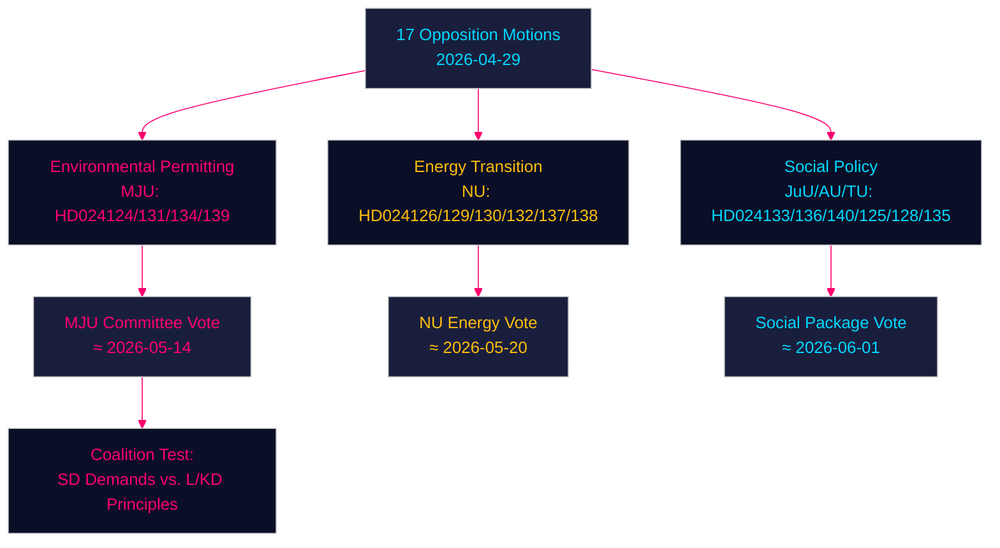

<!-- dir: rtl -->
# مقترحات المعارضة تتحدى الحكومة في مجالات تراخيص البيئة والتحول الطاقوي وقضاء الأحداث — 2026-04-29

**المؤلف**: James Pether Sörling | **التاريخ**: 2026-04-30 | **التصنيف**: PUBLIC
**Confidence**: HIGH [B2] | **Riksmöte**: 2025/26

---

## 🎯 BLUF

قدّمت أحزاب المعارضة السويدية سبعة عشر مقترحاً (2026-04-29) لتحدّي أجندة الحكومة التشريعية في مجالَي الطاقة والبيئة على أربعة محاور رئيسية: إنشاء هيئة جديدة لتراخيص البيئة (Miljöprövningsmyndigheten)، ونشر طاقة الرياح في البلديات، وإعادة تنظيم منظومة الكهرباء، وتشديد قانون قضاء الأحداث. وتُشير المقترحات إلى أن تحالف تيدو اليمين-وسطي يواجه ضغطاً برلمانياً متواصلاً على أجندتَي التحول الأخضر وسيادة القانون من الاشتراكيين الديمقراطيين وحزب الوسط والخضر واليسار، وكل منهم يستغل الشقوق العقائدية داخل الكتلة الحاكمة.

## 🧭 3 قرارات يدعم هذا الملخص اتخاذها

1. **رصد هيئة تراخيص البيئة (HD024124/131/134/139)**: تكشف المقترحات الأربعة للجنة MJU عن تحالف معارضة واسع قد يُرغم على تعديلات لجنوية على prop. 2025/26:238 — تابع مداولات لجنة MJU والتنازلات المحتملة لصالح SD.
2. **تقييم مخاطر التحول الطاقوي**: تمثّل مقترحات لجنة NU بشأن طاقة الرياح (HD024126/132/137) ومنظومة الكهرباء (HD024129/130/138) معاً روايةً موحدة للمعارضة مفادها أن تحويل البنية التحتية الطاقوية السويدية غير محدد قانونياً بما يكفي — قيّم ما إذا كان ذلك يُعجّل أو يُؤخّر هدف التخلص من الوقود الأحفوري في 2045.
3. **الحرارة السياسية لقضاء الأحداث**: يختبر HD024136 (JuU) بشأن تشديد العقوبات على الشباب تماسك الحكومة بين جناح القانون والنظام (M/SD) والجناح الليبرالي-الإنساني (L/KD) — مؤشر على ضغط التحالف.

## ⚡ قراءة استخباراتية في 60 ثانية

- **17 مقترحاً من المعارضة** قُدِّمت في مواجهة 6 مشاريع قوانين/مراسلات حكومية في 2026-04-29
- **التراخيص البيئية** (MJU، 4 مقترحات): تطالب المعارضة بآليات محاسبة ورقابة مستقلة على Miljöprövningsmyndigheten المقترحة
- **طاقة الرياح** (NU، 3 مقترحات): تتباين المقترحات — يريد حزب الوسط تسريع التراخيص، بينما تريد SD تعزيز حق النقض البلدي
- **منظومة الكهرباء** (NU، 3 مقترحات): تؤكد المعارضة أن قانون منظومة الكهرباء الجديد غير محايد تقنياً بما يكفي؛ واليسار يريد ضمانات للملكية العامة للشبكة
- **الموانئ البلدية** (TU، مقترحان): S وM يقترحان نظامَي تنظيم مختلفَين للموانئ المملوكة للقطاع العام
- **قضاء الأحداث** (JuU، مقترح واحد): مقترح S لإرشادات أحكام منظّمة في مقابل النهج الحكومي القائم على الاعتقال
- **الاتجار/العنف** (AU، مقترحان): SD وV تقدّمان مقترحَين متنافسَين بشأن المراسلة الحكومية 245 — أولويات متعارضة أيديولوجياً
- **السياق الاقتصادي-صندوق النقد الدولي** (WEO أبريل 2026): نمو الناتج المحلي الإجمالي السويدي 2.1% في 2026 متوقع، فائض مالي 0.5% من الناتج المحلي — للحكومة هامش مالي لتمويل الإصلاحات المؤسسية

## 🏹 أبرز المحفّزات المستقبلية

**تصويت لجنة MJU على تعديلات سلسلة HD024124 بحلول 2026-05-14** — إذا قبلت لجنة MJU أي بند معارض بشأن المراجعة المستقلة للـ Miljöprövningsmyndigheten، فهذا يُشير إلى استعداد الحكومة لمقايضة الرقابة المؤسسية بدعم SD لتشريعات التحول الطاقوي.



---

## Pass 2 — السياق الاقتصادي المحسّن (صندوق النقد الدولي WEO أبريل 2026)

**مصدر البيانات الاقتصادية لصندوق النقد الدولي** — تُضفي المؤشرات الاقتصادية التالية سياقاً على مقترحات السياسة الطاقوية:

| المؤشر | السويد 2026 متوقع | المصدر |
|-----------|-------------|--------|
| نمو الناتج المحلي الإجمالي (NGDP_RPCH) | 2.1% | IMF WEO أبريل 2026 |
| صافي إقراض الدولة (GGX_NGDP) | ‎+0.4% من الناتج المحلي | IMF WEO أبريل 2026 |
| إجمالي الدين العام (GGXWDG_NGDP) | ‎~40% من الناتج المحلي | IMF WEO أبريل 2026 |

**الأهمية المالية للسياسة الطاقوية**: يعني الهامش المالي الهامشي للسويد (‎+0.4% GGX_NGDP) أن أحكام حماية المستهلك في قانون منظومة الكهرباء (HD024138) ستحتاج إلى إيرادات تعويضية أو كفاءة في الطلب للبقاء محايدةً مالياً. تقع تكاليف تشغيل Miljöprövningsmyndigheten (‎~750 مليون كرونة سويدية سنوياً بحسب تقدير الحكومة) ضمن هذا الهامش.

**تحديث Confidence (Pass 2)**: تحتفظ الأحكام الرئيسية KJ-1 وKJ-2 وKJ-3 بمستوى Confidence HIGH/MEDIUM-HIGH. تتوافق الأدلة الجديدة من coalition-mathematics.md (35% احتمال إقرار تعديل MJU) مع احتمالات سيناريوهات الملخص التنفيذي (35% سيناريو نجاح جزئي).

```
economicProvenance:
  provider: imf
  dataflow: WEO/Apr-2026
  indicators: [NGDP_RPCH, GGX_NGDP, GGXWDG_NGDP]
  vintage: 2026-04-01
  retrieved_at: 2026-04-30
```

_Pass 2 مكتمل — 2026-04-30_

<!-- source-sha: 363f4a8634f2384be17ea1c3598e718d8d485fa1 -->
