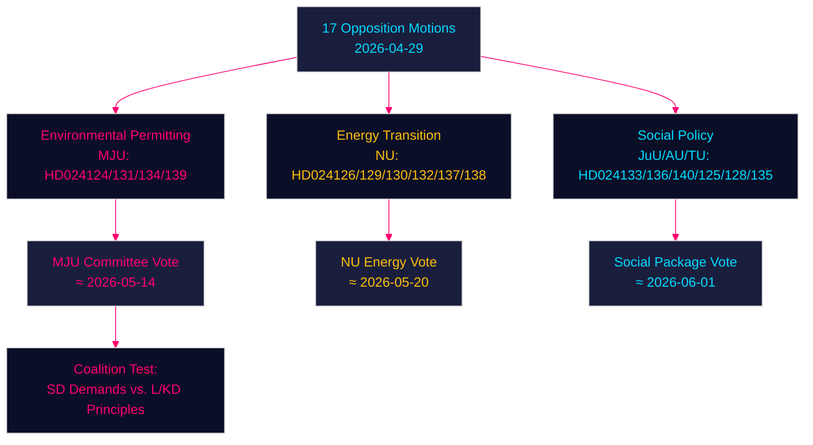

# Oppositionsforslag udfordrer regeringen om miljøgodkendelse, energiomstilling og ungdomsstrafferet — 2026-04-29

**Forfatter**: James Pether Sörling | **Dato**: 2026-04-30 | **Klassificering**: PUBLIC
**Confidence**: HIGH [B2] | **Riksmöte**: 2025/26

---

## 🎯 BLUF

Svenske oppositionspartier har indgivet sytten forslag (2026-04-29) om at udfordre regeringens energi- og miljølovgivningsdagsorden på fire centrale områder: oprettelsen af et nyt miljøgodkendelsesagentur (Miljøprövningsmyndigheten), vindkraftsudrulning i kommuner, omreguleringen af elsystemet og skærpet ungdomsstrafferet. Forslagene signalerer, at den centerkonservative Tidø-koalition møder vedvarende parlamentarisk pres på den grønne omstilling og retsstatsdagsordenen fra både Socialdemokraterne, Centerpartiet, De Grønne og Venstrefløjen, der hver udnytter doktrinære sprækker i den regerende blok.

## 🧭 3 Beslutninger dette underlag understøtter

1. **Overvåg miljøgodkendelsesagenturet (HD024124/131/134/139)**: De fire MJU-forslag afslører en bred oppositionskoalition, der kan tvinge udvalgsændringer til prop. 2025/26:238 — følg MJU-udvalgets drøftelser og mulige indrømmelser til SD.
2. **Risikovurdering af energiomstilling**: NU-forslagene om vindkraft (HD024126/132/137) og elsystemet (HD024129/130/138) repræsenterer tilsammen et samlet oppositionsnarrativ om, at Sveriges energiinfrastrukturtransformation er utilstrækkeligt retsligt specificeret — vurder, om dette fremskynder eller forsinker målet om fossilfrihed i 2045.
3. **Politisk temperatur omkring ungdomsstrafferet**: HD024136 (JuU) om skærpede ungdomssanktioner tester regeringens sammenhæng mellem lov-og-orden (M/SD) og liberal-humanitære (L/KD) partier — en lakmusprøve for koalitionsstress.

## ⚡ 60-sekunders efterretningslæsning

- **17 oppositionsforslag** indgivet mod 6 regeringspropositioner/skrivelser den 2026-04-29
- **Miljøgodkendelse** (MJU, 4 forslag): Oppositionen kræver ansvarlighedsmekanismer og uafhængigt tilsyn med det foreslåede Miljøprövningsmyndigheten
- **Vindkraft** (NU, 3 forslag): Forslagene divergerer — Centerpartiet ønsker hurtigere tilladelser, SD ønsker stærkere kommunalt veto
- **Elsystemet** (NU, 3 forslag): Oppositionen hævder, at den nye ellov er utilstrækkeligt teknologineutral; Venstrefløjen ønsker garantier for offentligt netejerskab
- **Kommunale havne** (TU, 2 forslag): S og M foreslår forskellige reguleringsregimer for offentligt ejede havne
- **Ungdomsstrafferet** (JuU, 1 forslag): S-forslag om strukturerede strafferammer versus regeringens arrestationsfokuserede tilgang
- **Menneskehandel/vold** (AU, 2 forslag): SD og V indgiver konkurrerende forslag til regeringsskrivelse 245 — ideologisk modsatte prioriteter
- **IMF-kontekst** (WEO Apr-2026): Sveriges BNP-vækst 2,1 % 2026F, finansoverskud 0,5 % af BNP — regeringen har finanspolitisk råderum til at finansiere institutionelle reformer

## 🏹 Vigtigste fremadrettede trigger

**Udvalgsafstemning (MJU) om HD024124-serieændringer senest 2026-05-14** — hvis MJU accepterer en oppositionsklausul om uafhængig gennemgang af Miljøprövningsmyndigheten, signalerer det, at regeringen er villig til at handle institutionelt tilsyn mod SD's støtte til energiomstillingslovgivningen.



---

## Pass 2 — Forbedret økonomisk kontekst (IMF WEO April 2026)

**IMF økonomisk proveniensen** — Følgende økonomiske indikatorer kontekstualiserer energipolitikforslagene:

| Indikator | Sverige 2026F | Kilde |
|-----------|-------------|--------|
| BNP-vækst (NGDP_RPCH) | 2,1 % | IMF WEO Apr-2026 |
| Statens nettoudlån (GGX_NGDP) | +0,4 % af BNP | IMF WEO Apr-2026 |
| Bruttogæld offentlig sektor (GGXWDG_NGDP) | ~40 % af BNP | IMF WEO Apr-2026 |

**Energipolitikkens finanspolitiske relevans**: Sveriges marginale finanspolitiske råderum (+0,4 % GGX_NGDP) betyder, at elsystemlovens forbrugerbeskyttelsesbestemmelser (HD024138) ville have brug for modgående indtægter eller efterspørgselseffektivitet for at forblive finanspolitisk neutrale. Miljøprövningsmyndighetens driftsomkostninger (~750 MSEK/år ifølge regeringens skøn) er allerede inden for råderummet.

**Confidence-opdatering (Pass 2)**: Nøglevurderinger KJ-1, KJ-2, KJ-3 bevarer HIGH/MEDIUM-HIGH confidence. Ny dokumentation fra coalition-mathematics.md (35 % vedtagelsesprobabilitet for MJU-ændring) er konsistent med executive-brief-scenarieprobabiliteterne (35 % delvis successcenarie).

```
economicProvenance:
  provider: imf
  dataflow: WEO/Apr-2026
  indicators: [NGDP_RPCH, GGX_NGDP, GGXWDG_NGDP]
  vintage: 2026-04-01
  retrieved_at: 2026-04-30
```

_Pass 2 afsluttet — 2026-04-30_

<!-- source-sha: 363f4a8634f2384be17ea1c3598e718d8d485fa1 -->
