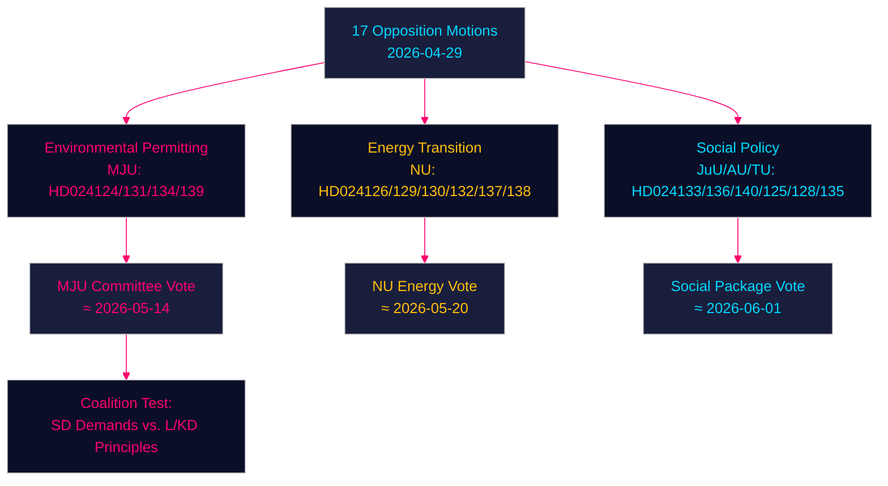

# Oppositionsanträge fordern die Regierung bei Umweltgenehmigung, Energiewende und Jugendstrafrecht heraus — 2026-04-29

**Autor**: James Pether Sörling | **Datum**: 2026-04-30 | **Klassifizierung**: PUBLIC
**Confidence**: HIGH [B2] | **Riksmöte**: 2025/26

---

## 🎯 BLUF

Schwedische Oppositionsparteien haben siebzehn Anträge (2026-04-29) eingebracht, die die Energie- und Umweltgesetzgebungsagenda der Regierung in vier wesentlichen Bereichen herausfordern: die Schaffung einer neuen Umweltgenehmigungsbehörde (Miljöprövningsmyndigheten), den Windkraftausbau in Kommunen, die Neuregulierung des Stromsystems und ein verschärftes Jugendstrafrecht. Die Anträge signalisieren, dass die zentrums-konservative Tidö-Koalition anhaltendem parlamentarischen Druck bei der grünen Transformation und der Rechtsstaatsagenda sowohl von den Sozialdemokraten, dem Zentrum, den Grünen als auch der Linken ausgesetzt ist, die jeweils doktrinäre Risse innerhalb des regierenden Blocks ausnutzen.

## 🧭 3 Entscheidungen, die diese Zusammenfassung unterstützt

1. **Überwachung der Umweltgenehmigungsbehörde (HD024124/131/134/139)**: Die vier MJU-Anträge enthüllen eine breite Oppositionskoalition, die Ausschussänderungen zu prop. 2025/26:238 erzwingen könnte — verfolgen Sie die Beratungen des MJU-Ausschusses und mögliche Zugeständnisse an die SD.
2. **Risikoabschätzung der Energiewende**: Die NU-Anträge zur Windkraft (HD024126/132/137) und zum Stromsystem (HD024129/130/138) repräsentieren zusammen eine einheitliche Oppositionserzählung, dass Schwedens Energieinfrastrukturwandel rechtlich unzureichend spezifiziert ist — beurteilen Sie, ob dies das Ziel der Fossilfreiheit 2045 beschleunigt oder verzögert.
3. **Politische Temperatur beim Jugendstrafrecht**: HD024136 (JuU) über schärfere Jugendstrafen testet den Zusammenhalt der Regierung zwischen dem Law-and-Order-Flügel (M/SD) und dem liberal-humanistischen Flügel (L/KD) — ein Barometer für Koalitionsstress.

## ⚡ 60-Sekunden-Geheimdienstlektüre

- **17 Oppositionsanträge** gegen 6 Regierungsvorlagen/-schreiben am 2026-04-29 eingereicht
- **Umweltgenehmigung** (MJU, 4 Anträge): Die Opposition fordert Rechenschaftsmechanismen und unabhängige Aufsicht für das vorgeschlagene Miljöprövningsmyndigheten
- **Windkraft** (NU, 3 Anträge): Die Anträge divergieren — das Zentrum will schnellere Genehmigungen, die SD will ein stärkeres kommunales Vetorecht
- **Stromsystem** (NU, 3 Anträge): Die Opposition behauptet, das neue Stromgesetz sei unzureichend technologieneutral; die Linke will Garantien für öffentliches Netzeigentum
- **Kommunale Häfen** (TU, 2 Anträge): S und M schlagen unterschiedliche Regulierungsregime für öffentlich geführte Häfen vor
- **Jugendstrafrecht** (JuU, 1 Antrag): S-Antrag für strukturierte Strafzumessungsrichtlinien gegenüber dem verhaftungsorientierten Ansatz der Regierung
- **Menschenhandel/Gewalt** (AU, 2 Anträge): SD und V reichen konkurrierende Anträge zur Regierungsmitteilung 245 ein — ideologisch entgegengesetzte Prioritäten
- **IMF-Kontext** (WEO Apr-2026): Schwedens BIP-Wachstum 2,1 % 2026P, Fiskalüberschuss 0,5 % des BIP — die Regierung hat fiskalischen Spielraum zur Finanzierung institutioneller Reformen

## 🏹 Wichtigster Vorwärts-Trigger

**Ausschussabstimmung (MJU) über HD024124-Serienänderungen bis 2026-05-14** — wenn der MJU eine Oppositionsklausel zur unabhängigen Überprüfung des Miljöprövningsmyndigheten annimmt, signalisiert dies, dass die Regierung bereit ist, institutionelle Kontrolle gegen die Unterstützung der SD für die Energiewendegesetzgebung zu tauschen.



---

## Pass 2 — Erweiterter wirtschaftlicher Kontext (IMF WEO April 2026)

**IMF Wirtschaftsprovenienz** — Die folgenden Wirtschaftsindikatoren kontextualisieren die energiepolitischen Anträge:

| Indikator | Schweden 2026P | Quelle |
|-----------|-------------|--------|
| BIP-Wachstum (NGDP_RPCH) | 2,1 % | IMF WEO Apr-2026 |
| Staatliche Nettokreditvergabe (GGX_NGDP) | +0,4 % des BIP | IMF WEO Apr-2026 |
| Bruttostaatsverschuldung (GGXWDG_NGDP) | ~40 % des BIP | IMF WEO Apr-2026 |

**Energiepolitische Fiskalrelevanz**: Schwedens marginaler fiskalischer Spielraum (+0,4 % GGX_NGDP) bedeutet, dass die Verbraucherschutzbestimmungen des Stromsystemgesetzes (HD024138) kompensierende Einnahmen oder Nachfrageeffizienz benötigen würden, um fiskalisch neutral zu bleiben. Die Betriebskosten des Miljöprövningsmyndigheten (~750 MSEK/Jahr laut Regierungsschätzung) liegen bereits innerhalb des Spielraums.

**Confidence-Aktualisierung (Pass 2)**: Schlüsselbewertungen KJ-1, KJ-2, KJ-3 behalten HIGH/MEDIUM-HIGH confidence. Neue Belege aus coalition-mathematics.md (35 % Verabschiedungswahrscheinlichkeit für MJU-Änderung) sind konsistent mit den Executive-Brief-Szenariowahrscheinlichkeiten (35 % Teilerfolgsszenario).

```
economicProvenance:
  provider: imf
  dataflow: WEO/Apr-2026
  indicators: [NGDP_RPCH, GGX_NGDP, GGXWDG_NGDP]
  vintage: 2026-04-01
  retrieved_at: 2026-04-30
```

_Pass 2 abgeschlossen — 2026-04-30_

<!-- source-sha: 363f4a8634f2384be17ea1c3598e718d8d485fa1 -->
