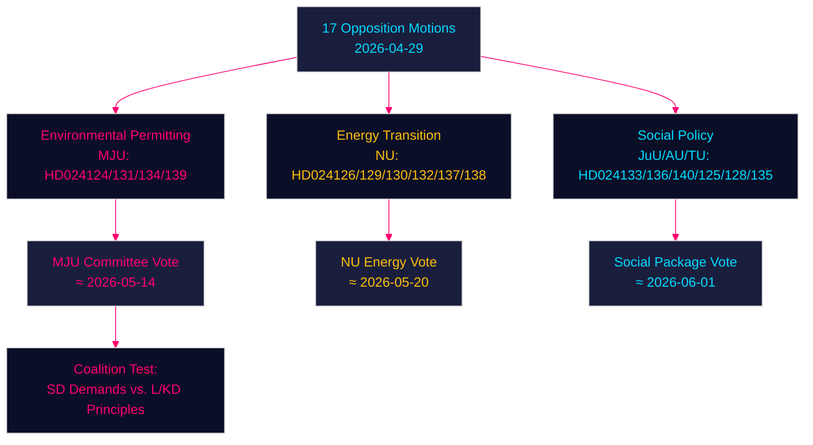

# Las mociones de la oposición desafían al gobierno en permisos ambientales, transición energética y justicia juvenil — 2026-04-29

**Autor**: James Pether Sörling | **Fecha**: 2026-04-30 | **Clasificación**: PUBLIC
**Confidence**: HIGH [B2] | **Riksmöte**: 2025/26

---

## 🎯 BLUF

Los partidos de oposición suecos han presentado diecisiete mociones (2026-04-29) que desafían la agenda legislativa energética y medioambiental del gobierno en cuatro áreas principales: la creación de una nueva agencia de permisos ambientales (Miljöprövningsmyndigheten), el despliegue de energía eólica en los municipios, la reforma de la regulación del sistema eléctrico y un derecho penal de menores más estricto. Las mociones señalan que la coalición centro-conservadora Tidö enfrenta presión parlamentaria sostenida sobre la transición verde y la agenda del Estado de derecho por parte de los Socialdemócratas, el Centro, los Verdes y la Izquierda, cada uno explotando fisuras doctrinales dentro del bloque gobernante.

## 🧭 3 Decisiones que apoya este informe

1. **Supervisar la agencia de permisos ambientales (HD024124/131/134/139)**: Las cuatro mociones MJU revelan una amplia coalición de oposición que puede forzar enmiendas en comisión a la prop. 2025/26:238 — seguir las deliberaciones de la comisión MJU y posibles concesiones al SD.
2. **Evaluación de riesgos de la transición energética**: Las mociones NU sobre energía eólica (HD024126/132/137) y sistema eléctrico (HD024129/130/138) representan juntas una narrativa de oposición unificada de que la transformación de la infraestructura energética sueca está insuficientemente especificada legalmente — evaluar si esto acelera o retrasa el objetivo de neutralidad de carbono 2045.
3. **Temperatura política en torno a la justicia juvenil**: HD024136 (JuU) sobre sanciones penales más estrictas para menores pone a prueba la cohesión del gobierno entre el ala de ley y orden (M/SD) y la liberal-humanista (L/KD) — un barómetro del estrés de la coalición.

## ⚡ Lectura de inteligencia en 60 segundos

- **17 mociones de oposición** presentadas contra 6 proposiciones/comunicaciones del gobierno el 2026-04-29
- **Permisos ambientales** (MJU, 4 mociones): La oposición exige mecanismos de responsabilidad y supervisión independiente del Miljöprövningsmyndigheten propuesto
- **Energía eólica** (NU, 3 mociones): Las mociones divergen — el Centro quiere permisos más rápidos, SD quiere un derecho de veto municipal más fuerte
- **Sistema eléctrico** (NU, 3 mociones): La oposición afirma que la nueva ley del sistema eléctrico es insuficientemente neutral tecnológicamente; la Izquierda quiere garantías sobre la propiedad pública de la red
- **Puertos municipales** (TU, 2 mociones): S y M proponen regímenes regulatorios diferentes para puertos de propiedad pública
- **Justicia juvenil** (JuU, 1 moción): Moción S para directrices estructuradas de determinación de penas frente al enfoque centrado en arrestos del gobierno
- **Trata/violencia** (AU, 2 mociones): SD y V presentan mociones concurrentes sobre la comunicación gubernamental 245 — prioridades ideológicamente opuestas
- **Contexto FMI** (WEO abr.-2026): Crecimiento del PIB sueco 2,1 % 2026P, superávit fiscal 0,5 % del PIB — el gobierno tiene margen fiscal para financiar reformas institucionales

## 🏹 Principal detonante prospectivo

**Votación en comisión (MJU) sobre enmiendas de la serie HD024124 antes del 2026-05-14** — si la MJU acepta cualquier cláusula de oposición sobre revisión independiente del Miljöprövningsmyndigheten, señala que el gobierno está dispuesto a intercambiar supervisión institucional por el apoyo de SD a la legislación sobre transición energética.



---

## Pass 2 — Contexto económico mejorado (FMI WEO abril 2026)

**Proveniencia económica FMI** — Los siguientes indicadores económicos contextualizan las mociones sobre política energética:

| Indicador | Suecia 2026P | Fuente |
|-----------|-------------|--------|
| Crecimiento del PIB (NGDP_RPCH) | 2,1 % | FMI WEO abr.-2026 |
| Préstamo neto del Estado (GGX_NGDP) | +0,4 % del PIB | FMI WEO abr.-2026 |
| Deuda pública bruta (GGXWDG_NGDP) | ~40 % del PIB | FMI WEO abr.-2026 |

**Relevancia fiscal de la política energética**: El margen fiscal marginal de Suecia (+0,4 % GGX_NGDP) implica que las disposiciones de protección del consumidor de la ley del sistema eléctrico (HD024138) necesitarían ingresos compensadores o eficiencia de la demanda para mantenerse fiscalmente neutras. Los costes operativos del Miljöprövningsmyndigheten (~750 MSEK/año según la estimación del gobierno) ya están dentro del margen.

**Actualización de Confidence (Pass 2)**: Los juicios clave KJ-1, KJ-2, KJ-3 mantienen Confidence HIGH/MEDIUM-HIGH. La nueva evidencia de coalition-mathematics.md (35 % de probabilidad de aprobación para la enmienda MJU) es consistente con las probabilidades de escenario del executive-brief (35 % de escenario de éxito parcial).

```
economicProvenance:
  provider: imf
  dataflow: WEO/Apr-2026
  indicators: [NGDP_RPCH, GGX_NGDP, GGXWDG_NGDP]
  vintage: 2026-04-01
  retrieved_at: 2026-04-30
```

_Pass 2 completado — 2026-04-30_

<!-- source-sha: 363f4a8634f2384be17ea1c3598e718d8d485fa1 -->
