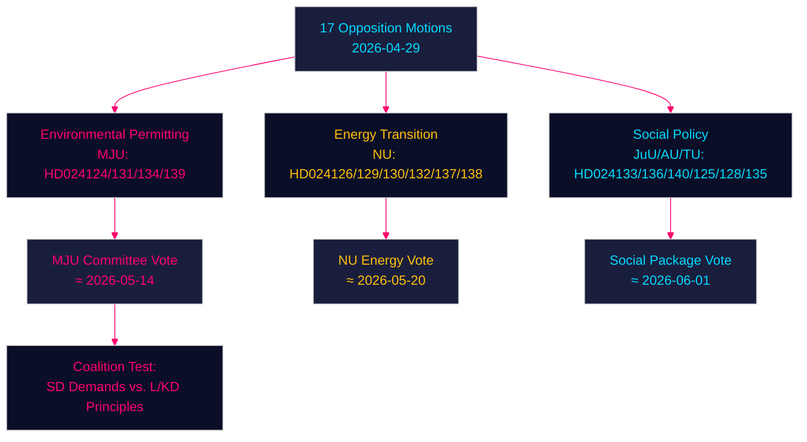

# Oppositiopuolueet haastavat hallituksen ympäristölupamenettelystä, energiasiirtymästä ja nuorisorikoslaista — 2026-04-29

**Kirjoittaja**: James Pether Sörling | **Päivämäärä**: 2026-04-30 | **Luokittelu**: PUBLIC
**Confidence**: HIGH [B2] | **Riksmöte**: 2025/26

---

## 🎯 BLUF

Ruotsin oppositiopuolueet ovat jättäneet seitsemäntoista aloitetta (2026-04-29), joissa haastetaan hallituksen energia- ja ympäristölainsäädäntöohjelma neljällä pääalueella: uuden ympäristölupaviraston (Miljöprövningsmyndigheten) perustaminen, tuulivoiman rakentaminen kunnissa, sähköjärjestelmän sääntelyn uudistaminen ja ankarampi nuorisorikoslaki. Aloitteet osoittavat, että keskustaoikeistolainen Tidö-koalitio kohtaa jatkuvaa parlamentaarista painetta vihreän siirtymän ja oikeusvaltioperiaatteen asialistalla sekä Sosiaalidemokraateilta, Keskustapuolueelta, Vihreiltä että Vasemmistolta, joista kukin hyödyntää opillisia halkeamia hallitsevassa blokissa.

## 🧭 3 Päätöstä, joita tämä lyhennelmä tukee

1. **Seuraa ympäristölupaviraston kehitystä (HD024124/131/134/139)**: Neljä MJU-aloitetta paljastavat laajan oppositiokoalition, joka saattaa pakottaa valiokuntamuutoksia prop. 2025/26:238:aan — seuraa MJU-valiokunnan harkintoja ja mahdollisia myönnytyksiä SD:lle.
2. **Energiasiirtymän riskiarviointi**: NU:n tuulivoima-aloitteet (HD024126/132/137) ja sähköjärjestelmäaloitteet (HD024129/130/138) edustavat yhdessä yhtenäistä oppositiokertomusta siitä, että Ruotsin energiainfrastruktuurin muutos on oikeudellisesti alimääriteltyjä — arvioi, kiihdyttääkö vai viivästyttääkö tämä hiilivapaustavoitetta 2045.
3. **Nuorisorikoslain poliittinen lämpötila**: HD024136 (JuU) ankarammista nuorisosanktioista testaa hallituksen yhtenäisyyttä laki-ja-järjestys- (M/SD) ja liberaalihumanististen (L/KD) siipien välillä — koalitiorasituksen barometri.

## ⚡ 60 sekunnin tiedustelulukema

- **17 oppositioaloitetta** jätetty 6 hallituksen esitystä/kirjelmää vastaan 2026-04-29
- **Ympäristölupa** (MJU, 4 aloitetta): Oppositio vaatii vastuumekanismeja ja riippumatonta valvontaa ehdotetulle Miljöprövningsmyndighetenille
- **Tuulivoima** (NU, 3 aloitetta): Aloitteet eriävät — Keskustapuolue haluaa nopeampaa lupamenettelyä, SD haluaa vahvempaa kunnallista veto-oikeutta
- **Sähköjärjestelmä** (NU, 3 aloitetta): Oppositio väittää, että uusi sähköjärjestelmälaki on riittämättömän teknologianeutraali; Vasemmisto haluaa takuita julkisesta verkon omistajuudesta
- **Kunnalliset satamat** (TU, 2 aloitetta): S ja M ehdottavat erilaisia sääntelyjärjestelmiä julkisesti omistetuille satamille
- **Nuorisorikoslaki** (JuU, 1 aloite): S-aloite rakenteellisista tuomiolinjauksista versus hallituksen pidätyslähtöinen lähestymistapa
- **Ihmiskauppa/väkivalta** (AU, 2 aloitetta): SD ja V jättävät kilpailevia aloitteita hallituksen kirjelmään 245 — ideologisesti vastakkaiset prioriteetit
- **IMF-konteksti** (WEO huhtikuu 2026): Ruotsin BKT-kasvu 2,1 % 2026E, finanssiylijäämä 0,5 % BKT:sta — hallituksella on finanssipoliittista liikkumavaraa institutionaalisten uudistusten rahoittamiseen

## 🏹 Tärkein eteenpäin katsova laukaisin

**Valiokunnan (MJU) äänestys HD024124-sarjan muutoksista viimeistään 2026-05-14** — jos MJU hyväksyy minkään opposition lausekkeen Miljöprövningsmyndighetenin riippumattomasta tarkastelusta, se signaloi, että hallitus on valmis kauppaamaan institutionaalista valvontaa vastaan SD:n tukea energiasiirtymälainsäädännölle.



---

## Pass 2 — Parannettu taloudellinen konteksti (IMF WEO huhtikuu 2026)

**IMF taloudellinen provenienssi** — Seuraavat taloudelliset indikaattorit kontekstualisoivat energiapoliittiset aloitteet:

| Indikaattori | Ruotsi 2026E | Lähde |
|-----------|-------------|--------|
| BKT-kasvu (NGDP_RPCH) | 2,1 % | IMF WEO huhtikuu 2026 |
| Valtion nettolainananto (GGX_NGDP) | +0,4 % BKT:sta | IMF WEO huhtikuu 2026 |
| Julkisyhteisöjen bruttovelka (GGXWDG_NGDP) | ~40 % BKT:sta | IMF WEO huhtikuu 2026 |

**Energiapolitiikan finanssipoliittinen merkitys**: Ruotsin marginaalinen finanssipoliittinen liikkumavara (+0,4 % GGX_NGDP) tarkoittaa, että sähköjärjestelmälain kuluttajansuojasäännökset (HD024138) tarvitsisivat kompensoivia tuloja tai kysynnän tehostamista pysyäkseen finanssipoliittisesti neutraaleina. Miljöprövningsmyndighetenin toimintakustannukset (~750 MSEK/vuosi hallituksen arvion mukaan) mahtuvat jo liikkumavaran sisälle.

**Confidence-päivitys (Pass 2)**: Avainarviot KJ-1, KJ-2, KJ-3 säilyttävät HIGH/MEDIUM-HIGH confidence. Uudet todisteet coalition-mathematics.md:stä (35 % hyväksymistodennäköisyys MJU-muutokselle) ovat yhteneväisiä executive-brief-skenaariontodennäköisyyksien kanssa (35 % osittainen menestys-skenaario).

```
economicProvenance:
  provider: imf
  dataflow: WEO/Apr-2026
  indicators: [NGDP_RPCH, GGX_NGDP, GGXWDG_NGDP]
  vintage: 2026-04-01
  retrieved_at: 2026-04-30
```

_Pass 2 valmis — 2026-04-30_

<!-- source-sha: 363f4a8634f2384be17ea1c3598e718d8d485fa1 -->
