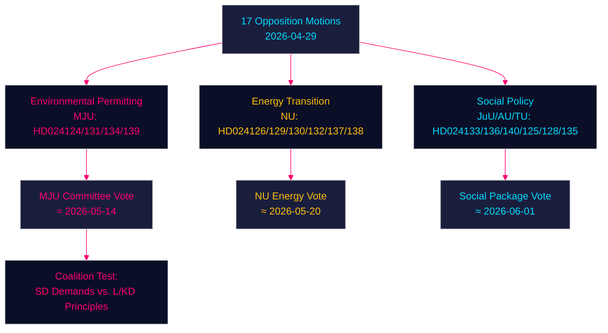

# Les motions de l'opposition défient le gouvernement sur les permis environnementaux, la transition énergétique et la justice des mineurs — 2026-04-29

**Auteur** : James Pether Sörling | **Date** : 2026-04-30 | **Classification** : PUBLIC
**Confidence** : HIGH [B2] | **Riksmöte** : 2025/26

---

## 🎯 BLUF

Les partis d'opposition suédois ont déposé dix-sept motions (2026-04-29) contestant l'agenda législatif énergétique et environnemental du gouvernement dans quatre domaines majeurs : la création d'une nouvelle agence de permis environnementaux (Miljöprövningsmyndigheten), le déploiement de l'éolien dans les communes, la réforme de la régulation du système électrique et un droit pénal des mineurs plus strict. Les motions signalent que la coalition centriste-conservatrice Tidö fait face à une pression parlementaire soutenue sur la transition verte et l'agenda de l'État de droit de la part des Sociaux-démocrates, du Centre, des Verts et de la Gauche, chacun exploitant des failles doctrinales au sein du bloc gouvernant.

## 🧭 3 Décisions que cette note soutient

1. **Surveiller l'agence de permis environnementaux (HD024124/131/134/139)** : Les quatre motions MJU révèlent une large coalition d'opposition susceptible de forcer des amendements en commission à la prop. 2025/26:238 — suivre les délibérations de la commission MJU et les concessions éventuelles à SD.
2. **Évaluation des risques de la transition énergétique** : Les motions NU sur l'éolien (HD024126/132/137) et le système électrique (HD024129/130/138) représentent ensemble un récit d'opposition unifié selon lequel la transformation de l'infrastructure énergétique suédoise est insuffisamment spécifiée juridiquement — évaluer si cela accélère ou retarde l'objectif de neutralité carbone 2045.
3. **Température politique autour de la justice des mineurs** : HD024136 (JuU) sur les sanctions pénales des mineurs teste la cohésion gouvernementale entre l'aile loi-et-ordre (M/SD) et l'aile libérale-humaniste (L/KD) — un baromètre du stress de la coalition.

## ⚡ Lecture de renseignement en 60 secondes

- **17 motions d'opposition** déposées contre 6 propositions/communications gouvernementales le 2026-04-29
- **Permis environnementaux** (MJU, 4 motions) : L'opposition exige des mécanismes de responsabilité et une supervision indépendante du Miljöprövningsmyndigheten proposé
- **Éolien** (NU, 3 motions) : Les motions divergent — le Centre veut des permis plus rapides, SD veut un droit de veto communal plus fort
- **Système électrique** (NU, 3 motions) : L'opposition affirme que la nouvelle loi sur le système électrique est insuffisamment neutre technologiquement ; la Gauche veut des garanties sur la propriété publique du réseau
- **Ports communaux** (TU, 2 motions) : S et M proposent des régimes réglementaires différents pour les ports à propriété publique
- **Justice des mineurs** (JuU, 1 motion) : Motion S pour des lignes directrices structurées de détermination des peines face à l'approche axée sur l'arrestation du gouvernement
- **Traite/violence** (AU, 2 motions) : SD et V déposent des motions concurrentes sur la communication gouvernementale 245 — priorités idéologiquement opposées
- **Contexte FMI** (WEO avr.-2026) : Croissance du PIB suédois 2,1 % 2026P, excédent budgétaire 0,5 % du PIB — le gouvernement dispose d'une marge budgétaire pour financer des réformes institutionnelles

## 🏹 Principal déclencheur prospectif

**Vote en commission (MJU) sur les amendements de la série HD024124 d'ici le 2026-05-14** — si la MJU accepte une clause d'opposition sur le contrôle indépendant du Miljöprövningsmyndigheten, cela signale que le gouvernement est prêt à échanger une surveillance institutionnelle contre le soutien de SD à la législation sur la transition énergétique.



---

## Pass 2 — Contexte économique enrichi (FMI WEO avril 2026)

**Provenance économique FMI** — Les indicateurs économiques suivants contextualisent les motions sur la politique énergétique :

| Indicateur | Suède 2026P | Source |
|-----------|-------------|--------|
| Croissance du PIB (NGDP_RPCH) | 2,1 % | FMI WEO avr.-2026 |
| Prêt net de l'État (GGX_NGDP) | +0,4 % du PIB | FMI WEO avr.-2026 |
| Dette publique brute (GGXWDG_NGDP) | ~40 % du PIB | FMI WEO avr.-2026 |

**Pertinence budgétaire de la politique énergétique** : La marge budgétaire marginale de la Suède (+0,4 % GGX_NGDP) implique que les dispositions de protection des consommateurs de la loi sur le système électrique (HD024138) nécessiteraient des recettes compensatrices ou une efficacité de la demande pour rester neutres budgétairement. Les coûts d'exploitation du Miljöprövningsmyndigheten (~750 MSEK/an selon l'estimation du gouvernement) sont déjà dans les limites de la marge.

**Mise à jour de la Confidence (Pass 2)** : Les jugements clés KJ-1, KJ-2, KJ-3 conservent la Confidence HIGH/MEDIUM-HIGH. Les nouvelles preuves de coalition-mathematics.md (35 % de probabilité d'adoption pour l'amendement MJU) sont cohérentes avec les probabilités de scénarios de l'executive-brief (35 % de scénario de succès partiel).

```
economicProvenance:
  provider: imf
  dataflow: WEO/Apr-2026
  indicators: [NGDP_RPCH, GGX_NGDP, GGXWDG_NGDP]
  vintage: 2026-04-01
  retrieved_at: 2026-04-30
```

_Pass 2 terminé — 2026-04-30_

<!-- source-sha: 363f4a8634f2384be17ea1c3598e718d8d485fa1 -->
