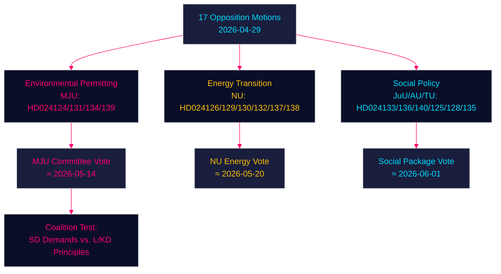

<!-- dir: rtl -->
# הצעות האופוזיציה מאתגרות את הממשלה בנושאי רישוי סביבתי, מעבר אנרגטי וצדק נוער — 2026-04-29

**מחבר**: James Pether Sörling | **תאריך**: 2026-04-30 | **סיווג**: PUBLIC
**Confidence**: HIGH [B2] | **Riksmöte**: 2025/26

---

## 🎯 BLUF

מפלגות האופוזיציה השוודיות הגישו שבע עשרה הצעות (2026-04-29) המאתגרות את אג'נדת החקיקה האנרגטית והסביבתית של הממשלה בארבעה תחומים עיקריים: הקמת רשות חדשה לרישוי סביבתי (Miljöprövningsmyndigheten), פריסת אנרגיית רוח בעיריות, מסגרת רגולציה מחדש של מערכת החשמל ודיני עונשין מחמירים לנוער. ההצעות מאותתות כי קואליציית טידו הימין-מרכזית מתמודדת עם לחץ פרלמנטרי מתמשך על מהפכת האנרגיה הירוקה וסדר היום של שלטון החוק, הן מהסוציאל-דמוקרטים, מפלגת המרכז, הירוקים והשמאל, שכל אחד מהם מנצל סדקים אידיאולוגיים בתוך הגוש השלטוני.

## 🧭 3 החלטות שתמצית זו תומכת בהן

1. **מעקב אחר רשות הרישוי הסביבתי (HD024124/131/134/139)**: ארבע הצעות ה-MJU חושפות קואליציה רחבה של אופוזיציה שעשויה לאלץ תיקוני ועדה להצעת חוק 2025/26:238 — עקבו אחר דיוני ועדת MJU ואחר הפשרות האפשריות לגבי SD.
2. **הערכת סיכוני מעבר אנרגטי**: הצעות NU לאנרגיית רוח (HD024126/132/137) ולמערכת החשמל (HD024129/130/138) מייצגות יחד נרטיב אופוזיציה מאוחד לפיו תשתית האנרגיה השוודית אינה מוגדרת דיה מבחינה משפטית — העריכו האם הדבר יאיץ או יעכב את יעד ניטרליות הפחמן ב-2045.
3. **הטמפרטורה הפוליטית בנושא צדק נוער**: HD024136 (JuU) בדבר ענישה מחמירה לנוער בוחן את לכידות הממשלה בין כנף החוק והסדר (M/SD) לכנף הליברלית-הומניסטית (L/KD) — אינדיקטור ללחץ קואליציוני.

## ⚡ קריאת מודיעין ב-60 שניות

- **17 הצעות אופוזיציה** הוגשו נגד 6 הצעות חוק/מסמכי ממשלה ב-2026-04-29
- **רישוי סביבתי** (MJU, 4 הצעות): האופוזיציה דורשת מנגנוני אחריות ופיקוח עצמאי על ה-Miljöprövningsmyndigheten המוצע
- **אנרגיית רוח** (NU, 3 הצעות): ההצעות מתפצלות — מפלגת המרכז רוצה רישוי מהיר יותר, SD רוצה זכות וטו עירונית חזקה יותר
- **מערכת החשמל** (NU, 3 הצעות): האופוזיציה טוענת שחוק מערכת החשמל החדש אינו נייטרלי טכנולוגית דיו; השמאל רוצה ערבויות לבעלות ציבורית על הרשת
- **נמלים עירוניים** (TU, 2 הצעות): S ו-M מציעות משטרי רגולציה שונים לנמלים בבעלות ציבורית
- **צדק נוער** (JuU, הצעה 1): הצעת S להנחיות גזר דין מובנות מול הגישה הממשלתית הממוקדת במעצר
- **סחר בבני אדם/אלימות** (AU, 2 הצעות): SD ו-V מגישות הצעות מתחרות על מסמך ממשלה 245 — עדיפויות מנוגדות אידיאולוגית
- **הקשר IMF** (WEO אפריל 2026): צמיחת התמ"ג השוודי 2.1% ב-2026 חיזוי, עודף פיסקלי 0.5% מהתמ"ג — לממשלה מרחב פיסקלי למימון רפורמות מוסדיות

## 🏹 הטריגר העתידי המרכזי

**הצבעת ועדת MJU על תיקוני סדרת HD024124 עד 2026-05-14** — אם MJU תאמץ סעיף אופוזיציה בנושא בדיקה עצמאית של Miljöprövningsmyndigheten, הדבר מסמן שהממשלה מוכנה לסחור פיקוח מוסדי בתמורה לתמיכת SD בחקיקת מעבר אנרגטי.



---

## Pass 2 — הקשר כלכלי מועשר (IMF WEO אפריל 2026)

**מקור הנתונים הכלכליים של IMF** — המדדים הכלכליים הבאים מקנטקסטים את הצעות מדיניות האנרגיה:

| מדד | שוודיה 2026 תחזית | מקור |
|-----------|-------------|--------|
| צמיחת תמ"ג (NGDP_RPCH) | 2.1% | IMF WEO אפריל 2026 |
| הלוואה נטו של המדינה (GGX_NGDP) | ‎+0.4% מהתמ"ג | IMF WEO אפריל 2026 |
| חוב ציבורי ברוטו (GGXWDG_NGDP) | ‎~40% מהתמ"ג | IMF WEO אפריל 2026 |

**הרלוונטיות הפיסקלית של מדיניות האנרגיה**: המרחב הפיסקלי השולי של שוודיה (‎+0.4% GGX_NGDP) פירושו שהוראות הגנת הצרכן בחוק מערכת החשמל (HD024138) יצטרכו הכנסות מפצות או יעילות ביקוש כדי להישאר נייטרליות פיסקלית. עלויות התפעול של Miljöprövningsmyndigheten (‎~750 מיליון כרון שוודי לשנה לפי אומדן הממשלה) כבר נמצאות בגבולות המרחב.

**עדכון Confidence (Pass 2)**: שיפוטי המפתח KJ-1, KJ-2, KJ-3 שומרים על רמת Confidence HIGH/MEDIUM-HIGH. ראיות חדשות מ-coalition-mathematics.md (35% הסתברות לאישור תיקון MJU) עקביות עם הסתברויות תרחישי ה-executive-brief (35% תרחיש הצלחה חלקית).

```
economicProvenance:
  provider: imf
  dataflow: WEO/Apr-2026
  indicators: [NGDP_RPCH, GGX_NGDP, GGXWDG_NGDP]
  vintage: 2026-04-01
  retrieved_at: 2026-04-30
```

_Pass 2 הושלם — 2026-04-30_

<!-- source-sha: 363f4a8634f2384be17ea1c3598e718d8d485fa1 -->
