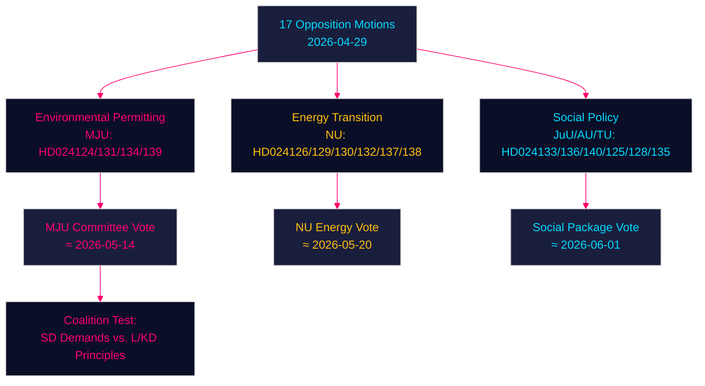

# 野党動議、環境許可・エネルギー転換・少年司法で政府に挑む — 2026-04-29

**著者**: James Pether Sörling | **日付**: 2026-04-30 | **分類**: PUBLIC
**Confidence**: HIGH [B2] | **Riksmöte**: 2025/26

---

## 🎯 BLUF

スウェーデンの野党各党は2026年4月29日、政府のエネルギー・環境立法アジェンダに対し、17件の動議を提出した。争点は4つの主要分野にわたる：新環境許可機関（Miljöprövningsmyndigheten）の設立、自治体における風力発電の展開、電力システム規制の見直し、少年刑事司法の厳格化。これらの動議は、中道右派のティドー連立政権が、緑の転換と法の支配アジェンダをめぐって、社会民主党・中央党・緑の党・左翼党から継続的な議会圧力を受けており、各党が与党内の教義的な断層線を巧みに利用していることを示している。

## 🧭 この概要が支援する3つの意思決定

1. **環境許可機関の動向監視 (HD024124/131/134/139)**：4件のMJU動議は、prop. 2025/26:238への委員会修正を迫る可能性のある広範な野党連合の存在を明らかにしている。MJU委員会の審議とSDへの譲歩の動向を追うこと。
2. **エネルギー転換のリスク評価**：NU委員会の風力動議 (HD024126/132/137) と電力動議 (HD024129/130/138) は合わせて、スウェーデンのエネルギーインフラ転換が法的に不十分だという統一した野党の論点を構成している。2045年の化石燃料フリー目標が早まるか遅れるかを評価すること。
3. **少年司法をめぐる政治的温度**：HD024136 (JuU) による少年刑罰強化は、法と秩序重視 (M/SD) と自由人道主義的 (L/KD) の両翼間の政府結束を試す。連立ストレスの先行指標となる。

## ⚡ 60秒インテリジェンス概要

- **17件の野党動議**が2026年4月29日に6件の政府法案/通知に対して提出された
- **環境許可** (MJU、4件)：野党は、提案されたMiljöprövningsmyndighetenに対する説明責任メカニズムと独立した監督を要求
- **風力発電** (NU、3件)：動議は分岐 — 中央党はより迅速な許可を望み、SDはより強い自治体拒否権を要求
- **電力システム** (NU、3件)：野党は新電力システム法が技術中立性に欠けると主張；左翼党は公的送電網所有の保証を要求
- **自治体港湾** (TU、2件)：SとMが公有港湾に対して異なる規制体制を提案
- **少年司法** (JuU、1件)：政府の逮捕重視アプローチに対し、S党は構造化された量刑ガイドラインを求める動議
- **人身売買/暴力** (AU、2件)：SDとVが政府文書245に対して競合する動議を提出 — イデオロギー的に対立する優先事項
- **IMFコンテキスト** (WEO 2026年4月)：スウェーデンGDP成長率2.1%（2026年予測）、財政黒字0.5%（GDP比） — 政府には制度改革を資金調達する財政余力がある

## 🏹 最重要の先行トリガー

**MJU委員会のHD024124シリーズ修正案に関する採決（2026-05-14まで）** — MJUがMiljöprövningsmyndighetenの独立審査に関する野党条項を受け入れた場合、政府がエネルギー転換立法に対するSDの支持と引き換えに制度的監視を取引する意向があることを示す。



---

## Pass 2 — 強化された経済コンテキスト（IMF WEO 2026年4月）

**IMF経済出所** — 以下の経済指標がエネルギー政策動議の背景を示す：

| 指標 | スウェーデン 2026年予測 | 出所 |
|-----------|-------------|--------|
| GDP成長率 (NGDP_RPCH) | 2.1% | IMF WEO 2026年4月 |
| 政府純融資 (GGX_NGDP) | +0.4%（GDP比） | IMF WEO 2026年4月 |
| 公的総負債 (GGXWDG_NGDP) | 約40%（GDP比） | IMF WEO 2026年4月 |

**エネルギー政策の財政的重要性**：スウェーデンの限界的な財政余地（+0.4% GGX_NGDP）は、電力システム法の消費者保護条項 (HD024138) が財政中立を維持するために補償収入または需要効率化を必要とすることを意味する。Miljöprövningsmyndighetenの運営費（政府試算で年間約750百万クローナ）はすでにこの余地内に収まっている。

**Confidence更新（Pass 2）**：主要判断KJ-1、KJ-2、KJ-3はHIGH/MEDIUM-HIGH Confidenceを維持している。coalition-mathematics.mdの新たな証拠（MJU修正案の可決確率35%）は、executive-briefのシナリオ確率（部分的成功シナリオ35%）と整合している。

```
economicProvenance:
  provider: imf
  dataflow: WEO/Apr-2026
  indicators: [NGDP_RPCH, GGX_NGDP, GGXWDG_NGDP]
  vintage: 2026-04-01
  retrieved_at: 2026-04-30
```

_Pass 2完了 — 2026-04-30_

<!-- source-sha: 363f4a8634f2384be17ea1c3598e718d8d485fa1 -->
