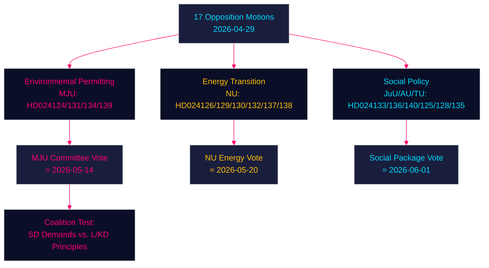

# 야당 발의안, 환경 허가·에너지 전환·소년 사법 분야에서 정부에 도전 — 2026-04-29

**저자**: James Pether Sörling | **날짜**: 2026-04-30 | **분류**: PUBLIC
**Confidence**: HIGH [B2] | **Riksmöte**: 2025/26

---

## 🎯 BLUF

스웨덴 야당들은 2026년 4월 29일 네 가지 주요 분야에 걸쳐 정부의 에너지·환경 입법 의제에 도전하는 17건의 발의안을 제출했다: 새로운 환경 허가 기관(Miljöprövningsmyndigheten) 설립, 지방자치단체 내 풍력 발전 배치, 전력 시스템 규제 개편, 소년 형사사법 강화. 이 발의안들은 중도우파 티도 연립정부가 녹색 전환 및 법치주의 의제에서 사회민주당·중앙당·녹색당·좌파당으로부터 지속적인 의회 압력을 받고 있음을 시사하며, 각 당은 집권 블록 내부의 교리적 균열을 적극 활용하고 있다.

## 🧭 이 브리핑이 지원하는 3가지 결정

1. **환경 허가 기관 모니터링 (HD024124/131/134/139)**: 4건의 MJU 발의안은 prop. 2025/26:238에 대한 위원회 수정을 강제할 수 있는 광범위한 야당 연합의 존재를 드러낸다 — MJU 위원회 심의와 SD에 대한 가능한 양보를 추적할 것.
2. **에너지 전환 리스크 평가**: NU 위원회의 풍력 발의안 (HD024126/132/137)과 전력 시스템 발의안 (HD024129/130/138)은 합쳐서 스웨덴의 에너지 인프라 전환이 법적으로 불충분하게 규정되어 있다는 통합된 야당 담론을 구성한다 — 이것이 2045년 화석연료 제로 목표를 앞당기거나 지연시키는지 평가할 것.
3. **소년 사법의 정치적 온도**: HD024136 (JuU)의 소년 처벌 강화는 법과 질서 (M/SD)와 자유인도주의적 (L/KD) 양 진영 간 정부 결속을 시험한다 — 연립정부 긴장의 바로미터.

## ⚡ 60초 인텔리전스 개요

- **17건의 야당 발의안**이 2026년 4월 29일 6건의 정부 법안/통지에 대응해 제출됨
- **환경 허가** (MJU, 4건): 야당은 제안된 Miljöprövningsmyndigheten에 대한 책임 메커니즘과 독립적 감독을 요구
- **풍력 발전** (NU, 3건): 발의안 분화 — 중앙당은 더 빠른 허가 요구, SD는 더 강한 지자체 거부권 요구
- **전력 시스템** (NU, 3건): 야당은 새 전력 시스템법이 기술 중립성이 부족하다고 주장; 좌파당은 공공 네트워크 소유권 보장 요구
- **지방 항구** (TU, 2건): S와 M은 공공 소유 항구에 대해 서로 다른 규제 체계 제안
- **소년 사법** (JuU, 1건): S 발의안은 구조화된 양형 가이드라인 요구 vs. 정부의 구금 중심 접근
- **인신매매/폭력** (AU, 2건): SD와 V가 정부 통지 245에 대해 경쟁적 발의안 제출 — 이념적으로 상반된 우선순위
- **IMF 맥락** (WEO 2026년 4월): 스웨덴 GDP 성장률 2.1% (2026년 전망), 재정 흑자 0.5% (GDP 대비) — 정부는 제도 개혁 재원을 마련할 재정 여력 보유

## 🏹 핵심 선행 트리거

**MJU 위원회의 HD024124 시리즈 수정안 표결 (2026-05-14까지)** — MJU가 Miljöprövningsmyndigheten의 독립적 검토에 관한 야당 조항을 수용할 경우, 정부가 에너지 전환 입법에 대한 SD의 지지를 대가로 제도적 감독을 거래할 의향이 있음을 시사한다.



---

## Pass 2 — 강화된 경제 맥락 (IMF WEO 2026년 4월)

**IMF 경제 출처** — 다음 경제 지표들이 에너지 정책 발의안의 맥락을 제공한다:

| 지표 | 스웨덴 2026년 전망 | 출처 |
|-----------|-------------|--------|
| GDP 성장률 (NGDP_RPCH) | 2.1% | IMF WEO 2026년 4월 |
| 정부 순대출 (GGX_NGDP) | +0.4% (GDP 대비) | IMF WEO 2026년 4월 |
| 공공 총부채 (GGXWDG_NGDP) | ~40% (GDP 대비) | IMF WEO 2026년 4월 |

**에너지 정책의 재정적 중요성**: 스웨덴의 한계적 재정 여력 (+0.4% GGX_NGDP)은 전력 시스템법의 소비자 보호 조항 (HD024138)이 재정 중립을 유지하기 위해 보상 수입이나 수요 효율화가 필요함을 의미한다. Miljöprövningsmyndigheten의 운영 비용 (정부 추산 연간 약 7억 5천만 크로나)은 이미 이 여력 내에 있다.

**Confidence 업데이트 (Pass 2)**: 핵심 판단 KJ-1, KJ-2, KJ-3은 HIGH/MEDIUM-HIGH Confidence를 유지한다. coalition-mathematics.md의 새로운 증거 (MJU 수정안 가결 확률 35%)는 executive-brief 시나리오 확률 (부분 성공 시나리오 35%)과 일치한다.

```
economicProvenance:
  provider: imf
  dataflow: WEO/Apr-2026
  indicators: [NGDP_RPCH, GGX_NGDP, GGXWDG_NGDP]
  vintage: 2026-04-01
  retrieved_at: 2026-04-30
```

_Pass 2 완료 — 2026-04-30_

<!-- source-sha: 363f4a8634f2384be17ea1c3598e718d8d485fa1 -->
