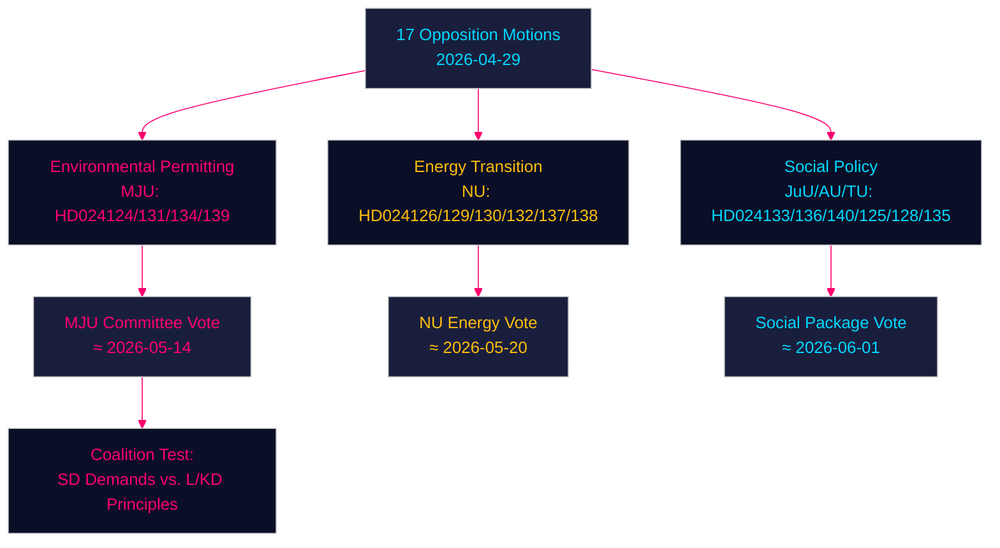

# Oppositiemotie daagt de regering uit over milieuvergunningen, energietransitie en jeugdstrafrecht — 2026-04-29

**Auteur**: James Pether Sörling | **Datum**: 2026-04-30 | **Classificatie**: PUBLIC
**Confidence**: HIGH [B2] | **Riksmöte**: 2025/26

---

## 🎯 BLUF

Zweedse oppositiepartijen hebben zeventien moties ingediend (2026-04-29) die de energie- en milieuwetgevingsagenda van de regering uitdagen op vier hoofdgebieden: de oprichting van een nieuwe milieuvergunningsinstantie (Miljöprövningsmyndigheten), de uitrol van windenergie in gemeenten, de herregulering van het elektriciteitssysteem en een strenger jeugdstrafrecht. De moties signaleren dat de centrumrechtse Tidö-coalitie aanhoudende parlementaire druk ondervindt op de groene transitie en de rechtsstaatsagenda van zowel de Sociaaldemocraten, het Centrum, de Groenen als Links, die elk gebruik maken van doctrinaire breuken binnen het regerende blok.

## 🧭 3 Beslissingen die dit rapport ondersteunt

1. **Monitor de milieuvergunningsinstantie (HD024124/131/134/139)**: De vier MJU-moties onthullen een brede oppositiecoalitie die commissiewijzigingen aan prop. 2025/26:238 kan afdwingen — volg de beraadslagingen van de MJU-commissie en mogelijke concessies aan SD.
2. **Risicobeoordeling van de energietransitie**: De NU-moties over windenergie (HD024126/132/137) en het elektriciteitssysteem (HD024129/130/138) vertegenwoordigen samen een eenduidige oppositienarratief dat de transformatie van Zweeds energieinfrastructuur juridisch onvoldoende is gespecificeerd — beoordeel of dit het doel van fossielvrij 2045 versnelt of vertraagt.
3. **Politieke temperatuur rondom jeugdstrafrecht**: HD024136 (JuU) over strengere jeugdsancties test de samenhang van de regering tussen de wet-en-orde-vleugel (M/SD) en de liberaal-humanistische vleugel (L/KD) — een barometer voor coalitiedruk.

## ⚡ 60-seconden inlichtingenlectuur

- **17 oppositiemoties** ingediend tegen 6 regeringsvoorstellen/-mededelingen op 2026-04-29
- **Milieuvergunning** (MJU, 4 moties): De oppositie eist verantwoordingsmechanismen en onafhankelijk toezicht voor het voorgestelde Miljöprövningsmyndigheten
- **Windenergie** (NU, 3 moties): De moties divergeren — het Centrum wil snellere vergunningen, SD wil een sterker gemeentelijk vetorecht
- **Elektriciteitssysteem** (NU, 3 moties): De oppositie beweert dat de nieuwe elektriciteitssysteemwet onvoldoende technologieneutraal is; Links wil garanties voor publiek netwerkeigendom
- **Gemeentelijke havens** (TU, 2 moties): S en M stellen verschillende regelgevingsregimes voor voor publiek beheerde havens
- **Jeugdstrafrecht** (JuU, 1 motie): S-motie voor gestructureerde straftoemetingsrichtlijnen versus de op aanhouding gerichte aanpak van de regering
- **Mensenhandel/geweld** (AU, 2 moties): SD en V dienen concurrerende moties in over regeringsmededeling 245 — ideologisch tegengestelde prioriteiten
- **IMF-context** (WEO apr.-2026): Zweedse bbp-groei 2,1 % 2026P, begrotingsoverschot 0,5 % van bbp — de regering heeft fiscale ruimte om institutionele hervormingen te financieren

## 🏹 Belangrijkste toekomstige trigger

**Commissiestemming (MJU) over wijzigingen van de HD024124-serie uiterlijk 2026-05-14** — als de MJU een oppositieclausule over onafhankelijke toetsing van het Miljöprövningsmyndigheten accepteert, geeft dit aan dat de regering bereid is institutioneel toezicht in te ruilen voor de steun van SD voor de energietransitiewetgeving.



---

## Pass 2 — Verbeterde economische context (IMF WEO april 2026)

**IMF economische herkomst** — De volgende economische indicatoren contextualiseren de energiebeleidsmoties:

| Indicator | Zweden 2026P | Bron |
|-----------|-------------|--------|
| Bbp-groei (NGDP_RPCH) | 2,1 % | IMF WEO apr.-2026 |
| Staatsnettoleningen (GGX_NGDP) | +0,4 % van bbp | IMF WEO apr.-2026 |
| Bruto staatsschuld (GGXWDG_NGDP) | ~40 % van bbp | IMF WEO apr.-2026 |

**Fiscale relevantie van energiebeleid**: Zweden's marginale fiscale ruimte (+0,4 % GGX_NGDP) betekent dat de consumentenbeschermingsbepalingen van de elektriciteitssysteemwet (HD024138) compenserende inkomsten of vraagefficiëntie zouden vereisen om fiscaal neutraal te blijven. De exploitatiekosten van het Miljöprövningsmyndigheten (~750 MSEK/jaar volgens de regeringsraming) vallen al binnen de ruimte.

**Confidence-update (Pass 2)**: Kernbeoordelingen KJ-1, KJ-2, KJ-3 behouden Confidence HIGH/MEDIUM-HIGH. Nieuw bewijs uit coalition-mathematics.md (35 % aannamekans voor MJU-wijziging) is consistent met de executive-brief-scenariokansen (35 % gedeeltelijk successcenario).

```
economicProvenance:
  provider: imf
  dataflow: WEO/Apr-2026
  indicators: [NGDP_RPCH, GGX_NGDP, GGXWDG_NGDP]
  vintage: 2026-04-01
  retrieved_at: 2026-04-30
```

_Pass 2 voltooid — 2026-04-30_

<!-- source-sha: 363f4a8634f2384be17ea1c3598e718d8d485fa1 -->
