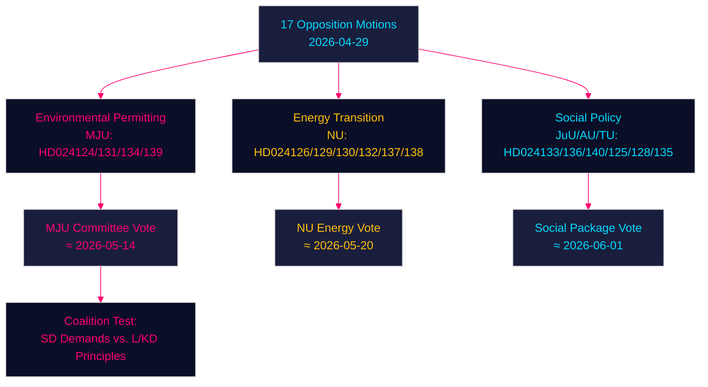

# Opposisjonsforslag utfordrer regjeringen om miljøgodkjenning, energiomstilling og ungdomsjustis — 2026-04-29

**Forfatter**: James Pether Sörling | **Dato**: 2026-04-30 | **Klassifisering**: PUBLIC
**Confidence**: HIGH [B2] | **Riksmöte**: 2025/26

---

## 🎯 BLUF

Svenske opposisjonspartier har levert sytten forslag (2026-04-29) som utfordrer regjeringens energi- og miljølovgivningsagenda på fire hovedområder: opprettelsen av et nytt miljøgodkjenningsorgan (Miljøprövningsmyndigheten), vindkraftutbygging i kommuner, omregulering av elsystemet og strengere ungdomsstraffrett. Forslagene signaliserer at den sentrumskonservative Tidø-koalisjonen møter vedvarende parlamentarisk press på den grønne omstillingen og rettsstatsagendaen fra både Sosialdemokratene, Senterpartiet, Miljøpartiet og Venstresiden, som hver utnytter doktrinære sprekkdannelser innenfor den styrende blokken.

## 🧭 3 Beslutninger dette underlaget støtter

1. **Overvåk miljøgodkjenningsorganet (HD024124/131/134/139)**: De fire MJU-forslagene avslører en bred opposisjonskoalisjon som kan tvinge frem utvalgsendringer i prop. 2025/26:238 — følg MJU-utvalgets drøftelser og mulige konsesjoner til SD.
2. **Risikovurdering av energiomstilling**: NU-forslagene om vindkraft (HD024126/132/137) og elsystemet (HD024129/130/138) representerer til sammen en samlet opposisjonsfortelling om at Sveriges energiinfrastrukturtransformasjon er utilstrekkelig rettslig spesifisert — vurder om dette fremskynder eller forsinker målet om fossilfrihet i 2045.
3. **Politisk temperatur rundt ungdomsstraffrett**: HD024136 (JuU) om strengere ungdomssanksjoner tester regjeringens samhørighet mellom lov-og-orden (M/SD) og liberal-humanitære (L/KD) partier — en pekepinn på koalisjonsbelastning.

## ⚡ 60-sekunders etterretningslesning

- **17 opposisjonsforslag** levert mot 6 regjeringsproposisjoner/skrivelser den 2026-04-29
- **Miljøgodkjenning** (MJU, 4 forslag): Opposisjonen krever ansvarsmekanismer og uavhengig tilsyn med det foreslåtte Miljøprövningsmyndigheten
- **Vindkraft** (NU, 3 forslag): Forslagene divergerer — Senterpartiet vil ha raskere tillatelser, SD vil ha sterkere kommunalt veto
- **Elsystemet** (NU, 3 forslag): Opposisjonen hevder at den nye elsystemloven er utilstrekkelig teknologinøytral; Venstresiden vil ha garantier for offentlig netteierskapet
- **Kommunale havner** (TU, 2 forslag): S og M foreslår ulike reguleringsregimer for offentlig eide havner
- **Ungdomsstraffrett** (JuU, 1 forslag): S-forslag om strukturerte straffeutmålingsretningslinjer mot regjeringens pågripelsesfokuserte tilnærming
- **Menneskehandel/vold** (AU, 2 forslag): SD og V leverer konkurrerende forslag til regjeringsskrivelse 245 — ideologisk motsatte prioriteringer
- **IMF-kontekst** (WEO Apr-2026): Sveriges BNP-vekst 2,1 % 2026F, finansoverskudd 0,5 % av BNP — regjeringen har finanspolitisk handlingsrom til å finansiere institusjonelle reformer

## 🏹 Viktigste fremadrettede trigger

**Utvalgsavstemning (MJU) om HD024124-serieendringer innen 2026-05-14** — hvis MJU aksepterer en opposisjonsklausul om uavhengig gjennomgang av Miljøprövningsmyndigheten, signaliserer det at regjeringen er villig til å handle institusjonelt tilsyn mot SD's støtte til energiomstillingslovgivningen.



---

## Pass 2 — Forbedret økonomisk kontekst (IMF WEO April 2026)

**IMF økonomisk proveniens** — Følgende økonomiske indikatorer kontekstualiserer energipolitikkforslagene:

| Indikator | Sverige 2026F | Kilde |
|-----------|-------------|--------|
| BNP-vekst (NGDP_RPCH) | 2,1 % | IMF WEO Apr-2026 |
| Statens nettoutlån (GGX_NGDP) | +0,4 % av BNP | IMF WEO Apr-2026 |
| Bruttoskuld offentlig sektor (GGXWDG_NGDP) | ~40 % av BNP | IMF WEO Apr-2026 |

**Energipolitikkens finanspolitiske relevans**: Sveriges marginale finanspolitiske handlingsrom (+0,4 % GGX_NGDP) betyr at elsystemlovens forbrukerbeskyttelsesbestemmelser (HD024138) ville trenge motvirkende inntekter eller etterspørselseffektivitet for å forbli finanspolitisk nøytrale. Miljøprövningsmyndighetens driftskostnader (~750 MSEK/år ifølge regjeringens anslag) er allerede innenfor handlingsrommet.

**Confidence-oppdatering (Pass 2)**: Nøkkelvurderinger KJ-1, KJ-2, KJ-3 beholder HIGH/MEDIUM-HIGH confidence. Nye bevis fra coalition-mathematics.md (35 % vedtakelsessannsynlighet for MJU-endring) er konsistent med executive-brief-scenariosannsynlighetene (35 % delvis suksess-scenario).

```
economicProvenance:
  provider: imf
  dataflow: WEO/Apr-2026
  indicators: [NGDP_RPCH, GGX_NGDP, GGXWDG_NGDP]
  vintage: 2026-04-01
  retrieved_at: 2026-04-30
```

_Pass 2 fullført — 2026-04-30_

<!-- source-sha: 363f4a8634f2384be17ea1c3598e718d8d485fa1 -->
