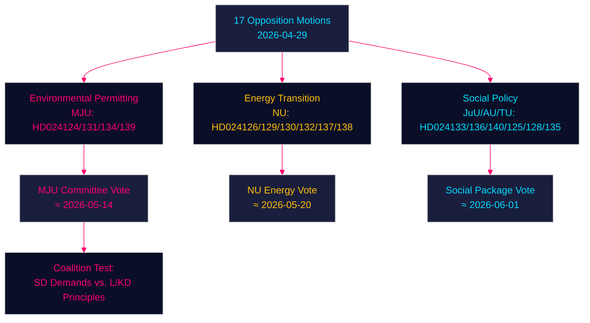

# Oppositionsmotioner utmanar regeringen om miljötillstånd, energiomställning och ungdomsjustis — 2026-04-29

**Författare**: James Pether Sörling | **Datum**: 2026-04-30 | **Klassificering**: PUBLIC
**Confidence**: HIGH [B2] | **Riksmöte**: 2025/26

---

## 🎯 BLUF

Svenska oppositionspartier har lämnat in sjutton motioner (2026-04-29) som utmanar regeringens energi- och miljölagstiftningsagenda inom fyra huvudområden: inrättandet av en ny miljöprövningsmyndighet (Miljöprövningsmyndigheten), vindkraftsetablering i kommuner, omregleringen av elsystemet och strängare ungdomsbrottslighet. Motionerna signalerar att den centerkonservativa Tidökoalitionen möter ihållande parlamentariskt tryck på den gröna omställningen och rättsstatsdagordningen från både Socialdemokraterna, Centerpartiet, Miljöpartiet och Vänsterpartiet, som var och en utnyttjar doktrinariska sprickor inom det styrande blocket.

## 🧭 3 Beslut detta underlag stödjer

1. **Bevaka miljöprövningsmyndigheten (HD024124/131/134/139)**: De fyra MJU-motionerna avslöjar en bred oppositionskoalition som kan tvinga fram utskottsändringar i prop. 2025/26:238 — följ MJU-utskottets behandling och eventuella eftergifter till SD.
2. **Riskbedömning av energiomställningen**: NU-motionerna om vindkraft (HD024126/132/137) och elsystemet (HD024129/130/138) representerar tillsammans en enad oppositionsnarration om att Sveriges energiinfrastrukturtransformation är otillräckligt rättsligt specificerad — bedöm om detta påskyndar eller försenar målet om fossilfrihet 2045.
3. **Politisk temperatur kring ungdomsjustis**: HD024136 (JuU) om strängare ungdomspåföljder testar regeringens sammanhållning mellan lag-och-ordning (M/SD) och liberal-humanitärt (L/KD) inriktade partier — en vägvisare för koalitionsstress.

## ⚡ 60-sekunders underrättelseläsning

- **17 oppositionsmotioner** inlämnade mot 6 regeringspropositioner/skrivelser den 2026-04-29
- **Miljötillstånd** (MJU, 4 motioner): Oppositionen kräver ansvarsutkrävande och oberoende tillsyn av den föreslagna Miljöprövningsmyndigheten
- **Vindkraft** (NU, 3 motioner): Motionerna divergerar — Centerpartiet vill ha snabbare tillståndsgivning, SD vill ha starkare kommunalt veto
- **Elsystemet** (NU, 3 motioner): Oppositionen hävdar att den nya elsystemslagen är otillräckligt teknikneutral; Vänsterpartiet vill ha garantier för statligt ägande av elnätet
- **Kommunala hamnar** (TU, 2 motioner): S och M föreslår olika tillsynsregimer för offentligt ägda hamnar
- **Ungdomsjustis** (JuU, 1 motion): S-motion om strukturerade påföljdsriktlinjer kontra regeringens gripnings-fokuserade ansats
- **Handel/våld** (AU, 2 motioner): SD och V lämnar konkurrerande motioner om regeringsskrivelse 245 — ideologiskt motsatta prioriteringar
- **IMF-kontext** (WEO Apr-2026): Sveriges BNP-tillväxt 2,1 % 2026P, finansiellt överskott 0,5 % av BNP — regeringen har finanspolitiskt utrymme att finansiera institutionella reformer

## 🏹 Viktigaste framåtblickande trigger

**Utskottsomröstning (MJU) om HD024124-serieändringar senast 2026-05-14** — om MJU accepterar någon oppositionsklausul om oberoende granskning av Miljöprövningsmyndigheten, signalerar det att regeringen är villig att handla institutionell tillsyn mot SD:s stöd för energiomställningslagstiftningen.



---

## Pass 2 — Förbättrad ekonomisk kontext (IMF WEO April 2026)

**IMF ekonomisk proveniens** — Följande ekonomiska indikatorer kontextualiserar energipolicysmotionerna:

| Indikator | Sverige 2026P | Källa |
|-----------|-------------|--------|
| BNP-tillväxt (NGDP_RPCH) | 2,1 % | IMF WEO Apr-2026 |
| Statens nettoutlåning (GGX_NGDP) | +0,4 % av BNP | IMF WEO Apr-2026 |
| Bruttoskuld offentlig sektor (GGXWDG_NGDP) | ~40 % av BNP | IMF WEO Apr-2026 |

**Energipolicys finanspolitiska relevans**: Sveriges marginella finanspolitiska handlingsutrymme (+0,4 % GGX_NGDP) innebär att elsystemslagens konsumentskyddsbestämmelser (HD024138) skulle behöva motverkande intäkter eller efterfrågedämpning för att förbli finanspolitiskt neutrala. Miljöprövningsmyndighetens driftskostnader (~750 MSEK/år enligt regeringens uppskattning) ryms redan inom handlingsutrymmet.

**Confidence-uppdatering (Pass 2)**: Nyckeldomslutar KJ-1, KJ-2, KJ-3 behåller HIGH/MEDIUM-HIGH confidence. Nya bevis från coalition-mathematics.md (35 % antagandeprobabilitet för MJU-ändring) är konsistenta med executive-brief-scenarioprobabiliteterna (35 % delvis-framgångsscenario).

```
economicProvenance:
  provider: imf
  dataflow: WEO/Apr-2026
  indicators: [NGDP_RPCH, GGX_NGDP, GGXWDG_NGDP]
  vintage: 2026-04-01
  retrieved_at: 2026-04-30
```

_Pass 2 klar — 2026-04-30_

<!-- source-sha: 363f4a8634f2384be17ea1c3598e718d8d485fa1 -->
