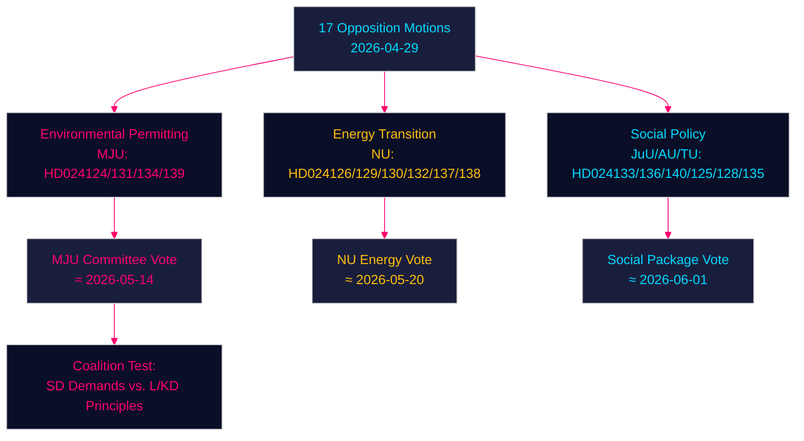

# 反对党动议在环境许可、能源转型及青少年司法问题上向政府发起挑战 — 2026-04-29

**作者**：James Pether Sörling | **日期**：2026-04-30 | **密级**：PUBLIC
**Confidence**：HIGH [B2] | **Riksmöte**：2025/26

---

## 🎯 BLUF

瑞典反对党于2026年4月29日提交了十七项动议，就四大核心领域对政府的能源与环境立法议程发起挑战：建立新的环境许可机构（Miljöprövningsmyndigheten）、推进市政风电部署、重构电力系统监管框架，以及强化青少年刑事司法。这些动议表明，中间偏右的提道联合政府在绿色转型与法治议程上正面临来自社会民主党、中央党、绿党及左翼党的持续议会压力，各党均在利用执政集团内部的理念分歧。

## 🧭 本简报支持的3项决策

1. **监测环境许可机构动态 (HD024124/131/134/139)**：四项MJU动议揭示了可能迫使prop. 2025/26:238进行委员会修订的广泛反对党联盟——追踪MJU委员会审议进展及对SD的潜在让步。
2. **能源转型风险评估**：NU委员会关于风电的动议 (HD024126/132/137) 和电力系统的动议 (HD024129/130/138) 共同构成统一的反对党叙事——即瑞典能源基础设施转型的法律界定不足——评估这是否将加速或延缓2045年无化石燃料目标。
3. **青少年司法政治温度**：HD024136 (JuU) 关于加重青少年刑罚的议案考验政府在法律秩序派 (M/SD) 与自由人道主义派 (L/KD) 之间的凝聚力——联合政府压力的晴雨表。

## ⚡ 60秒情报速读

- **17项反对党动议**于2026年4月29日提交，针对6项政府法案/文函
- **环境许可** (MJU，4项)：反对党要求对拟议中的Miljöprövningsmyndigheten建立问责机制与独立监督
- **风力发电** (NU，3项)：动议存在分歧——中央党希望加快审批，SD要求加强市政否决权
- **电力系统** (NU，3项)：反对党认为新电力系统法技术中立性不足；左翼党要求公共电网所有权保障
- **市政港口** (TU，2项)：S与M就公有港口提出不同监管方案
- **青少年司法** (JuU，1项)：S党动议要求结构化量刑指南，对应政府以逮捕为核心的路径
- **人口贩卖/暴力** (AU，2项)：SD与V就政府文函245提交竞争性动议——意识形态立场截然相反
- **IMF背景** (WEO 2026年4月)：瑞典GDP增速2.1%（2026年预测），财政盈余0.5%（占GDP）——政府具备资助制度改革的财政空间

## 🏹 最关键的前瞻触发事件

**MJU委员会就HD024124系列修正案进行表决（2026-05-14前）** — 若MJU接受任何关于Miljöprövningsmyndigheten独立审查的反对党条款，则表明政府愿意以制度监督换取SD对能源转型立法的支持。



---

## Pass 2 — 增强经济背景（IMF WEO 2026年4月）

**IMF经济数据溯源** — 以下经济指标为能源政策动议提供背景：

| 指标 | 瑞典2026年预测 | 来源 |
|-----------|-------------|--------|
| GDP增速 (NGDP_RPCH) | 2.1% | IMF WEO 2026年4月 |
| 政府净贷款 (GGX_NGDP) | +0.4%（占GDP） | IMF WEO 2026年4月 |
| 公共总债务 (GGXWDG_NGDP) | ~40%（占GDP） | IMF WEO 2026年4月 |

**能源政策的财政相关性**：瑞典边际财政空间（+0.4% GGX_NGDP）意味着电力系统法的消费者保护条款 (HD024138) 需要补偿性收入或需求端效率提升以维持财政中性。Miljöprövningsmyndigheten的运营成本（据政府估计约每年7.5亿瑞典克朗）已在该空间范围内。

**Confidence更新（Pass 2）**：核心判断KJ-1、KJ-2、KJ-3维持HIGH/MEDIUM-HIGH Confidence。coalition-mathematics.md的新证据（MJU修正案通过概率35%）与executive-brief情景概率（部分成功情景35%）保持一致。

```
economicProvenance:
  provider: imf
  dataflow: WEO/Apr-2026
  indicators: [NGDP_RPCH, GGX_NGDP, GGXWDG_NGDP]
  vintage: 2026-04-01
  retrieved_at: 2026-04-30
```

_Pass 2完成 — 2026-04-30_

<!-- source-sha: 363f4a8634f2384be17ea1c3598e718d8d485fa1 -->
