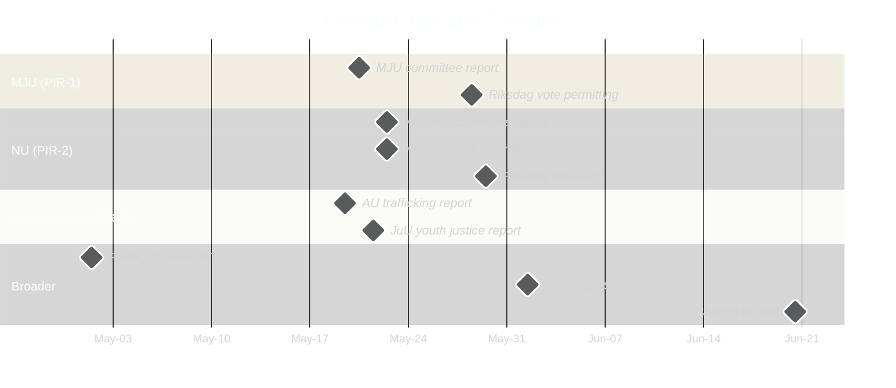

# Forward Indicators — Opposition Motions 2026-04-29

**Author**: James Pether Sörling | **Date**: 2026-04-30

---

## Priority Intelligence Requirements — Indicator Tracking

The following ≥10 dated forward indicators are tracked against PIR-1 (agency accountability), PIR-2 (wind/electricity), PIR-3 (election framing):

| # | Indicator | Date/Window | Threshold | PIR |
|---|-----------|------------|-----------|-----|
| 1 | MJU committee report on prop. 2025/26:238 | **2026-05-20** | Includes opposition amendment → PIR-1 confirmed | PIR-1 |
| 2 | Government response to HD024124 yrkanden | **2026-05-20** | Rejection without concession → Frame 1 hardens | PIR-1 |
| 3 | Riksdag chamber vote on Miljöprövningsmyndigheten | **2026-05-28** | 175+ Nej → Government bloc holds | PIR-1 |
| 4 | NU committee report on prop. 2025/26:239 (wind) | **2026-05-22** | Includes either HD024126 OR HD024137 yrkande | PIR-2 |
| 5 | NU committee report on prop. 2025/26:240 (electricity) | **2026-05-22** | Includes HD024129/130/138 consumer protection | PIR-2 |
| 6 | SVT/DN/SvD polling on energy price policy | **2026-05-15** | Energy as top-3 voter concern → SD/S competition intensifies | PIR-2 |
| 7 | Riksdag vote on wind power legislation | **2026-05-29** | Municipal veto unchanged = SD victory | PIR-2 |
| 8 | Youth justice JuU committee report | **2026-05-21** | HD024136 dismissed without concession → S reframes | PIR-3 |
| 9 | AU trafficking committee report | **2026-05-19** | SD/S conflict on HD024133 vs. HD024140 | PIR-3 |
| 10 | Spring recess begins (Riksdag) | **2026-06-20** | Unresolved motions → carried to autumn 2026/27 session | All |
| 11 | Opinion polling (Novus/SIFO) — party blocs | **2026-05-01** | Opposition 175+ aggregate seats → Election dynamics shift | PIR-3 |
| 12 | SD annual party congress resolution on energy | **2026-06-01** | Municipal veto enshrined in SD platform → no further compromise | PIR-2 |

## Trip-Wire Indicators

**Trip-wire 1** (PIR-1): Any MJU hearing inviting constitutional law professors signals government is preparing to concede on oversight mechanism.
**Trip-wire 2** (PIR-2): If SvK (Svenska kraftnät) director makes public statement on technology neutrality, NU committee is already moving toward HD024129 language.
**Trip-wire 3** (PIR-3): If S launches election campaign advert featuring "miljörättvisa" (environmental justice) before June 2026, they have decided to outflank MP and V on the permitting issue.

_Evidence: HD024124, HD024126, HD024129, HD024130, HD024133, HD024136, HD024138, HD024140 — riksdagen.se_
