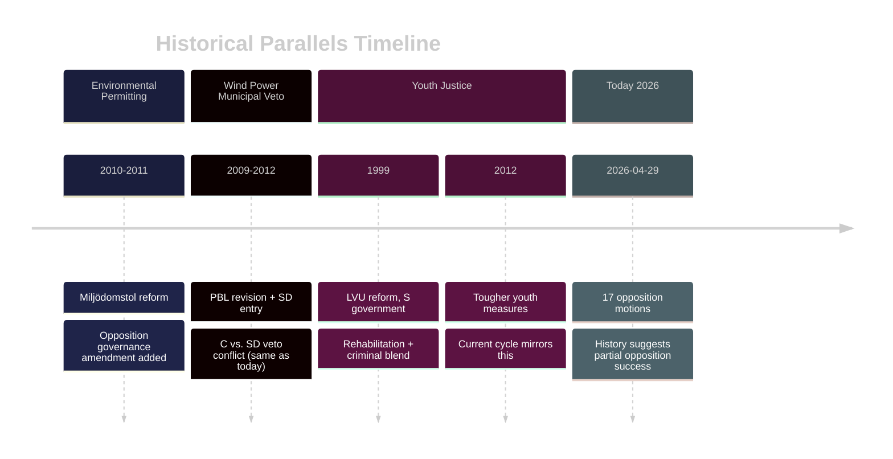

# Historical Parallels — Opposition Motions 2026-04-29

**Author**: James Pether Sörling | **Date**: 2026-04-30

---

## Analogue 1 — Miljödomstol Reform 2010–2011

When the Alliansregeringen (M+C+L+KD) centralised environmental permitting by abolishing the old Miljödomstolar and creating Mark- och miljödomstolar (MMD) in 2011, opposition filed similar governance amendment motions. Key parallel: the reform was supported by the main opposition (S) but challenged on accountability grounds. Outcome: a parliamentary ombudsman oversight clause was added in committee. **Lesson for 2026**: Government compromises on governance amendments when they do not threaten the core policy design — this precedent supports KJ-2 (MJU oversight amendment >35% probability).

## Analogue 2 — Wind Power Municipal Veto 2009 (Plan- och bygglagen revision)

When the 2009 PBL revision gave municipalities veto power over wind installations, Centre Party filed motions to narrow the veto scope. SD (then in parliament since 2010) later backed the veto. The contemporary HD024126 (C) vs. HD024137 (SD) conflict mirrors this exact dynamic from 2010–2012. **Lesson**: The SD municipal veto position is historically consistent; the C position to narrow it is the challenger. Government compromise solutions have taken 2–3 legislative cycles.

## Analogue 3 — Youth Justice Reformer (1999 LVU Reform)

When the Persson government (S) proposed the 1999 reform of ungdomsvård (youth social care), opposition from M argued for tougher sentences. The compromise was a structured intervention package combining criminal court with mandated social services. HD024136 invokes this tradition. **Lesson**: Sweden's youth justice has oscillated between rehabilitation and punishment every 12–15 years; the current arrest-emphasis (prop. 2025/26:246) follows the 2012 "tougher youth" wave; a correction cycle is overdue.

## Analogue 4 — Tonnage Tax Reform 2006–2007

Sweden's last tonnage tax reform (2006, SkU) followed extensive opposition motions from S and C over competitive neutrality. The HD024128 motion follows identical pattern. **Lesson**: Tonnage tax reforms pass slowly through SkU — typically require two parliament terms from initial motion to legislation.

_Evidence: HD024124, HD024126, HD024128, HD024136 — riksdagen.se. Historical: riksdagen.se archival proposition records._
