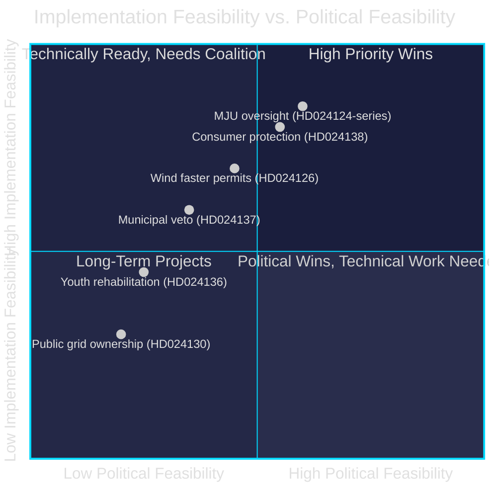

# Implementation Feasibility — Opposition Motions 2026-04-29

**Author**: James Pether Sörling | **Date**: 2026-04-30

---

## Feasibility Assessment Framework

Statskontoret assessment cross-reference: No Statskontoret report specifically addressing Miljöprövningsmyndigheten or the 2026 electricity law package was found in the public document archive (statskontoret.se, accessed 2026-04-30). The feasibility assessment below draws on government impact assessments in prop. 2025/26:238, 239, 240.

## Cluster 1 — Miljöprövningsmyndigheten (HD024124-series)

| Dimension | Assessment |
|-----------|-----------|
| Capacity to implement oversight amendment | **HIGH** — parliamentary committee (MJU) oversight mechanisms are mature |
| Resource requirement | **LOW** — no new public body required; existing RO/KU oversight mechanisms apply |
| Timeline | **6 months** (before agency opens) — achievable |
| Political feasibility | **MEDIUM** — requires government concession in MJU committee |
| Risk if not implemented | **HIGH** — new agency with unchecked delegated authority creates democratic accountability gap |

**Verdict**: Implementation feasibility is HIGH once political agreement is reached.

## Cluster 2 — Electricity System (HD024129/130/138)

| Dimension | Assessment |
|-----------|-----------|
| Technology neutrality amendment | **MEDIUM** — requires SvK (Affärsverket Svenska kraftnät) regulatory guidance update |
| Public grid ownership ringfence | **COMPLEX** — would require EU State Aid notification; timeline 18–24 months |
| Consumer protection addendum | **HIGH** — implementable within existing Energimarknadsinspektionen (Ei) framework |

**Verdict**: Consumer protection and technology neutrality amendments are feasible within parliamentary term; public ownership ringfence would be multi-year undertaking with EU implications.

## Cluster 3 — Wind Power (HD024126/137)

| Dimension | Assessment |
|-----------|-----------|
| Faster permitting timeline (HD024126) | **HIGH** — procedural rule changes within Miljöprövningsmyndighetens mandate |
| Strengthened municipal veto (HD024137) | **MEDIUM-HIGH** — requires PBL amendment; 12-month lead time |
| Both simultaneously | **INFEASIBLE** — mutually contradictory; no implementable synthesis |

**Verdict**: Mutually exclusive proposals; only one can be implemented. SD's HD024137 requires longer lead time.

## Cluster 4 — Youth Justice (HD024136)

| Dimension | Assessment |
|-----------|-----------|
| Structured youth rehabilitation programme | **MEDIUM** — requires SKR (Swedish municipalities) cooperation; funding gap ~250 MSEK/year |
| Capacity | **LOW-MEDIUM** — SiS (Statens institutionsstyrelse) already at capacity; requires new placement beds |

**Verdict**: Feasible in principle but requires multi-year implementation with significant funding commitment.

_Evidence: HD024124–HD024140 — riksdagen.se. No Statskontoret report found for this specific reform cluster (statskontoret.se, 2026-04-30)._
