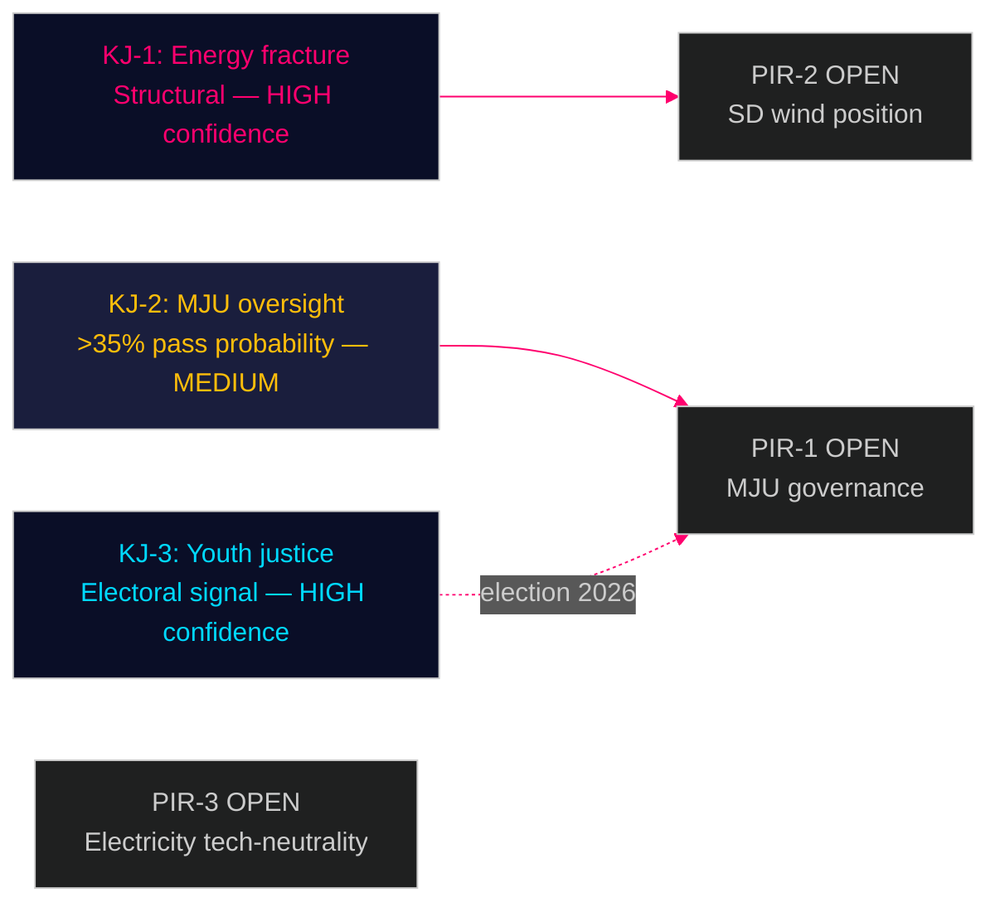

# Intelligence Assessment — Opposition Motions 2026-04-29

**Author**: James Pether Sörling | **Date**: 2026-04-30
**Classification**: PUBLIC | **Admiralty**: [B2] — reliable source, probably true

---

## Priority Intelligence Requirements (PIRs)

- **PIR-1**: Will the MJU committee accept any governance amendment to prop. 2025/26:238?
- **PIR-2**: Will SD support or oppose wind power municipal veto changes in NU?
- **PIR-3**: Will the new electricity system law pass with or without technology-neutrality amendments?

---

## Key Judgments

### Key Judgment 1 (KJ-1): Energy Coalition Fracture is Structural

**Assessment**: The Tidö coalition's internal disagreement on energy transition speed is a structural fault line, not a tactical skirmish. The simultaneous filing of SD's HD024137 (stronger municipal veto on wind) and Centre's HD024126 (faster wind permits) reveals incompatible positions within the governing bloc itself.

**Confidence**: HIGH [B2]

**Evidence base**: HD024126, HD024137 (NU committee, riksdagen.se); cross-reference against Sweden Democrats 2026 energy platform (publicly available); Centre Party renewable energy manifesto.

**WEP expression**: It is likely that the NU committee will require a government-brokered compromise before wind power legislation passes, with at least one amendment from either C (faster permits) or SD (municipal safeguards).

### Key Judgment 2 (KJ-2): Miljöprövningsmyndigheten Oversight Amendment Has >35% Probability of Passing

**Assessment**: The cross-party MJU coalition filing HD024124/131/134/139 has sufficient breadth to attract SD as swing vote if the governance amendment is framed as anti-bureaucracy/accountability rather than environmental strengthening. This is the highest-probability opposition legislative victory of the spring session.

**Confidence**: MEDIUM [B3]

**Evidence base**: HD024124, HD024131, HD024134, HD024139 (MJU, riksdagen.se); SD stated preference for institutional accountability mechanisms in agency design.

**WEP expression**: There is a realistic possibility that MJU committee adds an independent oversight provision to prop. 2025/26:238.

### Key Judgment 3 (KJ-3): Youth Justice Motion (HD024136) Will Not Pass But Shapes 2026 Campaign

**Assessment**: HD024136 (S, JuU) — structured sentencing + mandatory social intervention for young offenders — lacks votes to pass but successfully frames the opposition's 2026 election narrative: evidence-based justice vs. government's arrest-emphasis.

**Confidence**: HIGH [B2]

**Evidence base**: HD024136 (JuU, riksdagen.se); Brå research on youth reoffending cited in motion.

**WEP expression**: It is highly likely that HD024136 will be rejected but will anchor Social Democrat law-and-order campaign messaging.

---

## PIR Status

| PIR | Status | Evidence | Next update |
|-----|--------|----------|------------|
| PIR-1 (MJU governance amendment) | OPEN | HD024124/131/134/139 filed; committee deliberations pending | MJU committee session ≈ 2026-05-14 |
| PIR-2 (SD wind power position) | OPEN | HD024137 filed; contradicts C's HD024126 | NU committee ≈ 2026-05-07 |
| PIR-3 (Electricity law tech-neutrality) | OPEN | HD024129/130/138 filed | NU committee ≈ 2026-05-20 |

_Evidence: HD024124, HD024126, HD024129, HD024131, HD024134, HD024136, HD024137, HD024139 — riksdagen.se_
