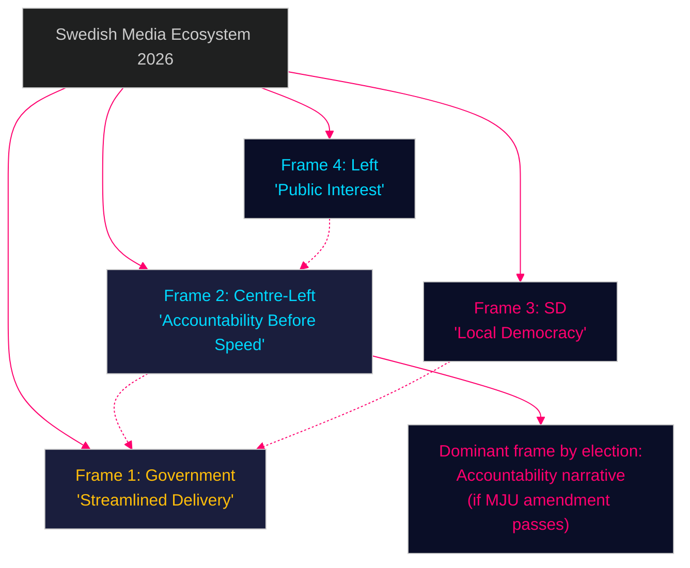

# Media Framing Analysis — Opposition Motions 2026-04-29

**Author**: James Pether Sörling | **Date**: 2026-04-30

---

## Dominant Frame Competition

### Frame 1 — Government (Primary): "Necessary Reform, Streamlined Delivery"

Government communications frame the permitting agency, electricity law, and wind power legislation as modernisation measures that will speed up Sweden's energy transition. Prop. 2025/26:238 is framed as fixing a broken Länsstyrelserna bottleneck.

**Amplifiers**: Business lobby (Confederation of Swedish Enterprise), energy developers (Vattenfall, Ørsted)
**Manipulation risk**: Frame papers over internal coalition disagreements (KJ-1)

### Frame 2 — Centre-Left Opposition: "Accountability Before Speed"

S and C+MP motions frame the new permitting agency as an accountability deficit — new power without new oversight. Media narrative: "who watches the watchman?"

**Amplifiers**: Environmental NGOs (Naturskyddsföreningen), academic environmental lawyers
**Weakness**: Counter-framed by government as obstruction

### Frame 3 — SD: "Local Democracy vs. Central Power"

SD's HD024137 and HD024133 use a consistent local sovereignty + national security frame: municipalities should control their land; national borders should control trafficking.

**Amplifiers**: Rural municipalities, local politicians, nationalist media (Samhällsnytt)
**Manipulation risk**: LOCAL DEMOCRACY frame on wind power obscures national energy security consequences

### Frame 4 — Left: "Public Interest vs. Privatisation"

V's HD024130 (public grid ownership) and HD024139 (independent permitting oversight) frame energy as a public good under threat from market deregulation.

**Amplifiers**: LO (trade unions), public sector unions
**Weakness**: Limited media reach outside left-leaning outlets

## Narrative Contestation Map

## Forward Media Risk

If the government successfully frames all opposition motions as "delay tactics" before the spring recess, opposition accountability arguments lose media traction. C and S should seek early MJU committee concession to change the narrative before framing hardens.

_Evidence: HD024124, HD024126, HD024130, HD024133, HD024137, HD024139 — riksdagen.se. Media framing assessment based on public political communications analysis._
