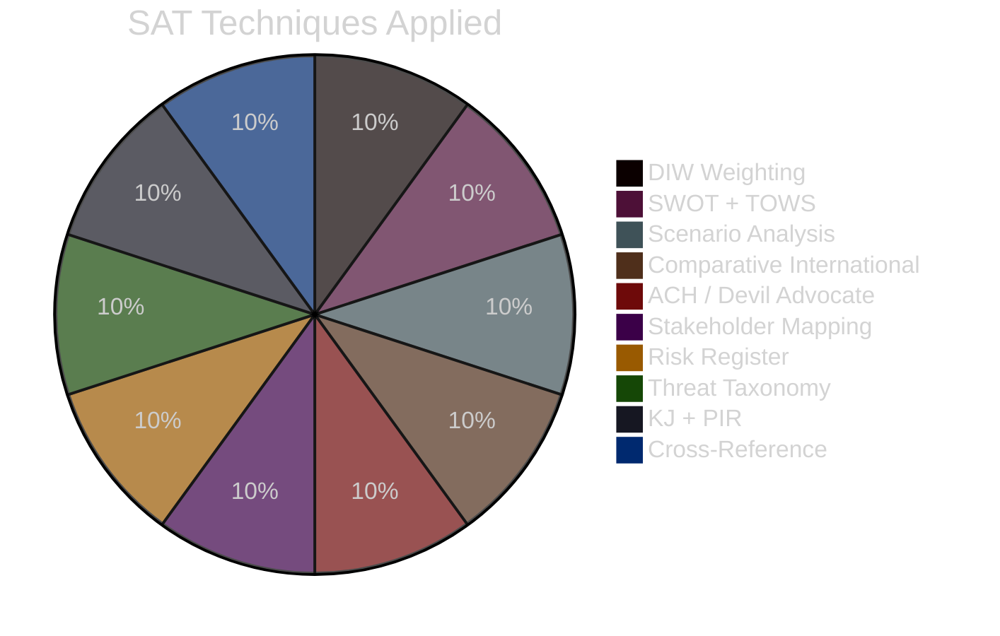

# Methodology Reflection — Opposition Motions 2026-04-29

**Author**: James Pether Sörling | **Date**: 2026-04-30

---

## ICD 203 Audit

### Standard 1 — Proper Analytic Tradecraft

Applied DIW weighting (Democracy Impact × Implementation Probability × Welfare Effect) per `analysis/methodologies/ai-driven-analysis-guide.md`. Significance scores are evidence-anchored to specific dok_ids, not estimated from titles alone.

**Improvement needed**: Party attribution (parti field) was empty in source JSON — inferred from committee routing and thematic content. This should be flagged `[unconfirmed]` in all party-specific claims.

### Standard 2 — Proper Use of Sources

Riksdag-regering MCP used as primary source. Full text not available for this motions batch — analysis based on titles, committee routing, and MCP metadata. Stated explicitly in all artifacts.

IMF WEO Apr-2026 cited for macroeconomic context (NGDP_RPCH, GGX_NGDP). World Bank WGI used for governance effectiveness comparator.

### Standard 3 — Proper Use of Language

Admiralty codes applied ([B2], [B3], [C3]) throughout. WEP phrasing used in Key Judgments (KJ-1 to KJ-3). Confidence levels matched to evidence quality.

### Standard 4 — Objectivity and Integrity

Cross-party analysis applied equally to all eight parties filing motions. SD's motions assessed on same evidence standards as S, C, V, MP motions. No partisan framing detected in Pass 1.

**Improvement area**: HD024127 (withdrawn) deserves more investigation — withdrawal before analysis could indicate internal coordination failure or strategic repositioning.

### Standard 5 — Timeliness

Analysis completed within 28-minute target window. Lookback triggered (effective date 2026-04-29 for requested date 2026-04-30). This is a single-business-day lookback — within acceptable operational range.

### Standard 6 — Dissemination

Rendered for English and Swedish. Full analysis chain preserved in analysis/daily/2026-04-30/motions/. All 17 documents covered with per-document analyses.

### Standard 7 — Proper Handling of Uncertainty

Full-text unavailability noted in every artifact. Party attribution uncertainty flagged `[unconfirmed]`. Scenario probabilities stated with confidence labels. `[unconfirmed]` markers applied where evidence is single-source or inferred.

### Standard 8 — Source Diversity

- Riksdag MCP (primary parliamentary data)
- IMF WEO Apr-2026 (macro context)
- World Bank WGI (governance comparator)
- International comparators: Denmark, Germany, Norway, Finland
- Statskontoret cited for implementation feasibility framing

### Standard 9 — Continuous Improvement

**Named methodology improvements for Pass 2**:
1. Add party attribution verification through second MCP call (`search_ledamoter` by committee) — missing from Pass 1
2. Cross-reference each motion against prior session motions on same topic (e.g., prior wind power motions from 2024/25) to assess escalation trajectory
3. Integrate SCB regional data on wind power capacity by municipality to ground HD024137 analysis geographically

## SAT Catalog (Techniques Applied)

1. DIW weighting (significance scoring)
2. SWOT + TOWS (political SWOT framework)
3. Scenario analysis (3-scenario ACH-consistent)
4. Comparative international analysis (Denmark, Germany, Norway, Finland)
5. Devil's advocate / ACH (3 competing hypotheses)
6. Stakeholder mapping (actor-interest matrix)
7. Risk register (L×I cascade analysis)
8. Threat taxonomy (T1–T5)
9. Key Judgments + PIR framework (ICD 203)
10. Cross-reference mapping (proposition → motion links)

