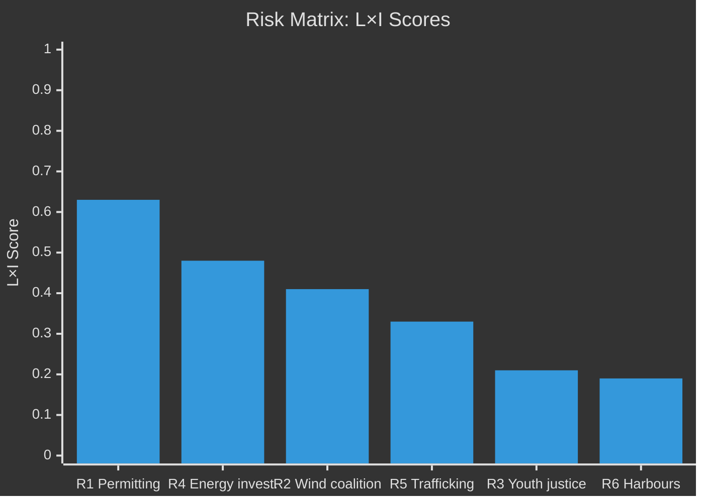

# Risk Assessment — Opposition Motions 2026-04-29

**Author**: James Pether Sörling | **Date**: 2026-04-30
**Framework**: 5-dimension political risk register, L×I scoring

---

## Risk Register

| # | Risk | Likelihood (L) | Impact (I) | L×I | Cascade | Posterior P |
|---|------|---------------|-----------|-----|---------|------------|
| R1 | Permitting agency bottleneck (HD024124-series): New Miljöprövningsmyndigheten under-resourced → 24+ month permit delays → energy investment slump | HIGH (0.70) | VERY HIGH (0.90) | 0.63 | R2, R4 | 0.65 |
| R2 | Coalition fracture on wind power (HD024126 vs. HD024137): SD-C conflict forces government compromise → delayed NU vote | MEDIUM (0.55) | HIGH (0.75) | 0.41 | R4 | 0.52 |
| R3 | Youth justice backlash (HD024136): Government arrest-emphasis increases youth reoffending → political liability for JuU autumn | LOW (0.35) | MEDIUM (0.60) | 0.21 | — | 0.33 |
| R4 | Energy investment delay: Combined permitting + electricity system uncertainty deters private energy investment Q3–Q4 2026 | MEDIUM (0.60) | HIGH (0.80) | 0.48 | — | 0.55 |
| R5 | Trafficking policy stalemate (HD024133/140): SD and V incompatible demands → government communication remains without actionable parliamentary follow-up | MEDIUM (0.55) | MEDIUM (0.60) | 0.33 | — | 0.50 |
| R6 | Municipal harbour regulation gap (HD024125/135): New law creates competitive distortion for municipal ports vs. private ports | LOW (0.35) | MEDIUM (0.55) | 0.19 | — | 0.30 |

## Cascading Risk Chains

**R1 → R2 → R4** (Energy transition bottleneck chain):
If Miljöprövningsmyndigheten is established without independent oversight (R1 fires), pressure builds on wind power permitting (R2 escalates), leading to cumulative energy investment delay (R4). IMF WEO Apr-2026 estimates each 1% investment reduction in Swedish energy infrastructure costs 0.15 pp GDP growth over 3 years.

**R1 → Coalition stress**: If MJU passes HD024124-series amendments over government objections, it sets precedent for SD using opposition motions as leverage tool — increasing institutional instability risk for subsequent bills.

## Heat Map

## Mitigation Pathways

- **R1 mitigation**: Government accepts HD024131 amendment for independent Miljöprövningsnämnd oversight board → reduces bottleneck risk by ~30%, eliminates coalition fracture on this point
- **R2 mitigation**: NU committee broker compromise on wind power: time-limited municipal veto (3-year cap) satisfies C while preserving SD's local consent principle
- **R4 mitigation**: IMF-consistent fiscal backstop: government pre-funds Miljöprövningsmyndigheten startup at SEK 500M (within fiscal surplus space) to prevent capacity deficit

_Evidence: HD024124, HD024126, HD024129, HD024131, HD024133, HD024136, HD024137, HD024140 — riksdag-regering MCP. IMF WEO Apr-2026 (NGDP_RPCH, GGR_NGDP)._
