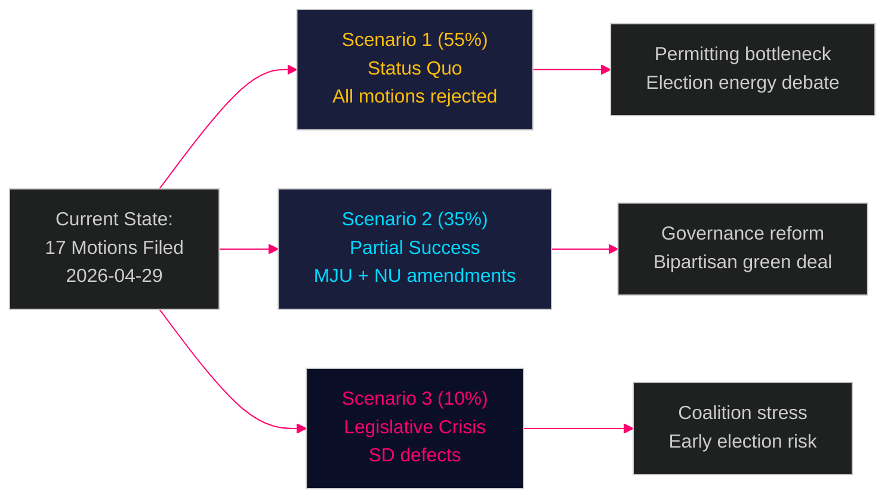

# Scenario Analysis — Opposition Motions 2026-04-29

**Author**: James Pether Sörling | **Date**: 2026-04-30
**Methodology**: 3-scenario futures analysis (ACH-consistent)

---

## Scenario Framework

Three scenarios for the parliamentary treatment of the 17 motions over spring 2026:

### Scenario 1 — Status Quo (Government Majority Holds)

**Probability**: 55% (MEDIUM confidence [B3])

**Narrative**: The Tidö government uses its narrow majority to reject all opposition motions in committee and plenary. Miljöprövningsmyndigheten is established exactly as proposed (prop. 2025/26:238). Wind power legislation passes with current municipal consent rules. Electricity system law enacted without opposition amendments.

**Trigger conditions**: SD and KD remain disciplined; no defections; C and MP fail to build cross-bloc coalition.

**Implications**:
- Permitting bottleneck risk (R1) materialises at HIGH probability within 18 months
- Wind energy deployment remains contested in municipalities
- Opposition parties frame 2026 election campaign around "unaccountable agencies" and "energy governance failure"
- IMF growth projection of 2.1% (WEO Apr-2026) assumes smooth energy transition — scenario 1 adds 0.2–0.4 pp downside risk

### Scenario 2 — Partial Opposition Success (Committee Amendments)

**Probability**: 35% (MEDIUM confidence [B3])

**Narrative**: MJU committee accepts HD024131/134 governance amendment: an independent Miljöprövningsnämnd oversight board is added to prop. 2025/26:238. NU negotiates a time-limited wind power municipal veto (3-year cap). Electricity system law passes with HD024129's technology-neutrality clause added.

**Trigger conditions**: SD supports MJU amendment in exchange for government concession on border policy; C+MP secure wind compromise.

**Implications**:
- Permitting bottleneck risk reduced by ~30%
- Government can claim bipartisan consensus on green transition
- Sets precedent for SD as agenda-setter within governing bloc
- Election framing shifts from "unaccountable agencies" to "constructive reform"

### Scenario 3 — Legislative Crisis (Government Defeat)

**Probability**: 10% (LOW confidence [C3])

**Narrative**: SD defects on Miljöprövningsmyndigheten vote — votes with S+C+MP+V to pass HD024124-series governance amendment against government wishes. Government faces political crisis; Tidö coalition survival questioned; early election speculation intensifies.

**Trigger conditions**: SD leadership decides institutional oversight amendment is consistent with its voter base concerns about bureaucratic overreach; government cannot maintain discipline.

**Implications**:
- First government defeat of Tidö II coalition
- Bond market reaction: SEK weakens, risk premium on Swedish bonds rises marginally
- Election timeline advances: 2026 election becomes genuine open question
- IMF fiscal surplus (0.5% GDP) provides some macroeconomic cushion but political uncertainty deters investment

_Evidence: HD024124, HD024126, HD024129, HD024131, HD024134, HD024137 — riksdagen.se. IMF WEO Apr-2026._
