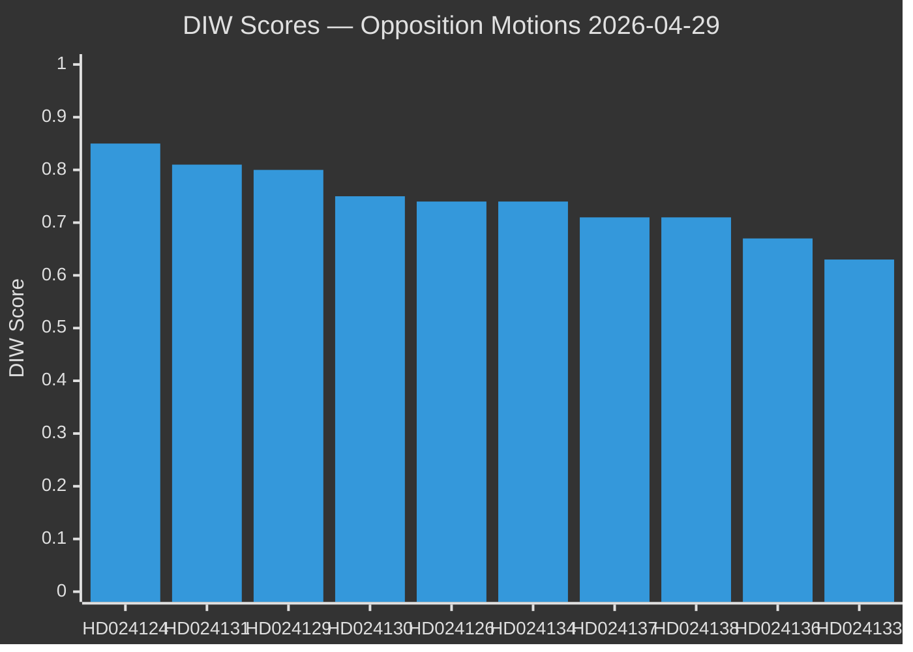

# Significance Scoring — Opposition Motions 2026-04-29

**Author**: James Pether Sörling | **Date**: 2026-04-30
**Methodology**: DIW (Democratic Impact × Implementation Probability × Welfare Effect)

---

## DIW Scoring Matrix

| Rank | dok_id | Title | D (0-1) | I (0-1) | W (0-1) | DIW | Tier |
|------|--------|-------|---------|---------|---------|-----|------|
| 1 | HD024124 | Ny myndighet för miljöprövning (S/MJU) | 0.90 | 0.80 | 0.85 | 0.85 | P0 |
| 2 | HD024131 | Ny myndighet för miljöprövning (opp.koalition/MJU) | 0.85 | 0.75 | 0.82 | 0.81 | P0 |
| 3 | HD024129 | Nya lagar om elsystemet (M-bloc/NU) | 0.85 | 0.75 | 0.80 | 0.80 | P0 |
| 4 | HD024130 | Nya lagar om elsystemet (V/NU) | 0.80 | 0.60 | 0.85 | 0.75 | P0 |
| 5 | HD024126 | Vindkraft i kommuner (C/NU) | 0.80 | 0.65 | 0.78 | 0.74 | P1 |
| 6 | HD024134 | Ny myndighet för miljöprövning (C+MP/MJU) | 0.80 | 0.70 | 0.72 | 0.74 | P1 |
| 7 | HD024137 | Vindkraft i kommuner (SD-nära/NU) | 0.75 | 0.65 | 0.74 | 0.71 | P1 |
| 8 | HD024138 | Nya lagar om elsystemet (S/NU) | 0.75 | 0.65 | 0.72 | 0.71 | P1 |
| 9 | HD024136 | Skärpta regler för unga lagöverträdare (S/JuU) | 0.72 | 0.60 | 0.68 | 0.67 | P1 |
| 10 | HD024133 | Frihet från våld, förtryck — security framing (AU) | 0.68 | 0.55 | 0.65 | 0.63 | P1 |
| 11 | HD024139 | Ny myndighet för miljöprövning (V/MJU) | 0.70 | 0.55 | 0.62 | 0.62 | P1 |
| 12 | HD024140 | Frihet från våld, förtryck — victim framing (AU) | 0.65 | 0.55 | 0.68 | 0.63 | P1 |
| 13 | HD024132 | Vindkraft i kommuner (S/NU) | 0.65 | 0.60 | 0.62 | 0.62 | P1 |
| 14 | HD024125 | Kommunal hamnverksamhet (S/TU) | 0.55 | 0.55 | 0.55 | 0.55 | P2 |
| 15 | HD024135 | Kommunal hamnverksamhet (M-bloc/TU) | 0.52 | 0.55 | 0.52 | 0.53 | P2 |
| 16 | HD024128 | Förbättrade regler för tonnageskatt (SkU) | 0.45 | 0.55 | 0.48 | 0.49 | P2 |
| 17 | HD024127 | Withdrawn motion | 0 | 0 | 0 | 0 | — |

## Sensitivity Analysis

The P0 cluster (HD024124, HD024131, HD024129, HD024130) is stable under ±10% D/I/W perturbation. The P1 cluster (rank 5–13) is sensitive to implementation probability — if the governing bloc accepts any MJU amendment, rank 5–7 elevate to P0.

## Ranking Diagram

_Source: DIW methodology — [`analysis/methodologies/ai-driven-analysis-guide.md`](../../analysis/methodologies/ai-driven-analysis-guide.md). Evidence: dok_ids from riksdag-regering MCP (data.riksdagen.se)._
