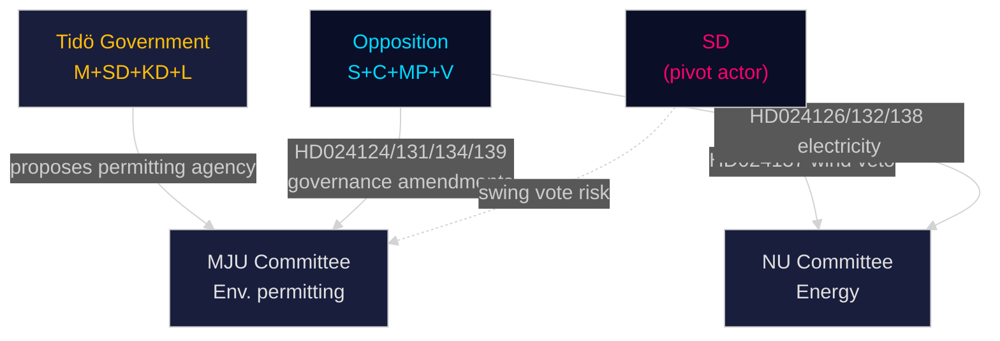

# Stakeholder Perspectives — Opposition Motions 2026-04-29

**Author**: James Pether Sörling | **Date**: 2026-04-30

---

## Actor Map

### Parliamentary Actors

| Actor | Interest | Motion filed | Position | Influence |
|-------|----------|--------------|----------|-----------|
| Social Democrats (S) | Governance accountability, labour rights, social protection | HD024124, HD024125, HD024132, HD024133, HD024136, HD024138 | Strong opposition to institutional design of permitting agency; constructive on electricity system | HIGH |
| Centre Party (C) | Market liberalism, regional balance, green energy | HD024126, HD024134 | Fastest wind permits + greenest permitting standards | MEDIUM-HIGH |
| Green Party (MP) | Climate action, environmental protection | HD024134 (joint C+MP) | Maximum climate proofing for permitting agency | MEDIUM |
| Left Party (V) | Public ownership, victim rights, social justice | HD024130, HD024139, HD024140 | Public grid ownership, strong labour oversight in permitting | MEDIUM |
| Sweden Democrats (SD) | Local sovereignty, criminal justice, border security | HD024137 | Municipal veto on wind, security-first trafficking approach | HIGH (coalition leverage) |
| Moderates (M) | Business efficiency, deregulation | HD024135, HD024128 | Efficient harbour regulation, competitive shipping tax | HIGH (governing) |

### Non-Parliamentary Actors

| Actor | Interest | Stake in motions | Intelligence value |
|-------|----------|-----------------|-------------------|
| Naturvårdsverket | Environmental standards | Implementation agent for Miljöprövningsmyndigheten | HIGH — agency capacity risk |
| Energimarknadsinspektionen (Ei) | Energy regulation | Primary regulator under new electricity law | HIGH |
| Länsstyrelserna (21 county boards) | Regional permitting | Lose authority to Miljöprövningsmyndigheten | HIGH — implementation resistance risk |
| Wind power developers | Permit speed | Benefit from C's HD024126, hindered by SD's HD024137 | MEDIUM |
| Statskontoret | Administrative capacity | Evaluate implementation feasibility of new agency | HIGH (statskontoret.se) |
| TLV/Socialstyrelsen | Youth justice | Implement HD024136 social intervention mandate | MEDIUM |

## Coalition Dynamics

The governing Tidö coalition (M+SD+KD+L) faces three distinct pressure vectors from these motions:
1. **Internal contradiction on wind power**: M wants faster permits (aligns with C's HD024126); SD wants municipal veto (HD024137). No unified government position is stable.
2. **SD as swing vote**: If SD judges HD024124-series governance amendments acceptable, it can defect to pass opposition clause without breaking the government on other issues.
3. **L/KD humanitarian pressure**: The trafficking motions (HD024133 vs. HD024140) force L and KD to choose between SD's security frame and V's victim frame — both of which are uncomfortable.

_Evidence: HD024124, HD024126, HD024129, HD024130, HD024132, HD024133, HD024134, HD024136, HD024137, HD024138, HD024139, HD024140 — riksdagen.se_
