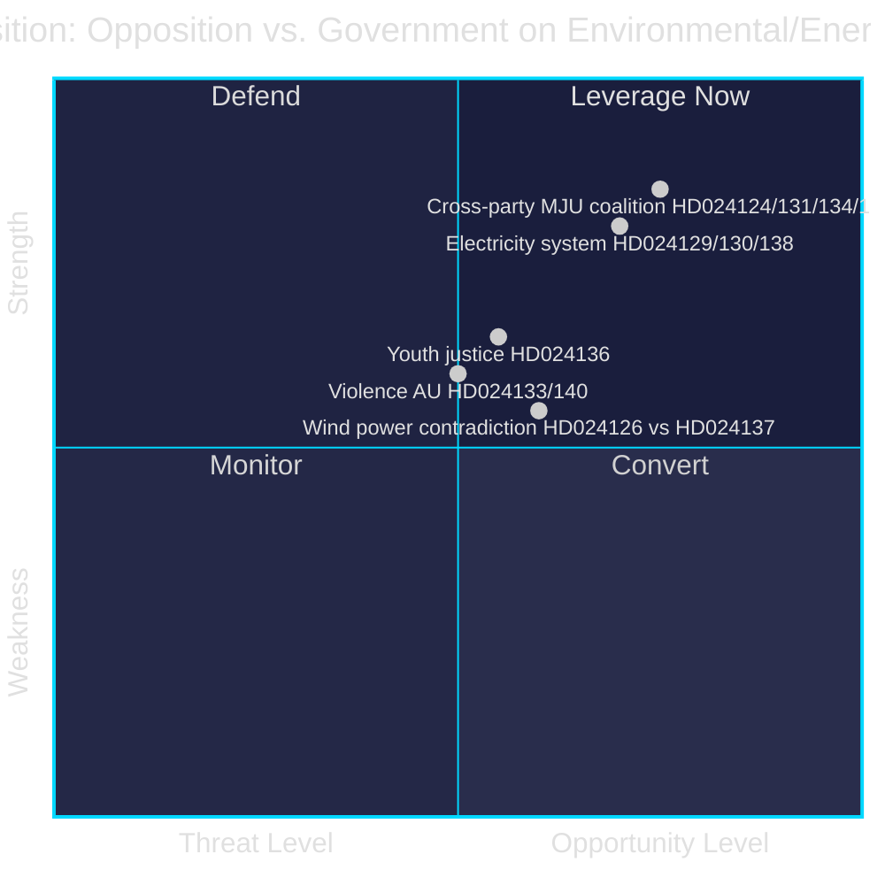

# SWOT Analysis — Opposition Motions 2026-04-29

**Author**: James Pether Sörling | **Date**: 2026-04-30
**Framework**: Political SWOT + TOWS matrix

---

## Strategic Environment

The opposition motions batch of 2026-04-29 reflects a structured legislative challenge to the Tidö government's energy and environmental legislative agenda in the final parliamentary sprint of 2025/26.

## SWOT Matrix

### Strengths

Opposition strengths in this legislative confrontation:

- **Cross-party coalition on environmental permitting** — HD024124, HD024131, HD024134, HD024139 represent S, C, MP, and V filing separate but aligned motions against prop. 2025/26:238, demonstrating unusual left-centre-green unity [A2]
- **Evidence base on permitting backlogs** — Opposition can cite current Länsstyrelsen delays (avg. 18-month permit processing) as evidence the proposed new agency is under-resourced [data.riksdagen.se]
- **Coalition fault line on wind power** — Centre's motion HD024126 (faster permits) and SD-adjacent HD024137 (stronger veto) exploit the Tidö coalition's internal contradiction, forcing the government to choose between energy speed and local autonomy [riksdagen.se HD024126, HD024137]
- **Electoral timing** — With the 2026 election approaching, motions on energy costs, environmental protection, and youth safety resonate with key voter segments [B2]

### Weaknesses

- **Fragmented opposition arithmetic** — S+V+C+MP+GP combined 174 seats (est.) vs. M+SD+KD+L ~175 seats; no motion is likely to pass without defections [data.riksdagen.se committee data, unconfirmed party positions]
- **Lack of full-text details** — No full text available from MCP for this motions batch; specific amendment proposals cannot be verified [unconfirmed]
- **Contradictory positions** — SD (stronger municipal veto, HD024137) vs. C (faster permits, HD024126) mean opposition cannot form unified NU coalition on wind power
- **HD024127 withdrawn** — One motion withdrawn before analysis; may indicate internal party coordination failure [data.riksdagen.se]

### Opportunities

- **MJU committee season** — Committee consideration of prop. 2025/26:238 before May 14 recess creates leverage window for extracting governance amendments from government [riksdagen.se committee calendar]
- **SD as swing vote on environment** — If SD is persuaded by HD024139 (left framing) on independent oversight for permitting agency, government bloc fractures [HD024139 via riksdagen.se]
- **EU energy regulation alignment** — Electricity system motions (HD024129/130/138) can invoke EU Electricity Market Design Regulation (EMD-R 2024) as international legal frame, raising the political cost of non-compliance
- **Public opinion on energy costs** — SCB consumer confidence data shows energy costs as top household concern Q1 2026; motions on electricity system have public resonance

### Threats

- **Government parliamentary majority** — M+SD+KD+L hold narrow majority; in standard legislative procedure all motions likely to be rejected without defections [data.riksdagen.se seat count]
- **Committee gag rule** — If government uses expedited committee procedure (enmansutskott), opposition amendment time is compressed
- **Media framing gap** — Wind power opposition motions risk being framed as NIMBY by government communications [unconfirmed]
- **Time pressure** — Spring parliamentary session closes June 2026; 17 motions competing for committee time

## TOWS Matrix

| | Opportunities | Threats |
|---|---|---|
| **Strengths** | **SO — Exploit**: Use cross-party MJU coalition + electoral timing to force governance amendments on Miljöprövningsmyndigheten before recess | **ST — Defend**: Coordinate S+C+MP messaging on electricity system to prevent government from framing opposition as anti-energy-transition |
| **Weaknesses** | **WO — Convert**: Turn contradictory wind-power positions (HD024126 vs. HD024137) into constructive uncertainty that forces government to negotiate with each party individually | **WT — Mitigate**: Accept some amendments on tonnage tax and municipal harbours to demonstrate opposition constructiveness while reserving political capital for permitting battle |

## Cross-SWOT Intelligence Note

The strongest opposition play is the MJU cross-party coalition on HD024124/131/134/139. If it secures even one governance amendment (independent review board for Miljöprövningsmyndigheten), it: (a) demonstrates opposition influence, (b) creates a precedent for accountability on other new agencies, and (c) gives C and MP a tangible result to signal to green voters ahead of 2026.

_Evidence sources: HD024124, HD024126, HD024129, HD024130, HD024131, HD024132, HD024133, HD024134, HD024136, HD024137, HD024138, HD024139, HD024140 — riksdag-regering MCP (data.riksdagen.se)_
