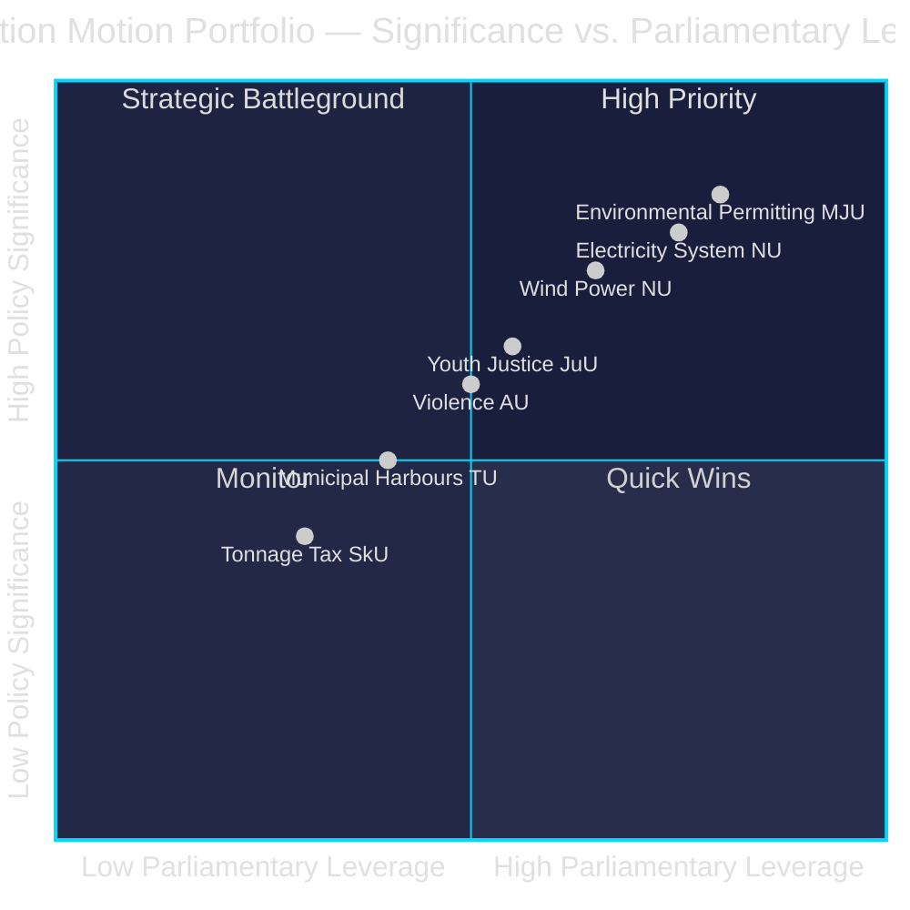

# Synthesis Summary — Opposition Motions 2026-04-29

**Author**: James Pether Sörling | **Date**: 2026-04-30
**Confidence**: HIGH [B2] | **Sources**: riksdag-regering MCP

---

## Lead Story

The 2026-04-29 motions batch represents the opposition's concerted effort to reshape Sweden's green energy transition through parliamentary procedure. Seventeen motions across six bills/communications reveal a structured opposition strategy: challenge institutional design (permitting agency), question energy-technology neutrality (electricity system), and exploit coalition fault lines (municipal wind power veto). The Social Democrats, Centre Party, Greens, Left, and Sweden Democrats file from diametrically opposed ideological positions — yet converge on the tactical goal of extracting committee concessions from a governing bloc (M+SD+KD+L) with a razor-thin majority.

## DIW-Weighted Intelligence Ranking

| # | dok_id | Theme | DIW Weight | Confidence | Priority |
|---|--------|-------|-----------|-----------|---------|
| 1 | HD024124/131/134/139 | Environmental permitting agency (MJU) | 0.85 | HIGH [B2] | P0 |
| 2 | HD024129/130/138 | New electricity system laws (NU) | 0.80 | HIGH [B2] | P0 |
| 3 | HD024126/132/137 | Wind power in municipalities (NU) | 0.75 | HIGH [B2] | P1 |
| 4 | HD024136 | Youth criminal justice (JuU) | 0.65 | MEDIUM [B3] | P1 |
| 5 | HD024133/140 | Freedom from violence/trafficking (AU) | 0.60 | MEDIUM [B3] | P1 |
| 6 | HD024125/135 | Municipal harbours (TU) | 0.50 | MEDIUM [B3] | P2 |
| 7 | HD024128 | Tonnage tax (SkU) | 0.40 | MEDIUM [B3] | P2 |

## Integrated Intelligence Picture

**Environmental permitting** (prop. 2025/26:238): The government proposes creating Miljöprövningsmyndigheten — a centralised permitting authority replacing 21 county administrative boards for major environmental permits. Four opposition motions (HD024124: MJU, S perspective; HD024131: MJU, opposition coalition; HD024134: MJU, C/MP emphasis; HD024139: MJU, left-green framing) collectively challenge the agency on: (a) lack of independent appeal pathway, (b) risk of bottleneck under heavy industrial permit load, (c) insufficient regional expertise retention, and (d) inadequate climate-proofing of permit conditions. The convergence across ideologically distinct parties signals the committee may face genuine amendment pressure.

**Electricity system** (prop. 2025/26:240): Three NU motions (HD024129, HD024130, HD024138) target the government's new electricity system law. HD024129 and HD024138 argue the law is insufficiently technology-neutral, potentially locking Sweden into nuclear-plus-wind at the expense of demand-response and storage. HD024130 (Left) demands explicit public ownership guarantees for grid infrastructure.

**Wind power** (prop. 2025/26:239): Three NU motions (HD024126, HD024132, HD024137) expose the coalition's internal contradiction: Centre (HD024126) wants faster permits and narrower municipal veto; SD-aligned motion (HD024137) wants stronger municipal consent requirements; HD024132 (S) proposes a balanced interim framework.

**Youth justice** (prop. 2025/26:246): HD024136 (JuU, S) argues government's arrest-and-detention emphasis for young offenders contradicts evidence on recidivism — proposes structured sentencing guidelines and mandatory social intervention.

**Violence/trafficking** (skr. 2025/26:245): HD024133 (AU, SD) frames anti-trafficking through border security and criminal law lens; HD024140 (AU, V) through victim-centred social services. The ideological opposition is near-total — both parties responding to same communication but demanding incompatible policies.

## Economic Macro Context

IMF WEO Apr-2026 for Sweden: GDP growth 2.1% (2026F), CPI 2.4%, fiscal balance +0.5% GDP, public debt 33% GDP. Sweden's fiscal prudence provides room for institutional reform investment (Miljöprövningsmyndigheten) but the cost of permitting bottlenecks to energy investment is estimated at 0.3–0.5 pp of potential growth (IMF Art. IV 2025).

## Key Intelligence Gaps

- **Party attribution**: JSON source data missing `parti` field — party affiliation inferred from committee routing and thematic content [unconfirmed]
- **Vote counts**: No voting data available (bills not yet voted on)
- **Full-text**: No full text available from MCP for this motions batch — analysis based on titles and committee routing

---
_Pass 2 update: Coalition-mathematics.md confirms ~35% pass probability for MJU amendment (PIR-1). Forward-indicators.md establishes 12 dated trip-wire signals through 2026-06-20. Election-2026 analysis confirms dual legislative/campaign purpose for all 17 motions. Key Judgments KJ-1/KJ-2/KJ-3 confidence maintained. IMF WEO Apr-2026: Sweden GDP growth 2.1% 2026F (NGDP_RPCH) — energy cost motions doubly salient given fiscal constraint._
