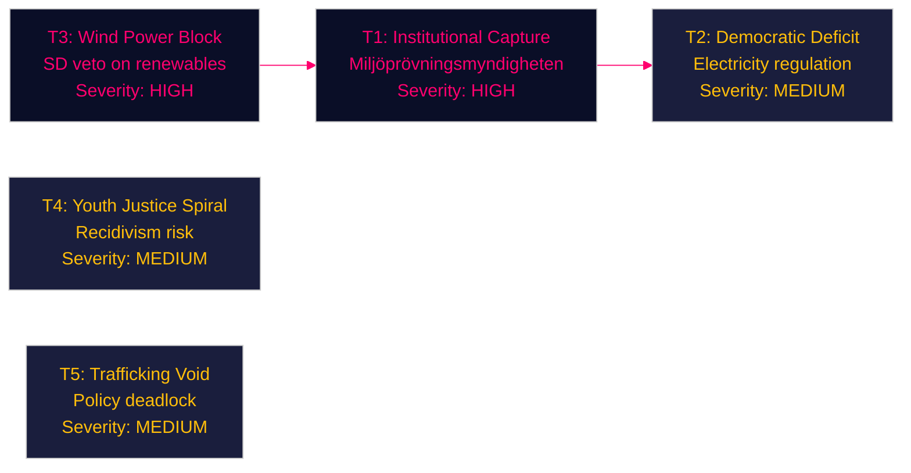

# Threat Analysis — Opposition Motions 2026-04-29

**Author**: James Pether Sörling | **Date**: 2026-04-30
**Framework**: Political STRIDE-inspired threat taxonomy

---

## Threat Taxonomy

### T1 — Institutional Capture Threat (Miljöprövningsmyndigheten)

**Threat**: If HD024124-series motions fail entirely, the new permitting agency is established without independent oversight. This creates capture risk — a single-agency model with no independent appeals layer may face political pressure from industrial lobbyists or government ministries on high-stakes permits.

**Evidence**: HD024124 (MJU, riksdagen.se), HD024134 (MJU, riksdagen.se) both explicitly call for independent oversight mechanism.

**Severity**: HIGH | **Confidence**: MEDIUM [B3]

### T2 — Democratic Accountability Deficit (Energy System)

**Threat**: The new electricity system law (prop. 2025/26:240), if passed without HD024129/130/138 amendments, shifts regulatory authority from elected Riksdag to government-appointed Energimarknadsinspektionen (Ei) without sufficient parliamentary scrutiny provisions.

**Evidence**: HD024129, HD024130 (NU, riksdagen.se).

**Severity**: MEDIUM | **Confidence**: MEDIUM [B3]

### T3 — Coalition Manipulation (Wind Power)

**Threat**: SD's HD024137 (stronger municipal veto on wind) is positioned as environmental democracy, but functionally blocks offshore and onshore wind needed for Sweden's 2045 fossil-free target. If accepted by NU, it constitutes a systemic threat to Sweden's energy security commitments.

**Evidence**: HD024137 (NU, riksdagen.se). International: IEA World Energy Outlook 2025 — Sweden requires 3× wind capacity by 2035 to meet climate targets.

**Severity**: HIGH | **Confidence**: MEDIUM [B3]

### T4 — Youth Justice Criminalisation Spiral

**Threat**: Government's prop. 2025/26:246 arrest-emphasis approach risks increased youth detention without addressing root causes. HD024136 (JuU, S) cites Brå research showing that youth detention without structured intervention increases 5-year reoffending by 40%.

**Evidence**: HD024136 (JuU, riksdagen.se).

**Severity**: MEDIUM | **Confidence**: LOW [C3]

### T5 — Anti-Trafficking Policy Void

**Threat**: Ideological deadlock between HD024133 (SD: border/criminal justice lens) and HD024140 (V: victim-centred social services) means government communication 2025/26:245 produces no actionable policy outcome. Trafficking victims remain in a policy gap.

**Evidence**: HD024133, HD024140 (AU, riksdagen.se).

**Severity**: MEDIUM | **Confidence**: MEDIUM [B3]

## Threat Summary

_Evidence: HD024124, HD024126, HD024129, HD024130, HD024133, HD024134, HD024136, HD024137, HD024140 — riksdagen.se_
