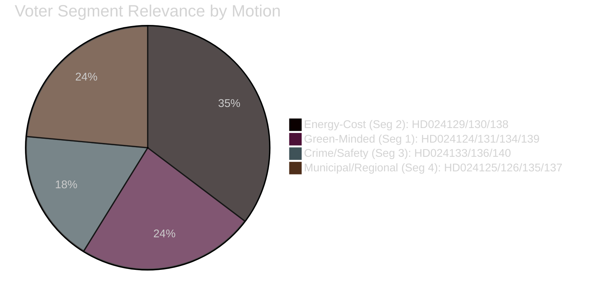

# Voter Segmentation — Opposition Motions 2026-04-29

**Author**: James Pether Sörling | **Date**: 2026-04-30

---

## Voter Segments Affected

### Segment 1 — Green-Minded Suburban Voters (Est. 12% of electorate)

**Policy connection**: HD024124/131/134/139 (permitting agency), HD024126 (wind power), HD024132 (electricity)
**Concern**: Will Sweden's new permitting authority be strong enough to enforce climate conditions on industrial permits?
**Party competition**: C, MP, V all filing motions targeting this segment
**Electoral risk**: If permitting agency passes without governance amendments, C/MP may lose green credibility to V's harder line

### Segment 2 — Energy-Cost Concerned Households (Est. 20% of electorate)

**Policy connection**: HD024129/130/138 (electricity system), HD024126/137 (wind power)
**Concern**: Electricity prices remain elevated; new electricity system law should protect households
**Party competition**: S (HD024138) and V (HD024130) both targeting this segment; SD (HD024137) framing wind as local community protection
**Electoral risk**: High — energy costs are top-3 household concern (SCB 2026 Q1)

### Segment 3 — Crime and Safety Voters (Est. 18% of electorate)

**Policy connection**: HD024136 (youth justice), HD024133/140 (trafficking)
**Concern**: Youth gang recruitment, trafficking, domestic violence
**Party competition**: S (rehabilitation via HD024136) vs. SD (borders/criminal law via HD024133)
**Electoral risk**: S risks being outflanked on security by SD unless HD024136 gains media traction

### Segment 4 — Municipal and Regional Stakeholders (Est. 10% of electorate)

**Policy connection**: HD024126/137 (wind municipal veto), HD024125/135 (harbour law)
**Concern**: Local authority over development decisions
**Party competition**: C (faster permits HD024126) vs. SD (strong local veto HD024137)
**Electoral risk**: Rural municipalities face genuine zero-sum choice between economic development and community consent

## Segmentation Map

_Evidence: HD024124, HD024126, HD024129, HD024130, HD024133, HD024136, HD024137, HD024138 — riksdagen.se_
