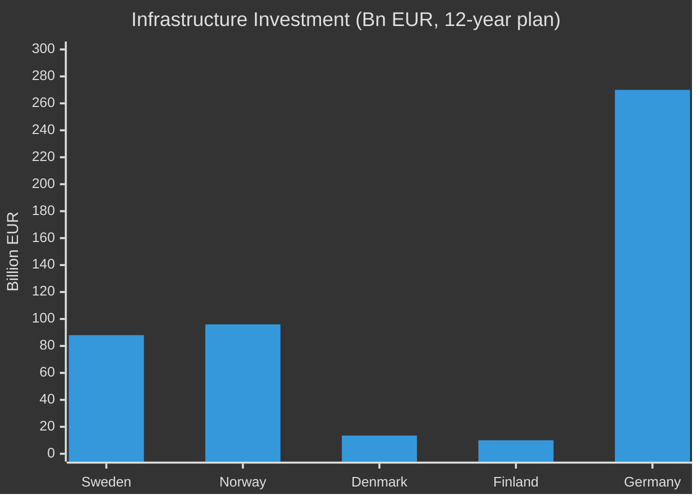

# Comparative International Analysis — Swedish Government Propositions, 30 April 2026

**Author**: James Pether Sörling | **Run ID**: 25150587415

---

## Comparator Set: Nordic + Germany on Infrastructure Investment

| Country | Comparable Policy | Scale | Status |
|---------|------------------|-------|--------|
| Sweden (HD03259) | National Transport Infrastructure Plan 2026–2037 | 970 bn SEK (€88bn) over 12 years | Submitted April 2026 |
| Norway | Nasjonal transportplan 2025–2036 | NOK 1,100 bn (€96bn) over 12 years | Approved 2024 |
| Denmark | Infrastrukturplan 2035 | DKK 100 bn (€13.5bn) | Ongoing 2023 |
| Finland | Transport System Plan 2021–2032 | €10bn | Active |
| Germany | Bundesverkehrswegeplan 2030 | €270bn | Active |

Sweden's commitment relative to GDP is broadly comparable to Norway and exceeds Denmark and Finland. The plan's emphasis on rail electrification aligns with EU Green Deal requirements and TEN-T revision standards.

## Comparator Set: Social Security Restriction for Prisoners (HD03252)

| Country | Comparable Policy | Status |
|---------|------------------|--------|
| Sweden (HD03252) | Restrict benefits for "kontrollerat boende" | Submitted 2026 |
| Denmark | Benefits suspended for persons under electronic monitoring | In force since 2020 |
| Netherlands | Partial benefits restriction for persons on home detention | In force since 2021 |
| UK | Benefits excluded for incarcerated persons | Long-standing |
| Finland | Benefits continue during community service; restricted for full custody | In force |

Sweden's approach is consistent with Danish and Dutch precedents. The "kontrollerat boende" category is the novel legal frontier; Denmark's approach targeted home detention explicitly.

## Comparator Set: Basel III Banking Package (HD03253)

| Country | CRR3/CRD6 Transposition | Status |
|---------|------------------------|--------|
| Sweden (HD03253) | April 2026 proposition | On schedule |
| Germany | Already amended KWG | Advanced 2025 |
| France | Implementing ordinances | 2025–2026 |
| Netherlands | Parliamentary bill | 2025 |
| Finland | Government proposal | 2025 |

Sweden is broadly on pace with major EU peers. The EU deadline is January 2026 (partially effective) with full application 2026–2027.

## Key International Lessons

1. **Infrastructure**: Norway's NTP experience shows that multi-year infrastructure plans require locked-in funding mechanisms to resist political re-prioritisation during budget cycles. Sweden's 970 bn SEK commitment will face annual budget scrutiny.
2. **Prisoner benefits**: Denmark's 2020 reform faced initial legal challenge but was upheld by Danish courts. Sweden's Lagrådet review process provides a comparable pre-legislative safeguard.
3. **Banking**: Germany's advanced Basel III transposition demonstrates that early implementation reduces compliance risk — Sweden's pace is appropriate but should monitor EBA deviation decisions.

