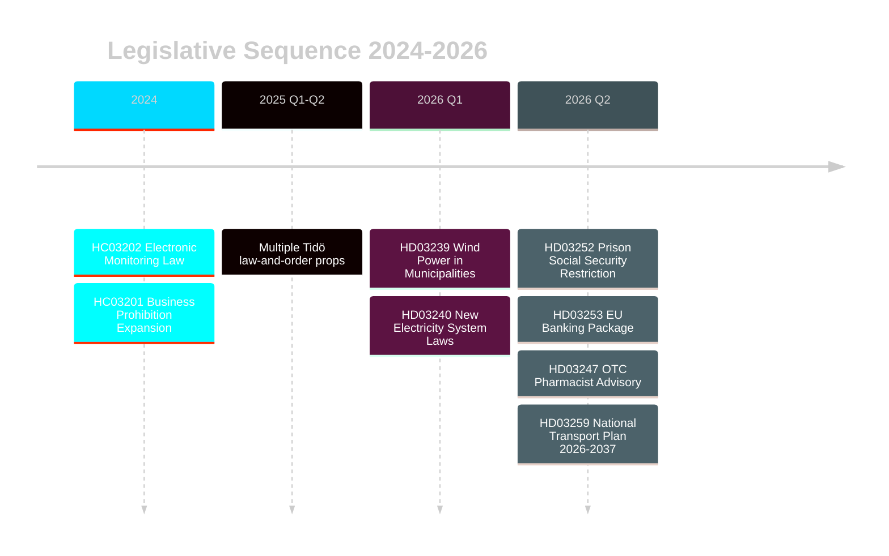
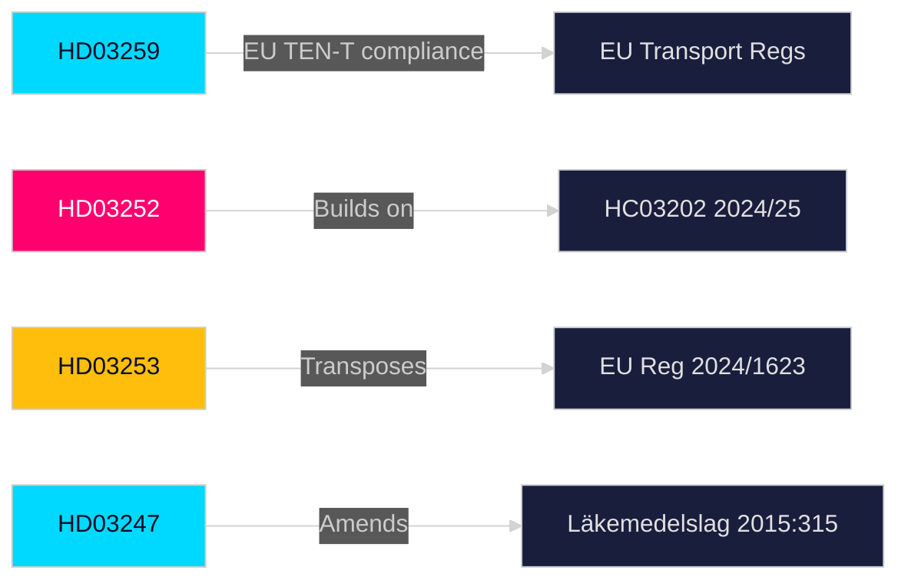

# Cross-Reference Map — Swedish Government Propositions, 30 April 2026

**Author**: James Pether Sörling | **Run ID**: 25150587415

---

## Document Cross-References

| From | To | Relationship | Type |
|------|----|-------------|------|
| HD03259 | TEN-T EU Regulation | European transport network compliance | External EU |
| HD03259 | Swedish Climate Act 2017 | Climate-proofing rail requirement | Domestic law |
| HD03252 | HC03202 (2024/25) | Predecessor — electronic monitoring expansion | Predecessor prop |
| HD03252 | ECHR Art. 8, Art. 14 | Constitutional compatibility | Human rights |
| HD03253 | EU Reg 2024/1623 (CRR3) | Transposition source | EU Regulation |
| HD03253 | EU Dir 2024/1619 (CRD6) | Transposition source | EU Directive |
| HD03247 | Läkemedelslag (2015:315) | Primary legislation being amended | Domestic law |
| HD03247 | EU Directive 2001/83/EC | Medicines directive | EU Directive |

## Legislative Sequence

## Thematic Clusters

| Theme | dok_ids | Pattern |
|-------|---------|---------|
| Law and order escalation | HD03252, HC03202, HC03201, HC03208 | Tidöalliansen 2022–2026 programme, consistent escalation |
| Energy and environment | HD03239, HD03240, HD03238 | Major structural legislation for energy transition |
| Infrastructure | HD03259 | Single dominant commitment document |
| EU transposition | HD03253, HD03244 | European regulatory integration |
| Healthcare | HD03247 | Patient safety improvements |

## PIR Linkages

| PIR | Relevant Documents |
|-----|-------------------|
| PIR-1 (Infrastructure) | HD03259 |
| PIR-2 (Criminal justice reform) | HD03252, HC03202 |
| PIR-3 (EU financial integration) | HD03253 |
| PIR-4 (Health system capacity) | HD03247 |

