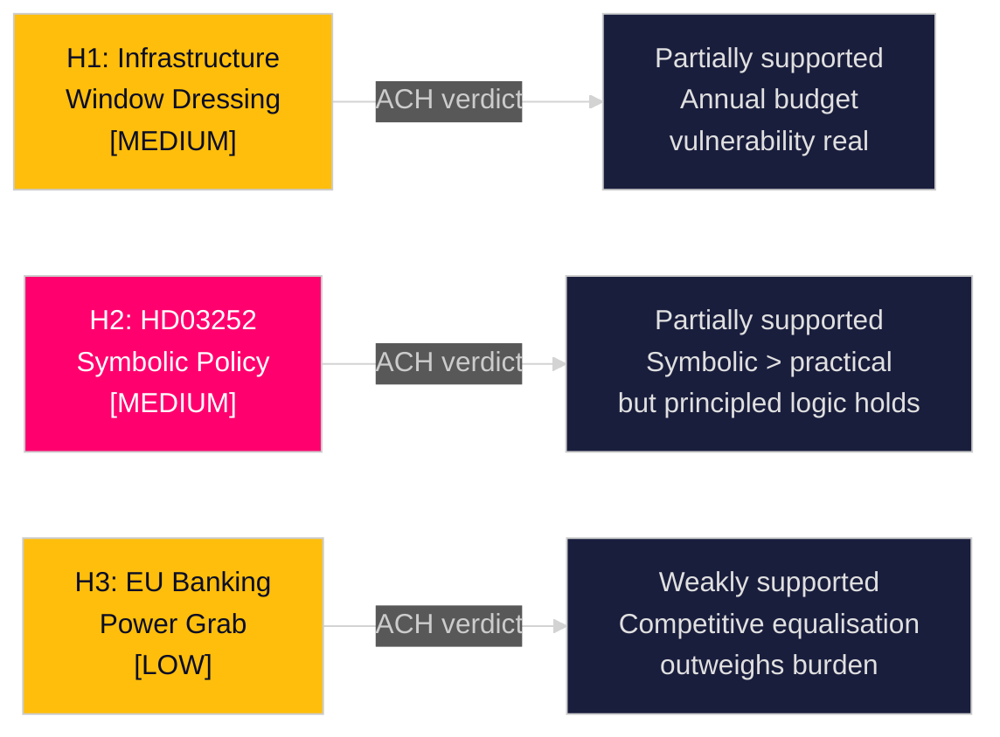

# Devil's Advocate — Competing Hypotheses — Swedish Government Propositions, 30 April 2026

**Author**: James Pether Sörling | **Run ID**: 25150587415  
**Method**: Analysis of Competing Hypotheses (ACH)

---

## Hypothesis 1: Infrastructure Plan Is Pre-Election Window Dressing

**Claim**: HD03259 is primarily an electoral manoeuvre rather than a genuine infrastructure commitment; the 970 bn SEK figure will be revised downward after the 2026 election regardless of which party wins.

**Supporting evidence**:
- HD03259 (riksdagen.se): The plan is a "skrivelse" (communication to parliament) not an appropriations bill — it sets intentions without legally binding annual budgets
- Historical precedent: Sweden's previous NTP (2022–2033) was revised in scope and funding after the 2022 election
- Minority government has no guaranteed budget majority for 12 years
- Annual budget negotiations with SD give SD annual leverage to adjust allocations

**Challenging evidence**:
- 970 bn SEK commitment has cross-party infrastructure consensus elements
- EU TEN-T obligations create legally binding corridor commitments
- Trafikverket planning cycle requires multi-year certainty

**ACH verdict**: The hypothesis is partially supported. The 970 bn SEK headline is real, but the annual allocation will vary. The plan constrains future governments modestly via EU TEN-T obligations but is not a legal straight-jacket. Confidence: MEDIUM [B2].

## Hypothesis 2: HD03252 Targets Vulnerable Population, Not Genuine Abusers

**Claim**: The actual population of persons in "kontrollerat boende" who fraudulently claim social insurance is small; HD03252 is primarily a symbolic policy aimed at low-income offenders, not genuine large-scale abuse prevention.

**Supporting evidence**:
- Limited published data on actual benefit abuse rates by persons in kontrollerat boende [unconfirmed — data not located in public sources]
- NGO criticism (Rädda Barnen, Amnesty Sweden) of the broad scope
- Opposition (S, V, MP) point to the poverty-crime nexus as making benefit restrictions counterproductive
- No Statskontoret capacity analysis of enforcement costs vs savings found

**Challenging evidence**:
- HD03252 (riksdagen.se): Justitiedepartementet cites principled argument that persons removed from open society should not simultaneously draw social insurance
- Danish and Dutch analogues passed legal review despite similar initial criticism
- Tidöavtalet (2022) explicitly committed to this category of reform

**ACH verdict**: Hypothesis partially supported — the policy has primarily symbolic/electoral value and the welfare abuse prevention rationale is thin. However, the principled consistency with prison-time logic has legal merit. Confidence: MEDIUM [B2].

## Hypothesis 3: EU Banking Package Is a European Power Grab at Sweden's Expense

**Claim**: HD03253 uses EU obligations to import capital requirements that disproportionately burden Swedish banks relative to banks in countries where implementation will be more flexible.

**Supporting evidence**:
- CRR3 introduces stricter own-funds requirements for some business models prevalent in Scandinavian banking (covered bonds, real estate lending)
- Swedish real estate exposure in bank portfolios means stricter LTV/RWA rules could tighten mortgage market
- EBA has acknowledged some Nordic-specific complexities in mapping

**Challenging evidence**:
- HD03253 (riksdagen.se): Finansdepartementet negotiated Nordic-specific carve-outs at EU level
- Swedish Financial Stability Council has assessed Swedish banks as well-capitalised
- EU-wide implementation reduces regulatory arbitrage, benefiting Swedish banks competitively

**ACH verdict**: Hypothesis weakly supported. Some capital pressure is real but is not unique to Sweden and the competitive equalisation benefits Swedish banks in the long run. Confidence: LOW [B3].

