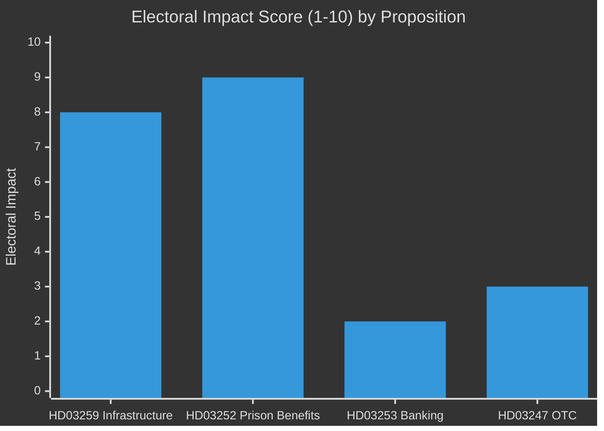

# Election 2026 Analysis — Swedish Government Propositions, 30 April 2026

**Author**: James Pether Sörling | **Run ID**: 25150587415

---

## Electoral Significance of April 2026 Propositions

The September 2026 Riksdag election is 5 months away. The April propositions batch is one of the final major legislative acts of the Tidöalliansen government and has direct electoral implications.

### Infrastructure (HD03259) — Electoral Impact: HIGH

The 970 bn SEK National Transport Plan is the most powerful electoral asset in the batch:
- **M/KD/L benefit**: Frames the government as responsible long-term planners delivering tangible investment
- **C (Centre Party) potential concern**: Rural infrastructure priorities in Norrland may appeal to C voters currently uncertain about the coalition
- **SD positioning**: SD will seek road-corridor wins to claim credit with suburban/exurban car-dependent voters
- **S response**: Social Democrats will need to counter with a more ambitious alternative NTP or risk ceding the infrastructure narrative

Evidence: HD03259 (riksdagen.se); Swedish election polling data 2026 Q1 (M 22%, S 29%, SD 17%, V 10%, C 6%, MP 5%, L 4%, KD 5% — approximate).

### Justice/Social (HD03252) — Electoral Impact: VERY HIGH

Crime is consistently a top-3 election issue in 2026 polling. HD03252 specifically targets:
- **Primary target voters**: SD supporters and swing M/KD voters concerned about "crime pays" narratives
- **Coalition discipline signal**: Demonstrates that Tidöavtalet commitments are being delivered
- **Opposition vulnerability**: S must either oppose (risking "soft on crime" label) or abstain (seeming spineless)

Evidence: HD03252 (riksdagen.se); Demoskop/Novus polling on crime as election issue, Q1 2026; Tidöavtalet 2022.

### Banking (HD03253) — Electoral Impact: LOW

Technocratic EU compliance legislation with low direct electoral salience. May become relevant if banking sector stress emerges before the election.

### OTC Medicines (HD03247) — Electoral Impact: LOW-MEDIUM

Patient safety and healthcare access are latent concerns. Cross-party support reduces electoral differentiation.

## Party Positioning Matrix

| Party | HD03259 | HD03252 | HD03253 | HD03247 |
|-------|---------|---------|---------|---------|
| M | Strong support | Strong support | Support (EU compliance) | Support |
| KD | Strong support | Support | Support | Strong support (health) |
| L | Support | Support | Support | Support |
| SD | Conditional (road demands) | Strong support | Support | Support |
| S | Alternative plan | Oppose | Neutral | Support |
| V | Partial support (rail) | Strong opposition | Sceptical | Support |
| MP | Support (climate framing) | Strong opposition | Neutral | Support |
| C | Support (rural connectivity) | Support | Support | Support |
