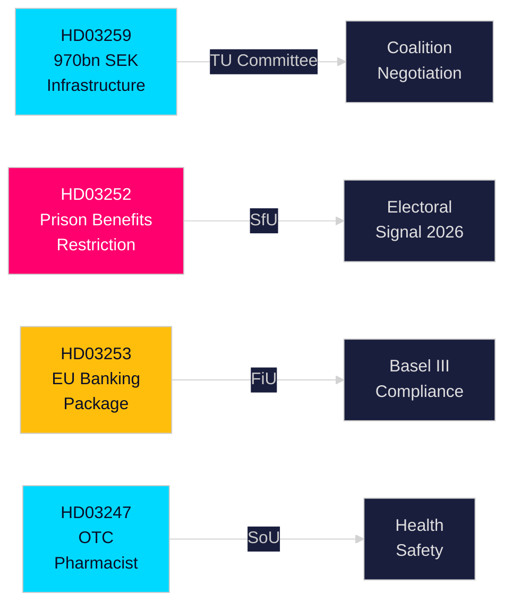

# Executive Brief — Swedish Government Propositions, 30 April 2026

**Author**: James Pether Sörling  
**Classification**: PUBLIC — GDPR Art. 9(2)(e,g)  
**Confidence**: HIGH [B2]  
**Run ID**: 25150587415

---

## 🎯 BLUF

Sweden's Kristersson government has submitted four significant propositions to the Riksdag in late April 2026, spanning infrastructure investment, criminal justice reform, EU financial regulation, and healthcare access. The dominant document — the National Transport Infrastructure Plan 2026–2037 (HD03259) — commits an historic 970 billion SEK to rail, road, maritime and aviation over twelve years, encoding a strategic pivot toward electric rail and climate-adapted roads that will shape regional competitiveness and industrial location decisions through the next decade. Parallel propositions tighten social security for incarcerated persons (HD03252), transpose the EU banking package into Swedish law (HD03253), and introduce pharmacist-advisory requirements for selected OTC medicines (HD03247).

## 🧭 3 Decisions This Brief Supports

| # | Decision | Relevance | Horizon |
|---|----------|-----------|---------|
| 1 | Infrastructure investment/relocation strategies for industries dependent on freight rail or E-road expansion | HD03259 allocates major funds to specific corridors — knowledge of winners/losers is actionable | 2026–2037 |
| 2 | Banking/financial sector compliance planning for Basel III / CRR3 / CRD6 domestic transposition | HD03253 sets the Swedish compliance timeline | 2026–2027 |
| 3 | Social policy positioning for parties ahead of 2026 autumn election | HD03252 restricts benefits for electronically-monitored prisoners — a tough-on-crime signal with electoral implications | 2026 H2 |

## ⚡ 60-Second Read

- **Infrastructure (HD03259)**: 970 bn SEK over 2026–2037; rail maintenance prioritised; new high-speed segments; Norrland connectivity; climate-proofing. Committee: TU.  
- **Justice/Social (HD03252)**: Persons serving sentences in "kontrollerat boende" (home detention with electronic tag) or in säkerhetsförvaring (preventive detention) lose entitlement to most social insurance benefits. Committee: SfU. Signals escalating law-and-order stance.  
- **Finance/EU (HD03253)**: Sweden transposes EU banking package (CRR3, CRD6, BRRD2 amendments) — Basel III full implementation, stricter capital buffers, new own-funds requirements. Finansdepartementet. Committee: FiU.  
- **Health (HD03247)**: Pharmacists must provide specific advisory interaction for designated OTC drugs to reduce misuse. Socialdepartementet. Committee: SoU.

## 🔮 Top Forward Trigger

**Infrastructure votes in TU committee (expected May–June 2026)**: Opposition parties SD, S, and MP have divergent positions on the corridor priorities. A minority government with no single-party majority must negotiate; watch for SD extracting concessions on road versus rail balance.

