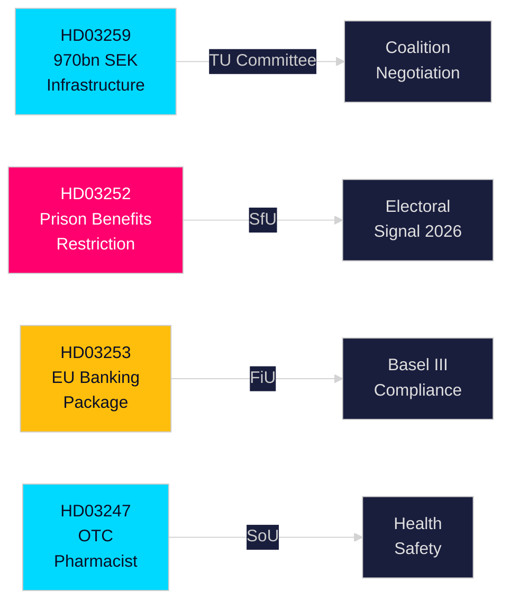

<!-- dir: rtl -->
# ملخص تنفيذي — مقترحات الحكومة السويدية، 30 أبريل 2026

**المؤلف**: James Pether Sörling  
**التصنيف**: عام — اللائحة الأوروبية GDPR المادة 9(2)(e,g)  
**الثقة**: عالية [B2]  
**معرّف التشغيل**: 25150587415

---

## 🎯 الخلاصة التنفيذية

قدّمت حكومة كريسترسون أربعة مقترحات قانونية مهمة إلى البرلمان السويدي (Riksdag) في أواخر أبريل 2026، تشمل الاستثمار في البنية التحتية وإصلاح العدالة الجنائية والتنظيم المالي الأوروبي والرعاية الصحية. الوثيقة الرئيسية — الخطة الوطنية لبنية تحتية النقل 2026–2037 (HD03259) — تُوظِّف 970 مليار كرونة سويدية تاريخية في السكك الحديدية والطرق والشحن البحري والطيران على مدى اثني عشر عامًا، مُرسِّخةً تحولًا استراتيجيًا نحو السكك الحديدية الكهربائية والطرق المتكيفة مع المناخ التي ستُشكّل القدرة التنافسية الإقليمية وقرارات التوطين الصناعي على مدى العقد القادم. تُشدِّد مقترحات موازية الضمان الاجتماعي للمحتجزين (HD03252)، وتُدرج حزمة الاتحاد الأوروبي المصرفية في القانون السويدي (HD03253)، وتُقرِّر متطلبات الاستشارة الصيدلانية لبعض الأدوية المتاحة دون وصفة طبية (HD03247).

## 🧭 3 قرارات يدعمها هذا الملخص

| # | القرار | الأهمية | الأفق الزمني |
|---|--------|---------|-------------|
| 1 | استراتيجيات الاستثمار في البنية التحتية والتوطين للصناعات المعتمدة على شحن السكك الحديدية أو توسعة الطرق الأوروبية | يخصص HD03259 أموالًا ضخمة لممرات محددة — معرفة الرابحين والخاسرين قابلة للتطبيق | 2026–2037 |
| 2 | التخطيط للامتثال لقطاع البنوك/المالية بموجب بازل III/CRR3/CRD6 | يُحدِّد HD03253 الجدول الزمني للتنفيذ السويدي | 2026–2027 |
| 3 | التموضع الاجتماعي السياسي للأحزاب قبل انتخابات خريف 2026 | يُقيِّد HD03252 مزايا السجناء الخاضعين للمراقبة الإلكترونية — إشارة صارمة لمكافحة الجريمة ذات آثار انتخابية | 2026 H2 |

## ⚡ قراءة 60 ثانية

- **البنية التحتية (HD03259)**: 970 مليار كرونة على مدى 2026–2037؛ صيانة السكك الحديدية مُقدَّمة على غيرها؛ قطاعات جديدة للسرعة العالية؛ الربط مع Norrland؛ التكيف المناخي. اللجنة: TU.
- **العدالة/الشؤون الاجتماعية (HD03252)**: يفقد الأشخاص الذين يقضون عقوبات في "kontrollerat boende" (الاحتجاز المنزلي بسوار إلكتروني) أو في säkerhetsförvaring (الاحتجاز الوقائي) حقهم في معظم مزايا التأمين الاجتماعي. اللجنة: SfU. يُشير إلى موقف متصاعد من القانون والنظام.
- **المالية/الاتحاد الأوروبي (HD03253)**: تُنفِّذ السويد حزمة الاتحاد الأوروبي المصرفية (CRR3 وCRD6 وتعديلات BRRD2) — التطبيق الكامل لبازل III، وأكثر صرامة لاحتياطيات رأس المال، ومتطلبات أموال خاصة جديدة. Finansdepartementet. اللجنة: FiU.
- **الصحة (HD03247)**: يجب على الصيادلة تقديم إرشادات محددة عند صرف أدوية معيّنة دون وصفة طبية للحد من إساءة الاستخدام. Socialdepartementet. اللجنة: SoU.

## 🔮 أبرز المحفزات القادمة

**تصويتات البنية التحتية في لجنة TU (المتوقعة مايو–يونيو 2026)**: تمتلك أحزاب المعارضة SD وS وMP مواقف متباينة حول أولويات الممرات. تضطر حكومة أقلية بلا أغلبية لحزب واحد إلى التفاوض؛ راقب ما إذا كان SD سيستخرج تنازلات حول توازن الطرق مقابل السكك الحديدية.

<!-- source-sha: 363f4a8634f2384be17ea1c3598e718d8d485fa1 -->
