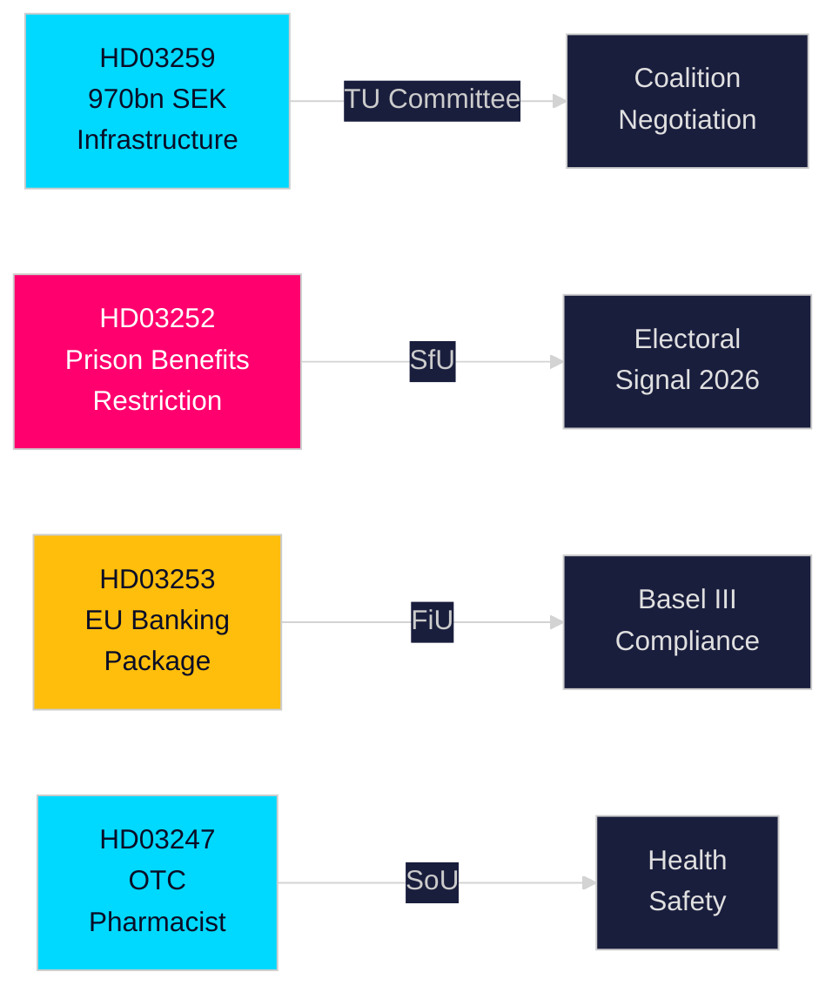

# Eksekutivrapport — Svenske regeringspropositioner, 30. april 2026

**Forfatter**: James Pether Sörling  
**Klassifikation**: PUBLIC — GDPR Art. 9(2)(e,g)  
**Konfidens**: HØJ [B2]  
**Kørselsnummer**: 25150587415

---

## 🎯 BLUF

Kristersson-regeringen har i slutningen af april 2026 fremsendt fire vigtige propositioner til Riksdagen omhandlende infrastrukturinvesteringer, strafferetsreform, EU-finansregulering og sundhedsadgang. Hoveddokumentet — den nationale transportinfrastrukturplan 2026–2037 (HD03259) — forpligter historiske 970 milliarder SEK til jernbane, vej, søfart og luftfart over tolv år og kodificerer et strategisk skift mod elektrisk jernbane og klimatilpassede veje, der vil forme regional konkurrenceevne og industrielle lokaliseringsbeslutninger i det næste årti. Parallelle propositioner stramme den sociale sikring for fængslede (HD03252), gennemfører EU's bankpakke i svensk ret (HD03253) og indfører krav om farmaceutisk rådgivning ved salg af udvalgte håndkøbslægemidler (HD03247).

## 🧭 3 beslutninger denne rapport understøtter

| # | Beslutning | Relevans | Horisont |
|---|-----------|----------|----------|
| 1 | Infrastrukturinvesterings- og lokaliseringsstrategier for industrier afhængige af godstog eller E-vejsudbygning | HD03259 afsætter store midler til specifikke korridorer — viden om vindere/tabere er handlingsbar | 2026–2037 |
| 2 | Compliance-planlægning for bank-/finanssektoren vedr. Basel III/CRR3/CRD6 | HD03253 fastsætter den svenske implementeringstidsplan | 2026–2027 |
| 3 | Socialpolitisk positionering for partier forud for efterårsvalget 2026 | HD03252 begrænser ydelser til elektronisk overvågede indsatte — et hårdt-over-for-kriminalitet-signal med valgmæssige implikationer | 2026 H2 |

## ⚡ 60 sekunders læsning

- **Infrastruktur (HD03259)**: 970 mia. SEK over 2026–2037; jernbanevedligeholdelse prioriteret; nye højhastighedssegmenter; Norrland-tilkoblingen; klimasikring. Udvalg: TU.
- **Retspleje/socialt (HD03252)**: Personer, der afsoner straffe i "kontrollerat boende" (hjemmefængsel med elektronisk fodlænke) eller i säkerhetsförvaring (præventiv forvaring), mister retten til de fleste sociale ydelser. Udvalg: SfU. Signalerer en eskalerende lov-og-orden-holdning.
- **Finans/EU (HD03253)**: Sverige gennemfører EU's bankpakke (CRR3, CRD6, BRRD2-ændringer) — fuld Basel III-implementering, strengere kapitalbuffere, nye egenkapitalkrav. Finansdepartementet. Udvalg: FiU.
- **Sundhed (HD03247)**: Farmaceuter skal yde specifik rådgivning ved udlevering af udpegede håndkøbslægemidler for at reducere misbrug. Socialdepartementet. Udvalg: SoU.

## 🔮 Vigtigste fremtidige udløser

**Infrastruktuafstemninger i TU-udvalget (forventet maj–juni 2026)**: Oppositionspartierne SD, S og MP har divergerende standpunkter om korridor-prioriteterne. En mindretalsregering uden absolut flertal skal forhandle; hold øje med om SD presser koncessionerne om balance mellem vej og jernbane.

<!-- source-sha: 363f4a8634f2384be17ea1c3598e718d8d485fa1 -->
